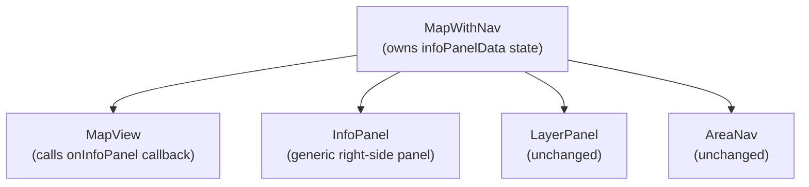
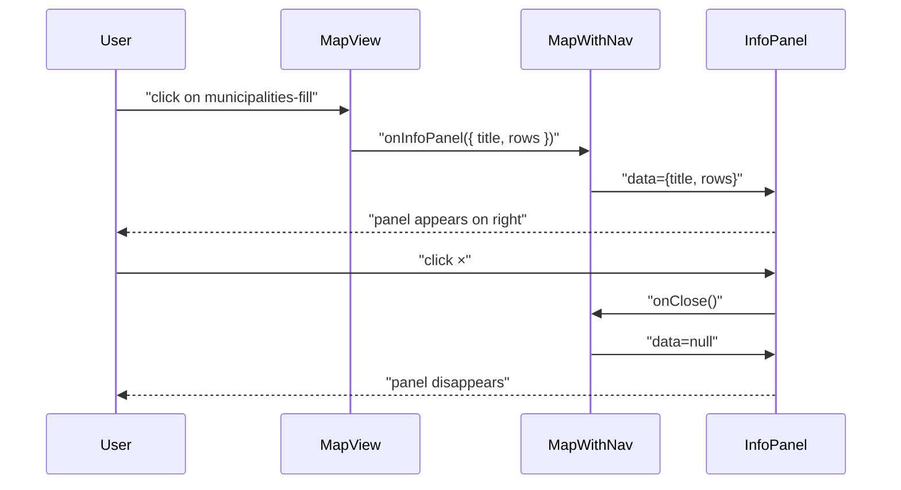

# Modification Design: Generic Info Panel & Bridge Zoom Fix

## Overview

Two targeted UX fixes:

1. **Generic info panel** — clicking a municipality polygon currently opens a `mapboxgl.Popup`, which stacks on top of any other popup already open. Replace it with a persistent right-side `InfoPanel` component rendered in React, outside Mapbox's DOM layer. The panel is generic — it accepts a title and a list of `[label, value]` rows — so it can be reused for any layer type (municipalities today, other data displays tomorrow).

2. **Bridge icon minzoom** — bridge NATO milsymbol icons appear at all zoom levels, cluttering the overview map. A `minzoom: 12` constraint on the `bridges-symbol` layer hides them until the user zooms to city-district scale.

---

## Problem Analysis

### Popup stacking

`mapboxgl.Popup` instances are appended to the Mapbox canvas container. When a municipality polygon underlaps a cell tower or road point, a click fires both the `municipalities-fill` handler AND the other layer's handler — Mapbox fires all matching layer handlers independently with no way to stop propagation between them.

Replacing the municipality popup with a React side panel solves this entirely: the panel is controlled by React state in `MapWithNav` and lives outside Mapbox's DOM layer, so it never visually collides with Mapbox popups.

### Bridge icon clutter

The `bridges-symbol` layer has no `minzoom` setting, so 2,637 bridge icons are rendered at all zoom levels. Setting `minzoom: 12` aligns bridge visibility with the zoom level where individual bridge features are meaningful.

---

## Alternatives Considered

### Feature-specific panels (e.g. `MunicipalityPanel`)
Works for the immediate need but creates proliferation of nearly-identical panel components as more data types are added. A single generic `InfoPanel` driven by data is more maintainable.

### Municipality popup: event stopPropagation
Not supported — Mapbox fires all layer handlers for a given click independently.

### Municipality popup: map-level click + queryRenderedFeatures priority
Would work but requires refactoring all layer click handlers into a single handler with a priority stack — disproportionate complexity for this fix.

### Bridge zoom: dynamic filter expression
`minzoom` on the layer definition is the canonical Mapbox solution; it has no runtime cost.

---

## Design

### InfoPanel component

New file: `src/components/InfoPanel.tsx`

```tsx
export interface InfoPanelData {
  title: string;
  rows: [string, string | null | undefined][];
}

interface InfoPanelProps {
  data: InfoPanelData | null;
  onClose: () => void;
}
```

- Returns `null` when `data` is `null` (panel hidden)
- Positioned `absolute right-4 top-1/2 -translate-y-1/2`, same dark-slate design language as `LayerPanel`
- Renders `data.title` as the heading
- Renders each `[label, value]` row; `null`/`undefined` values render as `—`
- `×` close button in the top-right corner

### Component architecture



### Data flow



### MapView prop change

Add optional `onInfoPanel` prop:

```ts
interface MapViewProps {
  // ... existing props
  onInfoPanel?: (data: InfoPanelData | null) => void;
}
```

In the `municipalities-fill` click handler, remove `mapboxgl.Popup` and replace with:

```ts
map.on("click", "municipalities-fill", (e) => {
  const f = e.features?.[0];
  if (!f) return;
  const p = f.properties as Record<string, unknown>;
  const name = p.name_sv
    ? `${p.name_fi} / ${p.name_sv}`
    : (p.name_fi as string) ?? "Municipality";
  onInfoPanel?.({
    title: name,
    rows: [
      ["Code", p.nat_code as string],
      ["Region", p.aoi_id as string],
    ],
  });
});
```

`InfoPanelData` is exported from `InfoPanel.tsx` and imported in `MapView.tsx`.

### Bridge minzoom

Add `minzoom: 12` to the `bridges-symbol` layer definition in `MapView.tsx`.

---

## Summary

| Change | Files | Approach |
|---|---|---|
| Generic info panel | `MapView.tsx`, `MapWithNav.tsx`, new `InfoPanel.tsx` | `InfoPanelData` type drives a reusable panel |
| Bridge minzoom | `MapView.tsx` | `minzoom: 12` on `bridges-symbol` layer |
| Tests | `MapView.test.tsx`, `MapWithNav.test.tsx`, new `InfoPanel.test.tsx` | Update + new tests |

No changes to API routes, database, or `layers.ts`.

---

## References

- Mapbox GL JS layer click events: https://docs.mapbox.com/mapbox-gl-js/api/map/#map.event:click
- Mapbox layer `minzoom`: https://docs.mapbox.com/mapbox-gl-js/style-spec/layers/#minzoom
