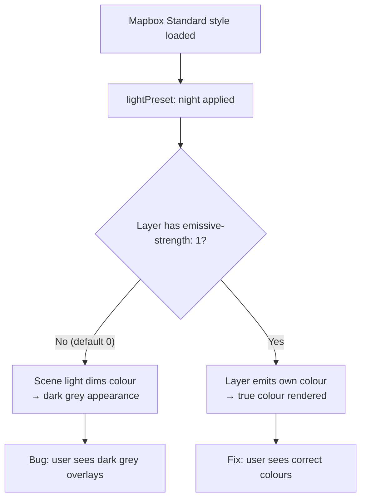

# Design: Fix Map Overlay Color Rendering in Night Mode

## Overview

Map overlay items (route lines, hazard markers, custom drawing features, AOI outlines, coverage circles, roads, railways, etc.) appear dark grey/desaturated when the satellite view is off. The same items render in their true colors when satellite is on. This document analyses the root cause and proposes a fix.

## Detailed Analysis

### Root Cause

The application uses **Mapbox Standard style** (`mapbox://styles/mapbox/standard`) when satellite is off. On `style.load`, it calls:

```ts
map.setConfigProperty("basemap", "lightPreset", "night");
```

In Mapbox GL JS v3+, the Standard style uses a physically-based lighting model. The `lightPreset: "night"` preset reduces scene light intensity dramatically, simulating nighttime. **Every custom layer with default emissive strength (0) participates in this lighting model** — meaning the rendered colour is multiplied by the (very low) scene light intensity, producing a dark, desaturated appearance.

When satellite view is on, the style switches to `mapbox://styles/mapbox/satellite-streets-v12`, which is a legacy Mapbox style that does **not** use the Standard style lighting model. Custom layers in the satellite style render at their true paint colours, which is why the problem disappears.

### Emissive Strength Paint Properties

Mapbox GL JS v3 introduced per-layer emissive-strength properties that control how much a layer participates in the scene lighting:

| Layer type | Property | Default |
|---|---|---|
| `fill` | `fill-emissive-strength` | `0` |
| `line` | `line-emissive-strength` | `0` |
| `circle` | `circle-emissive-strength` | `0` |
| `symbol` (icon) | `icon-emissive-strength` | `0` |
| `symbol` (text) | `text-emissive-strength` | `0` |

- **Value `0`**: Layer colour is fully subject to the scene lighting (dims in night mode).
- **Value `1`**: Layer emits its own colour fully — renders at the exact specified paint colour regardless of lighting.

### Evidence in Existing Code

The developer already applied a workaround for municipality highlight layers at line 1099:

```ts
// slot:"top" renders above Standard style night-mode color pipeline
map.addLayer({ id: "municipality-highlight-fill", ..., slot: "top", ... });
```

Using `slot: "top"` inserts the layer above the Standard style's rendering pipeline. However:

1. This approach was only applied to two municipality highlight layers — all other overlay layers are unaffected.
2. The `slot: "top"` approach changes rendering order (non-slotted layers render above slotted ones), which the developer acknowledged at line 1602–1603 when deliberately keeping route layers slot-less.
3. The emissive-strength approach is semantically correct, doesn't change z-order, and works at any slot position.

### Affected Layers

| Layer ID | Type | Slot | Status |
|---|---|---|---|
| `aoi-fill` | fill | none | Affected |
| `aoi-outline-glow` | line | none | Affected |
| `aoi-outline` | line | none | Affected |
| `aoi-outline-outer` | line | none | Affected |
| `municipalities-fill` | fill | none | Affected |
| `municipalities-outline` | line | none | Affected |
| `municipality-highlight-fill` | fill | top | Workaround applied — add emissive-strength too |
| `municipality-highlight-line` | line | top | Workaround applied — add emissive-strength too |
| `landcover-military` | fill | bottom | Affected (GO/SLOW-GO/NO-GO colors) |
| `contours-minor` | line | bottom | Affected |
| `contours-major` | line | bottom | Affected |
| `contours-labels` (text) | symbol | middle | Affected |
| `roads-line-casing` | line | none | Affected |
| `roads-line` | line | none | Affected |
| `bridges-symbol` | symbol | none | Affected |
| `railways-line` | line | none | Affected |
| `route-line-outline` | line | none | Affected |
| `route-line` | line | none | Affected |
| `route-hazards-info` | circle | none | Affected |
| `route-hazards-warning` | circle | none | Affected |
| `route-hazards-critical` | circle | none | Affected |
| `route-coverage-gaps-line` | line | top | Affected |
| `coverage-circles-fill` | fill | middle | Affected |
| `coverage-circles-line` | line | bottom | Affected |
| `measure-fill` | fill | none | Affected |
| `measure-line` | line | none | Affected |
| `measure-vertices` | circle | none | Affected |
| `custom-layer-{id}-fill` | fill | none | Affected |
| `custom-layer-{id}-line` | line | none | Affected |
| `custom-layer-{id}-circle` | circle | none | Affected |
| `custom-layer-{id}-symbol` | symbol | none | Affected |
| `cell-towers-*` | symbol | top | Working (icon images embed colour) |
| `hillshading` | hillshade | bottom | Intentionally excluded — lighting is desired |

## Alternatives Considered

### Alternative 1: Change `lightPreset` away from `"night"`

Remove or change the `lightPreset: "night"` call so the basemap uses a brighter preset.

**Rejected**: The night preset is intentional — it gives the map the dark military aesthetic the project requires. Removing it would change the basemap appearance dramatically.

### Alternative 2: Move all layers to `slot: "top"`

Change all affected layers to use `slot: "top"` (as was done for municipality highlights).

**Rejected**: Changes rendering z-order. Non-slotted layers render above `slot: "top"` layers; the existing route layer comment (line 1602) relies on this for correct layering. Changing slots would require careful reordering of `addLayer` calls.

### Alternative 3: Add `*-emissive-strength: 1` paint properties (Selected)

Add emissive-strength properties to all custom overlay layers so they render at full brightness regardless of the scene lighting.

**Selected because:**
- Semantically correct — the property was designed exactly for this use case.
- Does not change rendering order or z-ordering.
- Works regardless of slot assignment.
- Surgical change to paint properties only — no layer/source restructuring.
- The satellite style (`satellite-streets-v12`) ignores these properties harmlessly.

## Detailed Design

Add the appropriate `*-emissive-strength: 1` property to the paint object of every affected custom layer in `src/components/MapView.tsx`:

```
fill-emissive-strength: 1    → aoi-fill, municipalities-fill, municipality-highlight-fill,
                                landcover-military, coverage-circles-fill, measure-fill,
                                custom-layer-{id}-fill

line-emissive-strength: 1    → aoi-outline-glow, aoi-outline, aoi-outline-outer,
                                municipalities-outline, municipality-highlight-line,
                                contours-minor, contours-major,
                                roads-line-casing, roads-line, railways-line,
                                route-line-outline, route-line,
                                route-coverage-gaps-line, coverage-circles-line,
                                measure-line, custom-layer-{id}-line

circle-emissive-strength: 1  → route-hazards-info, route-hazards-warning,
                                route-hazards-critical, measure-vertices,
                                custom-layer-{id}-circle

icon-emissive-strength: 1    → bridges-symbol, custom-layer-{id}-symbol

text-emissive-strength: 1    → contours-labels
```

`hillshading` is intentionally excluded — hillshade relies on lighting for its terrain effect.

## Diagram



## Summary

The fix adds `*-emissive-strength: 1` paint properties to all custom overlay layers in `MapView.tsx`. This is a targeted, semantically correct change to ~30 layer definitions in a single file. No component structure, API, or test fixtures change. The `hillshading` layer is intentionally excluded.

## References

- Mapbox GL JS v3 Standard style: https://docs.mapbox.com/mapbox-gl-js/guides/standard-style/
- Emissive strength spec: https://docs.mapbox.com/style-spec/reference/layers/#paint-fill-fill-emissive-strength
- Light presets: https://docs.mapbox.com/mapbox-gl-js/guides/standard-style/#light-presets
