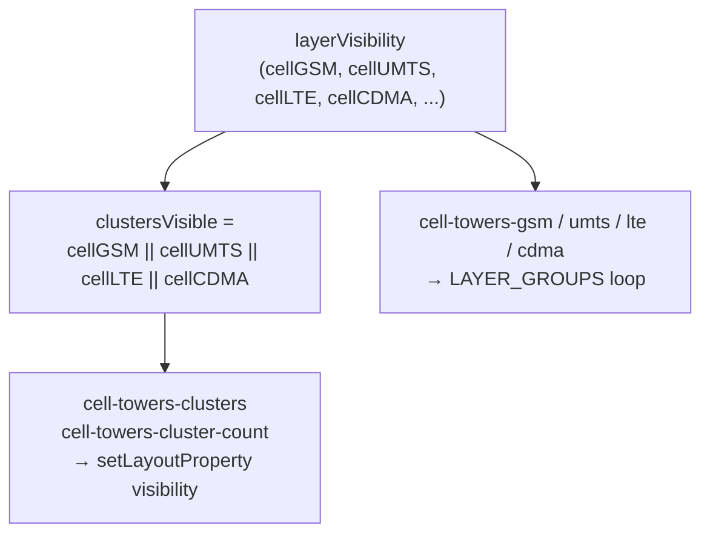

# Design: Fix Cell-Tower Cluster Visibility Sync

## Overview

The `cell-towers-clusters` and `cell-towers-cluster-count` Mapbox layers are never controlled by the COMMS visibility toggles. This causes two related symptoms:

1. Disabling all COMMS types (GSM, UMTS, LTE, CDMA) still shows cluster circles and count labels on the map.
2. Zooming into a visible cluster past `clusterMaxZoom: 14` dissolves the cluster (expected) but reveals nothing underneath, because all per-type layers are `none` — the user sees a cluster "disappear" into empty space.

## Detailed Analysis

### Current layer structure

```
cell-towers-source  (GeoJSON, cluster:true, clusterMaxZoom:14)
  ├── cell-towers-clusters       filter: has(point_count)    ← NOT in LAYER_GROUPS
  ├── cell-towers-cluster-count  filter: has(point_count)    ← NOT in LAYER_GROUPS
  ├── cell-towers-gsm            filter: radio==GSM, !cluster  → LAYER_GROUPS.cellGSM
  ├── cell-towers-umts           filter: radio==UMTS, !cluster → LAYER_GROUPS.cellUMTS
  ├── cell-towers-lte            filter: radio==LTE, !cluster  → LAYER_GROUPS.cellLTE
  └── cell-towers-cdma           filter: radio==CDMA, !cluster → LAYER_GROUPS.cellCDMA
```

The cluster layers have no entry in `LAYER_GROUPS`, so the `layerVisibility` sync `useEffect` never touches them.

### Expected behaviour

| Cell toggles               | Clusters visible | Individual points visible |
|----------------------------|------------------|---------------------------|
| At least one ON            | yes              | per-type toggle            |
| All OFF                    | **no**           | no                        |

The cluster is a visual proxy for grouped individual points of any type. It should follow the logical OR of all four cell-type toggles.

## Alternatives Considered

### A — Add a `cellClusters` `LayerKey`

Add a fifth COMMS key that the user can toggle independently. Rejected: clusters are not a standalone data category — they are a rendering artefact of the individual points. Exposing a separate toggle would confuse users and require syncing logic to keep it coherent with the four type toggles.

### B — Compute `clustersVisible` inline in the visibility sync `useEffect` (chosen)

In the `layerVisibility` `useEffect` (and matching initial `style.load` block), derive:

```ts
const clustersVisible =
  layerVisibility.cellGSM ||
  layerVisibility.cellUMTS ||
  layerVisibility.cellLTE ||
  layerVisibility.cellCDMA;
```

Then call `map.setLayoutProperty` on both cluster layer IDs accordingly. No new `LayerKey` or `LAYER_GROUPS` entry required. This is the minimal targeted fix.

### C — Put cluster IDs into a combined `cellAny` entry in `LAYER_GROUPS`

Would work but requires a new `LayerKey` value, changes to the `LayerVisibility` interface, `DEFAULT_LAYER_VISIBILITY`, and all tests that touch `LAYER_GROUPS`. Disproportionate churn for what is a derived value.

## Detailed Design

### 1. `style.load` — initial cluster visibility

In the `style.load` handler, after adding the cluster layers, set their initial `visibility` based on the same derived boolean used for per-type layers. Currently the cluster layers are added without an explicit `layout` property (defaults to `visible`), so they always start visible. Change to:

```ts
const clustersVisible =
  vis.cellGSM || vis.cellUMTS || vis.cellLTE || vis.cellCDMA;

map.addLayer({
  id: "cell-towers-clusters",
  ...,
  layout: { visibility: clustersVisible ? "visible" : "none" },
  ...
});

map.addLayer({
  id: "cell-towers-cluster-count",
  ...,
  layout: { visibility: clustersVisible ? "visible" : "none" },
  ...
});
```

### 2. `layerVisibility` `useEffect` — live sync

After the existing `LAYER_GROUPS` loop, add:

```ts
const clustersVisible =
  layerVisibility.cellGSM ||
  layerVisibility.cellUMTS ||
  layerVisibility.cellLTE ||
  layerVisibility.cellCDMA;

for (const id of ["cell-towers-clusters", "cell-towers-cluster-count"]) {
  map.setLayoutProperty(id, "visibility", clustersVisible ? "visible" : "none");
}
```

### Data flow diagram



## Summary

Two small additions — one in `style.load` and one in the `layerVisibility` `useEffect` — derive `clustersVisible` from the four cell-type flags and apply it to both cluster layers. No API, library, or interface changes required.

## References

- [Mapbox GL JS — Clusters](https://docs.mapbox.com/mapbox-gl-js/example/cluster/)
- [Mapbox GL JS — setLayoutProperty](https://docs.mapbox.com/mapbox-gl-js/api/map/#map#setlayoutproperty)
- `src/components/MapView.tsx` — current layer setup and visibility sync effect
- `src/lib/layers.ts` — LAYER_GROUPS definition
