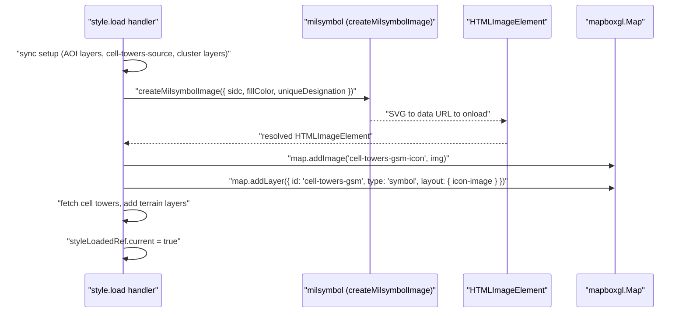

# Design: NATO Milsymbol Cell Tower Markers

## Overview

Replace the current Mapbox GL JS `circle` layers used for individual cell tower markers with NATO military symbols generated by the `milsymbol` library. Each radio type (GSM, UMTS, LTE, CDMA) will render as a color-coded NATO APP-6 signal/radio unit symbol rather than a coloured dot. Cluster bubbles remain as grey circles. The existing layer visibility toggle, source filtering, popup, and cursor-hover behaviour are preserved.

---

## Detailed Analysis

### Current Rendering

`MapView.tsx` adds four `circle`-type Mapbox layers — `cell-towers-gsm`, `cell-towers-umts`, `cell-towers-lte`, `cell-towers-cdma` — each with a static `circle-color` and a 5 px radius. Individual towers are indistinguishable by shape; only colour separates the four types.

### Goal

Render each unclustered tower as a NATO military symbol:

- Visually consistent with the IPB theme
- Shape reinforces the communication nature of the feature
- Colour and a short text label (GSM / UMTS / LTE / CDMA) together identify the radio type

### Constraints

1. **Mapbox GL JS does not support SVG natively** in `icon-image`. Images must be added via `map.addImage(id, HTMLImageElement | ImageData | ImageBitmap)`.
2. **milsymbol outputs SVG strings and Canvas elements.** The simplest cross-browser path is: SVG string → `data:image/svg+xml` URL → `HTMLImageElement` (with `onload`) → `map.addImage()`.
3. **Images must be added before the layers that reference them.** Both must happen inside (or after) the `style.load` event.
4. **Clustering** uses Mapbox's native `cluster:true` GeoJSON source and renders cluster points with a separate `circle` layer — this is unchanged.
5. **Layer visibility toggling** in `MapWithNav` already calls `map.setLayoutProperty(..., 'visibility', ...)` via `LAYER_GROUPS`. Only the layer _type_ changes (circle → symbol); layer IDs stay the same, so `LAYER_GROUPS` needs no changes.

---

## Alternatives Considered

| Approach                                              | Pros                                                   | Cons                                                                | Decision     |
| ----------------------------------------------------- | ------------------------------------------------------ | ------------------------------------------------------------------- | ------------ |
| SVG → data URL → `` → `map.addImage()`           | Simple, no extra deps, works in JSDOM tests with mocks | Async (requires `onload`)                                           | **Selected** |
| `Symbol.asCanvas()` → `map.addImage()`                | Synchronous canvas API                                 | Canvas unavailable in SSR / test environments without extra mocking | Rejected     |
| CSS marker overlay (`mapboxgl.Marker`)                | Easy SVG injection                                     | Poor performance with 2 000+ markers; conflicts with clustering     | Rejected     |
| Custom Mapbox layer via WebGL                         | Maximum perf                                           | Massive complexity, out of scope                                    | Rejected     |
| Keep circles, add Unicode antenna icon as symbol text | Zero new deps                                          | Not a real NATO symbol                                              | Rejected     |

---

## SIDC Code Selection

The milsymbol library supports 15-character APP-6B alphanumeric SIDCs.  
All four cell tower types share the **same base SIDC** — `SFGPUUSR-------` (Friendly, Present, Ground, Signal — Radio Unit) — because:

- There are no NATO symbols specifically for GSM / UMTS / LTE / CDMA.
- Using the same base symbol keeps the silhouette consistent (analysts recognise the symbol class at a glance).
- `colour` + `uniqueDesignation` text label distinguish the radio type.

| Radio type | SIDC              | Fill colour        | Unique designation |
| ---------- | ----------------- | ------------------ | ------------------ |
| GSM        | `SFGPUUSR-------` | `#fde047` (yellow) | `GSM`              |
| UMTS       | `SFGPUUSR-------` | `#fb923c` (orange) | `UMTS`             |
| LTE        | `SFGPUUSR-------` | `#4ade80` (green)  | `LTE`              |
| CDMA       | `SFGPUUSR-------` | `#c4b5fd` (purple) | `CDMA`             |

If the SIDC does not render as expected (milsymbol returns a degenerate SVG), the fallback is `SFGPUUS--------` (Signal Unit, generic), which is the parent entry in the APP-6B hierarchy.

---

## Detailed Design

### New utility: `src/lib/milsymbol.ts`

```ts
import ms from "milsymbol";

export interface MilsymbolOptions {
  sidc: string;
  size?: number; // symbol pixel size fed to milsymbol (default 40)
  fillColor?: string; // hex colour applied to symbol fill
  uniqueDesignation?: string; // short text label rendered inside the frame
}

/**
 * Returns an HTMLImageElement promise resolved from a milsymbol SVG.
 */
export function createMilsymbolImage(
  opts: MilsymbolOptions,
): Promise<HTMLImageElement> {
  const { sidc, size = 40, fillColor, uniqueDesignation } = opts;
  const sym = new ms.Symbol(sidc, {
    size,
    ...(fillColor ? { fillColor } : {}),
    ...(uniqueDesignation ? { uniqueDesignation } : {}),
  });
  const svg = sym.asSVG();
  return new Promise((resolve, reject) => {
    const img = new Image();
    img.onload = () => resolve(img);
    img.onerror = reject;
    img.src = `data:image/svg+xml;charset=utf-8,${encodeURIComponent(svg)}`;
  });
}
```

### Changes to `src/components/MapView.tsx`

#### 1. Import the utility

```ts
import { createMilsymbolImage } from "@/lib/milsymbol";
```

#### 2. Add images then layers (inside `style.load`)

```ts
const TOWER_CONFIGS = [
  {
    id: "cell-towers-gsm",
    radio: "GSM",
    color: "#fde047",
    visible: vis.cellGSM,
  },
  {
    id: "cell-towers-umts",
    radio: "UMTS",
    color: "#fb923c",
    visible: vis.cellUMTS,
  },
  {
    id: "cell-towers-lte",
    radio: "LTE",
    color: "#4ade80",
    visible: vis.cellLTE,
  },
  {
    id: "cell-towers-cdma",
    radio: "CDMA",
    color: "#c4b5fd",
    visible: vis.cellCDMA,
  },
] as const;

const SIDC = "SFGPUUSR-------";

await Promise.all(
  TOWER_CONFIGS.map(({ id, radio, color }) =>
    createMilsymbolImage({
      sidc: SIDC,
      fillColor: color,
      uniqueDesignation: radio,
    }).then((img) => map.addImage(`${id}-icon`, img)),
  ),
);

for (const { id, radio, visible } of TOWER_CONFIGS) {
  map.addLayer({
    id,
    type: "symbol",
    source: "cell-towers-source",
    filter: [
      "all",
      ["!", ["has", "point_count"]],
      ["==", ["get", "radio"], radio],
    ],
    layout: {
      visibility: visible ? "visible" : "none",
      "icon-image": `${id}-icon`,
      "icon-size": 0.6,
      "icon-allow-overlap": true,
    },
  });
}
```

Because `style.load` becomes async, it is wrapped as an `async` arrow:

```ts
map.on("style.load", async () => { ... });
```

#### 3. No changes to `LAYER_GROUPS`, popup, moveend, or visibility sync effect

The layer IDs (`cell-towers-gsm`, etc.) are unchanged, so all downstream logic remains identical.

### Mapbox image naming

| Layer ID           | Image key               |
| ------------------ | ----------------------- |
| `cell-towers-gsm`  | `cell-towers-gsm-icon`  |
| `cell-towers-umts` | `cell-towers-umts-icon` |
| `cell-towers-lte`  | `cell-towers-lte-icon`  |
| `cell-towers-cdma` | `cell-towers-cdma-icon` |

---

## Architecture Diagram



---

## Test Strategy

- **`src/lib/milsymbol.ts`**: Unit-test `createMilsymbolImage` with `vi.mock("milsymbol")` and a mock `Image` class that auto-fires `onload`. Verify the SVG data URL is set on `img.src` and the resolved value is the image.
- **`MapView.tsx`**: The existing Mapbox mock stubs `addImage`. Add assertions that `addImage` is called 4 times (once per radio type). Change circle-layer assertions to symbol-layer assertions (`icon-image` layout property; no `circle-radius` paint property).

---

## Summary

- Install `milsymbol` npm package (TypeScript types are included).
- Add `src/lib/milsymbol.ts` — thin async wrapper around `ms.Symbol(...).asSVG()` → `HTMLImageElement`.
- In `MapView.tsx`, convert the four per-radio-type `circle` layers to `symbol` layers, pre-loading the milsymbol SVG into Mapbox with `map.addImage()`.
- All existing logic (clustering, visibility toggle, popup, source filtering, terrain layers) is unchanged.
- Tests are updated to reflect the new layer type and the new `addImage` calls.

---

## References

- milsymbol npm: https://www.npmjs.com/package/milsymbol
- milsymbol GitHub: https://github.com/spatialillusions/milsymbol
- Mapbox GL JS `addImage` docs: https://docs.mapbox.com/mapbox-gl-js/api/map/#map#addimage
- NATO APP-6B SIDC structure: https://docs.carmenta.com/pages/app6b_sidc.html
- SVG to Mapbox addImage pattern: https://gist.github.com/ryanhamley/3d6844349ae27cae3a087b028228f8cf
