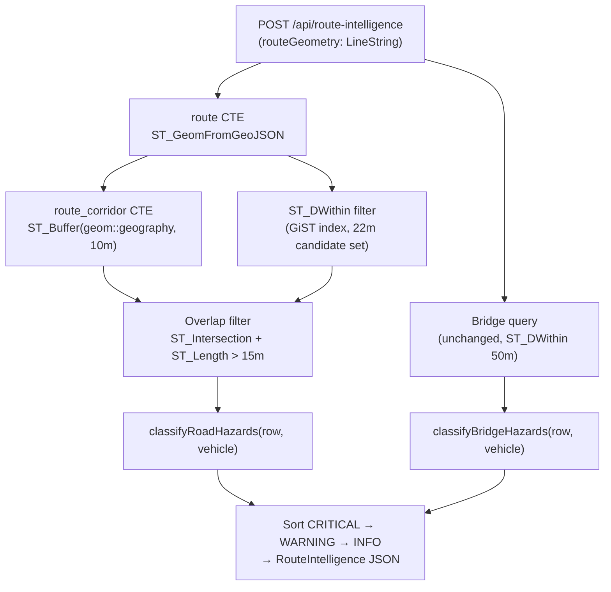

# Design: Route-Intelligence Road Query — Overlap Filter

## Overview

The `POST /api/route-intelligence` endpoint analyses a planned route for vehicle hazards
by querying the `roads` and `bridges` PostGIS tables. The current roads query matches
**any** road segment whose geometry comes within ~22 m of the route line. Because roads
branch off the main road at junctions, their starting point has **zero distance** from
the route, so every bad-condition side road gets flagged — even though the vehicle never
travels on it. This document describes the cause in detail and proposes an
overlap-length filter as the fix.

---

## Detailed Analysis of the Problem

### Current query

```sql
SELECT DISTINCT ON (link_id)
  ...
  ST_AsGeoJSON(ST_Centroid(geom)) AS closest_pt
FROM roads, ST_GeomFromGeoJSON($1) AS route_geom
WHERE ST_DWithin(geom, route_geom, 0.0004)
ORDER BY link_id
LIMIT 500
```

`0.0004` degrees ≈ 22 m at 60 °N latitude.

### Why side roads are incorrectly included

`ST_DWithin` returns `true` when **any** point on road geometry `A` is within the given
distance of route geometry `B`. At a road junction the side road shares exactly the
junction vertex with the main road. The junction vertex lies **on** the route line
(distance = 0), so `ST_DWithin` is always satisfied for any road that branches from
the route, regardless of angle or condition.

```
Main route (vehicle travels east): ──────────────────────────────→
                                             │
                Bad side road (north):       │  (junction vertex on route → distance = 0 → flagged)
                                             │
```

### Why reducing the buffer threshold alone does not fix it

Even reducing the threshold to 1 m or 0 m, the junction vertex remains exactly 0 m
from the route, so the side road is still returned. The root issue is geometric, not
about the threshold value.

### Roads vs bridges

Bridges are stored as **POINTs** (`GEOMETRY(POINT, 4326)`), not line strings. A bridge
point is placed AT the bridge structure; it does not share vertices with road junctions.
The 50 m buffer for bridges is appropriate for catching bridges the vehicle actually
crosses. **No change to the bridge query is needed.**

---

## Alternatives Considered

### Alt 1: Reduce `ST_DWithin` threshold (rejected)

Reducing from 0.0004° to a smaller value does not help because the junction vertex is
always at distance 0. Side roads are still matched. A very small threshold would also
miss valid road segments whose Digiroad geometry is offset from the Mapbox route
centre-line.

### Alt 2: Angular (azimuth) filter (rejected as primary fix)

Compute the angle between the road segment and the route at the closest point. Exclude
roads whose angle to the route exceeds, say, 45°.

Pros: conceptually correct; independent of segment length.  
Cons: complex multi-step SQL (`ST_Azimuth`, `ST_LineLocatePoint`,
`ST_LineInterpolatePoint`); sensitive to very short segments or curved roads; brittle
near segment endpoints.

### Alt 3: Overlap fraction (rejected — unstable for short segments)

Require that at least X % of the road segment falls inside a corridor buffer.  
Problem: a short access stub entirely within the buffer (e.g., 8 m total) would satisfy
100 % overlap even though it is not the route being travelled. Fraction also has a
divide-by-zero edge case for zero-length geometries.

### Alt 4: Functional-class filter (supplementary, not primary)

Digiroad stores a `functional_class` column (1 = national highway, 5 = private road).
Filtering to higher classes would reduce noise but would hide bad conditions on
low-class roads that the Mapbox-routed path might actually traverse in rural Finland.
Not the right primary fix.

### Alt 5: Overlap-length filter (selected)

Buffer the route line by R metres to create a **corridor polygon**, then compute the
intersection of each candidate road segment with that corridor. Keep only roads where
the intersection length exceeds a minimum threshold T.

**Why this works:**

A perpendicular side road that branches at a junction enters the corridor at distance 0
and exits after approximately R metres → intersection ≈ R m.  
A road running alongside the route is inside the corridor for its full segment length
(tens to hundreds of metres) → intersection >> T.

**Geometry table (R = 10 m, T = 15 m):**

| Road angle to route | Approx. intersection inside 10 m corridor | Passes T = 15 m? |
|---------------------|------------------------------------------|-------------------|
| 90° (perpendicular) | ≈ 10 m                                   | No ✓ filtered     |
| 75°                 | ≈ 10.4 m                                 | No ✓ filtered     |
| 60°                 | ≈ 11.5 m                                 | No ✓ filtered     |
| 45°                 | ≈ 14.1 m                                 | No ✓ filtered     |
| 30° (merge/fork)    | ≈ 20 m                                   | Yes — acceptable  |
| 0° (parallel road)  | full segment length                      | Yes ✓ included    |

Roads at ≤ 30° to the route are typically merge ramps or route forks — relevant hazards.

**Secondary improvement: `ST_ClosestPoint` instead of `ST_Centroid`**

The current query returns `ST_Centroid(geom)` for the hazard marker. For roads that
run alongside but not centered on the route, the centroid can be far from where the
hazard is relevant. `ST_ClosestPoint(r.geom, rt.geom)` returns the point on the road
that is geometrically closest to the route — a more accurate location for the hazard
dot shown on the map.

---

## Detailed Design

### Query change (roads only)

Replace the current roads query with a CTE-based query that:

1. Materialises `route` (the parsed GeoJSON LineString geometry) — evaluated once.
2. Materialises `route_corridor` (a 10 m geography buffer cast back to geometry) —
   evaluated once.
3. Applies the existing `ST_DWithin` filter as a fast GiST-indexed first pass.
4. Applies the overlap-length filter as a second-pass refinement:
   `ST_Length(ST_Intersection(r.geom, rc.geom)::geography) > 15`
5. Returns `ST_ClosestPoint(r.geom, rt.geom)` instead of `ST_Centroid(r.geom)`.

```sql
WITH route AS (
  SELECT ST_GeomFromGeoJSON($1) AS geom
),
route_corridor AS (
  SELECT ST_Buffer(geom::geography, 10)::geometry AS geom
  FROM route
)
SELECT DISTINCT ON (r.link_id)
  r.id, r.link_id, r.aoi_id,
  r.max_mass_kg, r.max_height_cm, r.max_bogie_mass_kg, r.max_axle_mass_kg,
  r.width_cm, r.pavement_type, r.has_damage, r.damage_recurring,
  r.condition_class, r.condition_text, r.rut_depth_mm,
  ST_AsGeoJSON(ST_ClosestPoint(r.geom, rt.geom)) AS closest_pt
FROM roads r
CROSS JOIN route rt
CROSS JOIN route_corridor rc
WHERE ST_DWithin(r.geom, rt.geom, 0.0004)
  AND ST_Length(ST_Intersection(r.geom, rc.geom)::geography) > 15
ORDER BY r.link_id
LIMIT 500
```

### No TypeScript changes required

SQL column aliases (`closest_pt`, etc.) remain identical. `RoadRow` interface and all
hazard-classification logic are unchanged. Only the SQL string inside `query<RoadRow>()`
changes.

### No bridge query change

The bridge query already works correctly for point geometries and is unchanged.

### Performance characteristics

| Step | Cost | Notes |
|------|------|-------|
| `ST_DWithin(r.geom, rt.geom, 0.0004)` | Fast — uses GiST index | Same as before |
| `ST_Buffer(geom::geography, 10)` | One-time, CTE | Computed once per request |
| `ST_Intersection + ST_Length` | Per candidate road only | Runs only on GiST-filtered set (≤ 500 rows) |

The `CROSS JOIN route` and `CROSS JOIN route_corridor` each join exactly one row, so
they add no Cartesian product overhead. The planner treats them as constant expressions.

### Constants

| Constant | Value | Rationale |
|----------|-------|-----------|
| Corridor radius R | 10 m | Wider than a single lane (≈ 3.5 m); tolerates Digiroad/Mapbox geometry offset |
| Minimum overlap T | 15 m | Filters perpendicular (≈ 10 m) and steep diagonal (≈ 14 m) side roads |
| `ST_DWithin` threshold | 0.0004° (≈ 22 m) | Unchanged; provides GiST-indexed candidate set |

---

## Architecture Diagram



---

## Summary

The fix is a **single SQL query change** in `src/app/api/route-intelligence/route.ts`.
No TypeScript types, no test fixtures, no bridge query, no UI components change.

- Add `WITH route / route_corridor` CTEs to materialise the 10 m corridor once.
- Add `AND ST_Length(ST_Intersection(r.geom, rc.geom)::geography) > 15` to reject
  roads that only touch the route at a junction.
- Change `ST_Centroid(geom)` → `ST_ClosestPoint(r.geom, rt.geom)` for accurate
  hazard marker placement.

The unit tests mock `query` at the DB layer and verify hazard-classification logic, not
the SQL text — so **no test changes are required** for the query fix. We will add a
brief inline comment documenting the overlap constant.

---

## References

- PostGIS `ST_Intersection`: https://postgis.net/docs/ST_Intersection.html
- PostGIS `ST_Buffer` (geography): https://postgis.net/docs/ST_Buffer.html
- PostGIS `ST_Length` (geography): https://postgis.net/docs/ST_Length.html
- PostGIS `ST_ClosestPoint`: https://postgis.net/docs/ST_ClosestPoint.html
- PostGIS `ST_DWithin` (index use): https://postgis.net/docs/ST_DWithin.html
- Digiroad data model: https://vayla.fi/en/transport-network/data/digiroad
