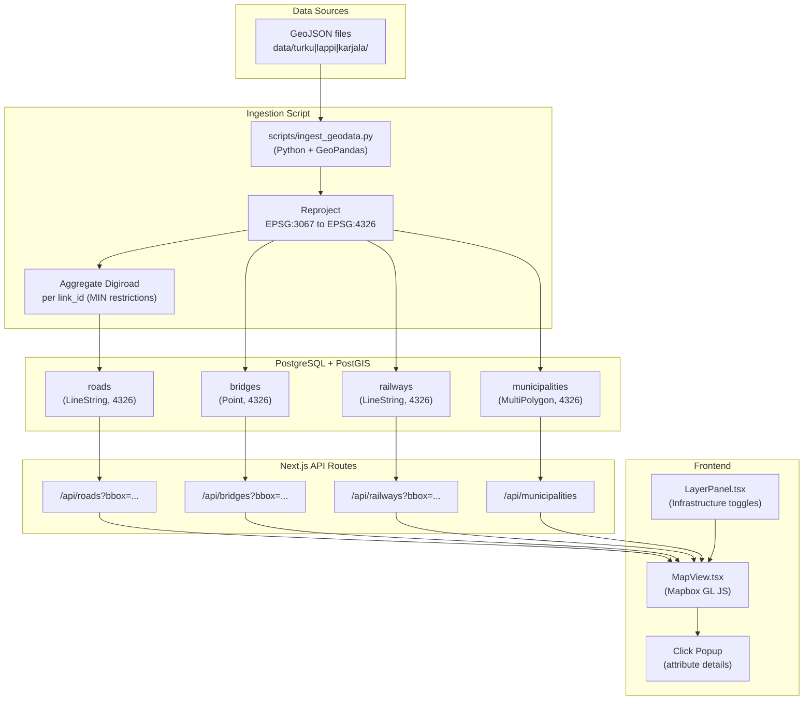
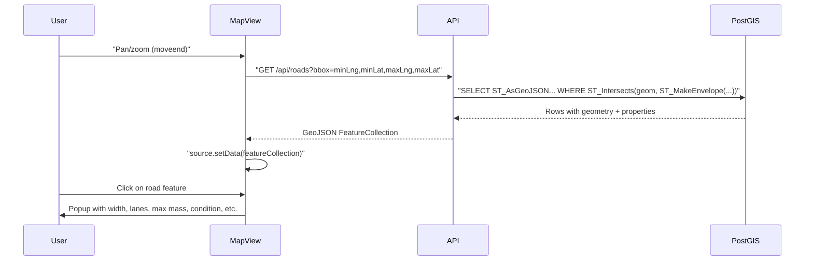

# Modification Design: GeoJSON Data Ingestion & Infrastructure Overlays

## Overview

This modification ingests regional GeoJSON infrastructure data (51 files across 3 AOIs) into PostGIS and exposes it as interactive map overlays. Priority layers: **roads** (consolidated from 8+ Digiroad attribute files), **bridges** (with military-relevant weight/height limits), **railways**, and **municipality boundaries**. Each layer features click-to-popup interaction showing all military-relevant attributes.

---

## Detailed Analysis

### Data Inventory

The `data/` folder contains files from three Finnish open-data providers:

| Provider | File Prefix | Type | Regions |
|---|---|---|---|
| Digiroad (FTIA) | `digiroad_dr_*` | Road attributes (LineString, EPSG:3067) | All 3 |
| Digiroad (FTIA) | `digiroad_dr_tielinkki_*` | Road network base geometry | Lappi, Karjala |
| Väylävirasto | `taitorakenteet_*` | Bridges & tunnels (Point, EPSG:3067) | All 3 |
| Väylävirasto | `ratatiedot_locationtracks.json` | Railway tracks (LineString, EPSG:3067) | Turku, Karjala |
| Väylävirasto | `vesivaylatiedot_vaylat_uusi.json` | Waterways (LineString, EPSG:3067) | Turku, Karjala |
| NLS Finland | `paikkatiedot_kuntarajat_10k.json` | Municipality polygons (MultiPolygon, EPSG:3067) | All 3 |
| NLS Finland | `tiestotiedot_*` | Road condition data (LineString/Point, EPSG:3067) | All 3 |

**Coordinate system**: All files use **EPSG:3067** (Finnish National Grid, ETRS-TM35FIN). Must reproject to **EPSG:4326** (WGS84) for PostGIS/Mapbox consumption.

### Digiroad Linear Referencing Model

Digiroad uses a **linear referencing** data model:
- Each road link has a UUID `link_id` and a full LineString geometry
- Attribute files (max weight, width, etc.) contain sub-segments defined by `alku_m` (start meters) and `loppu_m` (end meters) along the parent link
- The same link_id can appear in multiple attribute files with different ranges and values
- Not all roads have all attribute types (e.g., most roads have no official weight restriction)

For hackathon purposes, we **aggregate per link_id** (taking the most restrictive value — min for limits, any for flags). This is actually the correct military approach: show worst-case constraint along the route.

### Key Data Schemas

#### Digiroad attribute files (common to all regions)
| File | Property | Meaning |
|---|---|---|
| `dr_leveys` | `arvo` | Road width in cm |
| `dr_kaistojen_lukumaara` | `arvo` | Lane count |
| `dr_max_korkeus` | `arvo` | Max height in cm |
| `dr_max_massa` | `arvo` | Max vehicle mass in kg |
| `dr_max_telimassa` | `arvo` | Max bogie mass in kg |
| `dr_max_akselimassa` | `arvo` | Max axle mass in kg (Turku/Karjala) |
| `dr_paallystetty_tie` | `arvo` | Pavement type (1=asphalt, 2=gravel, 3=dirt) |
| `dr_kelirikko` | `arvo` | Surface damage code |
| `dr_tielinkki_silta_alikulku_tunneli` | `silta_alik` | Structure flag (0=none, 1=bridge, 2=underpass, 3=tunnel) |

#### Bridge properties (taitorakenteet_silta)
Key military fields: `ajoneuvon_suurin_sallittu_massa` (max vehicle mass, tonnes), `ajoneuvoyhdistelman_suurin_sallittu_massa` (max combination mass, tonnes), `ajoneuvon_suurin_sallittu_telille_kohdistuva_massa` (max bogie mass), `korkeusrajoitus` (height restriction), `tila` (status: in use/demolished).

---

## Alternatives Considered

### A. Separate table per Digiroad attribute file
**Pros**: Faithful to source data, preserves sub-segment granularity.  
**Cons**: Frontend must JOIN 8+ tables to show one popup; complex API; overkill for tactical planning where worst-case matters.  
**Decision**: Rejected.

### B. PostGIS materialized view joining attribute tables
**Pros**: Best of both worlds — raw tables stay normalized, view provides denormalized access.  
**Cons**: Adds complexity; requires maintaining raw + view tables; overkill for hackathon scale.  
**Decision**: Rejected for now.

### C. One unified roads table (chosen)
**Pros**: Simple API, simple frontend popup, single query per bbox, natural fit for Mapbox GeoJSON layer.  
**Cons**: Loses sub-segment granularity (acceptable for tactical overview).  
**Decision**: Adopted. Aggregate per `link_id`: MIN for limits, first non-null for descriptive attributes.

### D. Load all regions into one table vs. separate tables per region
**Decision**: One table per layer type with `aoi_id` column. Same query can filter by region, and the bbox query already constrains geography.

---

## Detailed Design

### Database Schema

```sql
-- Roads: consolidated from all Digiroad attribute files, one row per road link segment
CREATE TABLE roads (
    id           SERIAL PRIMARY KEY,
    link_id      TEXT    NOT NULL,
    aoi_id       TEXT    NOT NULL,       -- 'turku' | 'lappi' | 'karjala'
    geom         GEOMETRY(LINESTRING, 4326) NOT NULL,
    -- from dr_tielinkki (Lappi/Karjala) or inferred
    admin_class      INTEGER,            -- hallinn_lk: 1=national, 2=regional, 3=municipal, 4=private
    functional_class INTEGER,            -- toiminn_lk: 1=motorway ... 6=private
    has_structure    INTEGER,            -- silta_alik: 0=none, 1=bridge, 2=underpass, 3=tunnel
    -- movement restrictions (aggregated: MIN per link)
    max_mass_kg      INTEGER,            -- max vehicle mass in kg
    max_height_cm    INTEGER,            -- max vehicle height in cm
    max_bogie_mass_kg INTEGER,           -- max bogie/teli mass in kg
    max_axle_mass_kg  INTEGER,           -- max axle mass in kg
    -- road characteristics (first value per link)
    width_cm     INTEGER,                -- road width in cm
    lane_count   INTEGER,                -- number of lanes
    pavement_type INTEGER,               -- 1=asphalt, 2=gravel, 3=dirt/other
    -- condition
    has_damage   BOOLEAN DEFAULT FALSE,
    damage_recurring BOOLEAN DEFAULT FALSE,
    condition_class INTEGER,             -- 1-5 from paallysteiden_kunto
    condition_text TEXT,
    rut_depth_mm NUMERIC,
    ride_quality INTEGER
);
CREATE INDEX roads_geom_idx ON roads USING GIST(geom);
CREATE INDEX roads_aoi_idx ON roads (aoi_id);

-- Bridges: from taitorakenteet_silta, active structures only
CREATE TABLE bridges (
    id              SERIAL PRIMARY KEY,
    bridge_src_id   INTEGER,             -- original numeric id
    oid             TEXT,
    name            TEXT,
    code            TEXT,                -- tunnus (T-NNNN)
    status          TEXT,                -- 'kaytossa' | 'purettu' | 'poistettu'
    aoi_id          TEXT    NOT NULL,
    geom            GEOMETRY(POINT, 4326) NOT NULL,
    max_vehicle_mass_t   NUMERIC,        -- tonnes
    max_bogie_mass_t     NUMERIC,
    max_combination_mass_t NUMERIC,
    max_axle_mass_t      NUMERIC,
    height_restriction_m NUMERIC,
    type_name       TEXT,
    owner           TEXT,
    municipalities  TEXT,
    road_address    TEXT,
    network_type    TEXT,                -- 'Tieverkko' | 'Rataverkko'
    updated_date    DATE
);
CREATE INDEX bridges_geom_idx ON bridges USING GIST(geom);

-- Railways: from ratatiedot_locationtracks
CREATE TABLE railways (
    id              SERIAL PRIMARY KEY,
    track_src_id    INTEGER,
    oid             TEXT,
    name            TEXT,
    description     TEXT,
    track_type      TEXT,               -- 'turvaraide', 'paারaide', etc.
    state           TEXT,               -- 'IN USE', 'OUT OF USE'
    aoi_id          TEXT    NOT NULL,
    geom            GEOMETRY(LINESTRING, 4326) NOT NULL,
    route_name      TEXT,
    length_m        NUMERIC,
    start_km        INTEGER,
    end_km          INTEGER,
    maintenance_district TEXT,
    operating_centre TEXT
);
CREATE INDEX railways_geom_idx ON railways USING GIST(geom);

-- Municipality boundaries: from paikkatiedot_kuntarajat_10k
CREATE TABLE municipalities (
    id          SERIAL PRIMARY KEY,
    nat_code    TEXT,
    name_fi     TEXT,
    name_sv     TEXT,
    aoi_id      TEXT NOT NULL,
    geom        GEOMETRY(MULTIPOLYGON, 4326) NOT NULL
);
CREATE INDEX municipalities_geom_idx ON municipalities USING GIST(geom);
```

### Python Ingestion Script

**Location**: `scripts/ingest_geodata.py`

**Dependencies**: `geopandas`, `psycopg2-binary`, `shapely`, `python-dotenv`

**Strategy**:
1. Load `.env.local` to get `DATABASE_URL`
2. Connect to PostgreSQL + verify PostGIS extension
3. Drop & recreate tables (idempotent re-run)
4. For each region (`turku`, `lappi`, `karjala`):
   - **Roads**: Load each Digiroad attribute file; reproject to EPSG:4326; aggregate per `link_id` (MIN for numeric restrictions, first for descriptive); use the geometry from the file with the most features (`dr_kaistojen_lukumaara`) as the road geometry base; join attributes from all other files; insert into `roads`
   - **Bridges**: Parse property fields (semicolon/comma-delimited weight strings); reproject Point geometry; insert into `bridges`
   - **Railways**: Reproject LineString; insert into `railways`
   - **Municipalities**: Reproject MultiPolygon; insert into `municipalities`
5. Print a summary (rows inserted per table)

**Geometry reprojection**: Use `gdf.to_crs(epsg=4326)` (GeoPandas handles EPSG:3067 → EPSG:4326 natively via pyproj).

**Bridge weight parsing**: The `painorajoitukset` field is a delimited string like `ajoneuvonSuurinSallittuTelilleKohdistuvaMassa:arvo:18,yksikko:tonni,...`. Parse by splitting on commas and extracting `arvo` values for each field name. Individual typed columns (`ajoneuvon_suurin_sallittu_massa` etc.) are also present as direct properties and preferred.

### API Routes

New endpoints following the existing pattern from `cell-towers/route.ts`:

| Route | Table | Max features | Notes |
|---|---|---|---|
| `GET /api/roads?bbox=...` | `roads` | 5000 | Ordered by road significance |
| `GET /api/bridges?bbox=...` | `bridges` | unlimited | All bridges in bbox |
| `GET /api/railways?bbox=...` | `railways` | unlimited | All tracks in bbox |
| `GET /api/municipalities` | `municipalities` | unlimited | No bbox — static layer |

All routes: reuse `parseBbox` from `features/route.ts`, graceful degradation when `DATABASE_URL` absent, `ST_Intersects` + `ST_MakeEnvelope` + `ST_AsGeoJSON`.

### Layer System Updates

**New `LayerKey` values** (added to `src/lib/layers.ts`):
```
roads, bridges, railways, municipalities
```

**New `DEFAULT_LAYER_VISIBILITY` entries**: all `true` except municipalities (`false` by default to avoid visual clutter).

**New `LAYER_GROUPS` entries**:
- `roads` → `['roads-line']`
- `bridges` → `['bridges-symbol']`
- `railways` → `['railways-line']`
- `municipalities` → `['municipalities-fill', 'municipalities-outline']`

### MapView Layer Rendering

**Roads** (`roads-line`):
- Type: `line`
- Color expression: data-driven by `condition_class`:
  - 1-2 (bad): red `#ef4444`
  - 3 (fair): yellow `#eab308`
  - 4-5 (good): green `#22c55e`
  - null (unknown): grey `#64748b`
- Width: 2px, increases to 4px at zoom > 12

**Bridges** (`bridges-symbol`):
- Type: `symbol`
- NATO milsymbol icons registered via `map.addImage()` using `createMilsymbolImage`
- SIDC: `SFGPIBE--------` (Friendly Ground Installation Bridge/Engineering)
- Active bridges: yellow fill `#facc15`; demolished/removed: grey `#94a3b8`
- Two images registered: `bridge-active` and `bridge-inactive`
- Icon size: 0.5 (same scale as cell tower symbols)

**Railways** (`railways-line`):
- Type: `line`
- Color: `#a78bfa` (purple)
- Width: 2px
- Dasharray: `[2, 2]`

**Municipalities** (`municipalities-fill` + `municipalities-outline`):
- Fill: white `#ffffff` opacity 0.05
- Outline: white `#ffffff` opacity 0.4, width 1px

### Click Popup Formats

**Road popup**:
```
Road Segment
Width: 650 cm  |  Lanes: 2
Max Mass: 8,000 kg  |  Max Height: 420 cm
Pavement: Asphalt  |  Condition: Good (4)
Damage: None
```

**Bridge popup**:
```
Alhon silta (T-1380)
Type: Vesistösilta  |  Status: In use
Max Vehicle: 35 t  |  Max Combination: 60 t
Max Bogie: 18 t  |  Height limit: —
Owner: Väylävirasto
Road: tienumero:12499...
```

**Railway popup**:
```
PO V003-P
Paimio raide: V003-P V003 - Puskin
Type: turvaraide  |  State: IN USE
Route: 001  |  Length: 71 m
District: Etelä-Suomi
```

**Municipality popup**:
```
Parainen / Pargas
```

### LayerPanel Updates

New **"INFRASTRUCTURE"** section with:
- Roads (amber dot)
- Bridges (orange dot)
- Railways (purple dot)
- Municipalities (white dot)

---

## Architecture Diagram



### Popup Data Flow



---

## Summary

- **1 Python ingestion script** (`scripts/ingest_geodata.py`) reads all 51 GeoJSON files, reprojects from EPSG:3067 to EPSG:4326, aggregates Digiroad attributes per `link_id`, and loads 4 PostGIS tables
- **4 new API routes** serve GeoJSON for the new layers with bbox filtering
- **4 new layer keys** extend the existing layer system in `layers.ts`
- **MapView** gains 4 new source+layer groups and click-popup handlers for each
- **LayerPanel** gains a new "INFRASTRUCTURE" section

---

## References

- [Digiroad data model documentation](https://vayla.fi/en/transport-network/data/digiroad/data)
- [EPSG:3067 Finnish National Grid](https://epsg.io/3067)
- [GeoPandas CRS reprojection guide](https://geopandas.org/en/stable/docs/user_guide/projections.html)
- [PostGIS ST_Intersects reference](https://postgis.net/docs/ST_Intersects.html)
- [Mapbox GL JS GeoJSON sources](https://docs.mapbox.com/mapbox-gl-js/style-spec/sources/#geojson)
- [Mapbox line layer styling](https://docs.mapbox.com/mapbox-gl-js/style-spec/layers/#line)
