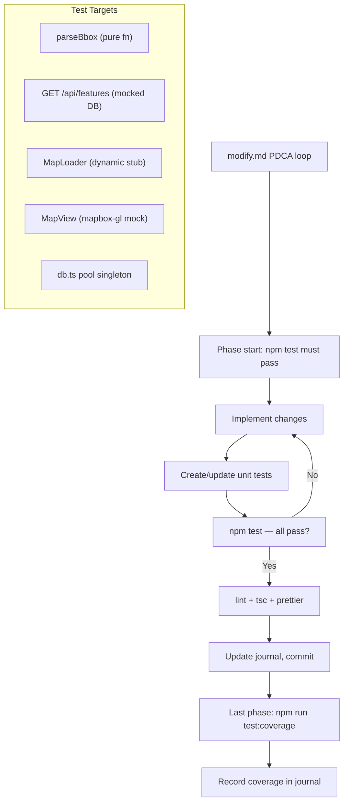

# Design Document: Testing Infrastructure for Aurora IPB

## Overview

Set up Vitest as the testing framework for the Aurora Next.js 16 project, write an initial suite of unit tests for existing code, and update the `/modify` command's PDCA loop in `.claude/commands/modify.md` to make testing a first-class step in the Act and Check phases.

---

## Detailed Analysis

### Current State

The project has no test runner, no test files, and no `test` script in `package.json`. The PDCA loop in `modify.md` mentions running tests, but since no framework exists those steps are always no-ops. This creates a gap where code can regress silently.

### Files to Test (Existing Code)

| File                            | Testable Surface                                                                 |
| ------------------------------- | -------------------------------------------------------------------------------- |
| `src/app/api/features/route.ts` | `parseBbox` (pure logic), `GET` handler (mock DB, mock env)                      |
| `src/lib/db.ts`                 | Pool singleton initialisation (guard against double-create), `query` passthrough |
| `src/components/MapLoader.tsx`  | Renders without crashing; renders the loading placeholder on first paint         |
| `src/components/MapView.tsx`    | Mounts container div; skips map init when `mapboxgl` is mocked                   |

### Constraints

- `mapbox-gl` accesses `window` at module import time — must be mocked at the Vitest module level before any import of `MapView`.
- Async Server Components (Next.js App Router) cannot be rendered by Vitest/RTL; only Client Components (`'use client'`) are tested here.
- `src/lib/db.ts` creates a real `pg.Pool` at import time when `DATABASE_URL` is set; tests must run with `DATABASE_URL` unset or mock the `pg` module.

---

## Alternatives Considered

| Option                    | Pros                                                                                             | Cons                                                                            |
| ------------------------- | ------------------------------------------------------------------------------------------------ | ------------------------------------------------------------------------------- |
| **Jest**                  | Next.js official docs, huge ecosystem                                                            | Slow (CJS transform), complex ESM config, extra `jest.config.js` boilerplate    |
| **Vitest** (chosen)       | Native ESM, `vite-tsconfig-paths` handles `@/` aliases, very fast cold start, same `vi.mock` API | Slightly newer; mapbox-gl canvas mock needed                                    |
| **Playwright** (E2E only) | Tests real browser, catches visual regressions                                                   | Slow, overkill for pure-logic unit tests; good complement but not a replacement |

---

## Detailed Design

### Package Changes

```
devDependencies added:
  vitest
  @vitejs/plugin-react
  @testing-library/react
  @testing-library/dom
  @testing-library/user-event
  @testing-library/jest-dom     ← custom matchers (toBeInTheDocument, etc.)
  vite-tsconfig-paths           ← resolves @/ path alias
  jsdom                         ← browser-like env for component tests
```

### `vitest.config.ts` (project root)

```typescript
import { defineConfig } from "vitest/config";
import react from "@vitejs/plugin-react";
import tsconfigPaths from "vite-tsconfig-paths";

export default defineConfig({
  plugins: [react(), tsconfigPaths()],
  test: {
    environment: "jsdom",
    globals: true,
    setupFiles: ["./src/test/setup.ts"],
  },
});
```

### `src/test/setup.ts` (global test setup)

```typescript
import "@testing-library/jest-dom";
```

### `package.json` scripts added

```json
"test": "vitest run",
"test:watch": "vitest",
"test:coverage": "vitest run --coverage"
```

### Mock Strategy

**`mapbox-gl`** — mocked at module level so `MapView` never touches `window.WebGLRenderingContext`:

```typescript
vi.mock("mapbox-gl", () => ({
  default: {
    Map: vi.fn(() => ({
      addControl: vi.fn(),
      remove: vi.fn(),
    })),
    NavigationControl: vi.fn(),
    accessToken: "",
  },
}));
```

**`@/lib/db`** — mocked in API route tests so no real `pg.Pool` is created:

```typescript
vi.mock("@/lib/db", () => ({ query: vi.fn() }));
```

**`next/dynamic`** — mocked in `MapLoader` tests to return a simple stub:

```typescript
vi.mock("next/dynamic", () => ({
  default: () => () => <div data-testid="map-stub" />,
}));
```

### Test File Layout

```
src/
└── test/
    ├── setup.ts                             ← global jest-dom matchers
    ├── api/
    │   └── features.test.ts                 ← parseBbox + GET handler
    ├── lib/
    │   └── db.test.ts                       ← pool singleton guard
    └── components/
        ├── MapLoader.test.tsx               ← dynamic import stub
        └── MapView.test.tsx                 ← mapbox-gl mock + mount
```

### `modify.md` PDCA Loop Changes

The `modify.md` command already lists test runs in the phase-end checklist. We will reinforce testing at two additional points:

1. **Plan phase** — add an explicit "verify test suite is green" step at the top of phase 1 (already there as a checkbox, will confirm wording).
2. **Check step wording** — change the passive `"if configured"` caveat to a hard requirement: tests must pass (non-zero exit = phase blocked).
3. **Act phase (last phase)** — add a step: "Run `npm run test:coverage` and record coverage summary in the journal."

---

## Architecture Diagram



---

## Summary

We install Vitest with React Testing Library and jsdom, configure `vite-tsconfig-paths` for `@/` alias resolution, write initial tests covering the key units of existing code, and update `modify.md` to make a green test suite a hard gate in every phase of the PDCA loop.

---

## References

- [Next.js Vitest Testing Guide](https://nextjs.org/docs/app/guides/testing/vitest)
- [Vitest docs — jsdom environment](https://vitest.dev/guide/environment)
- [React Testing Library](https://testing-library.com/docs/react-testing-library/intro/)
- [@testing-library/jest-dom](https://github.com/testing-library/jest-dom)
- [vite-tsconfig-paths](https://github.com/aleclarson/vite-tsconfig-paths)
- [mapbox-gl-js-mock](https://github.com/mapbox/mapbox-gl-js-mock)
