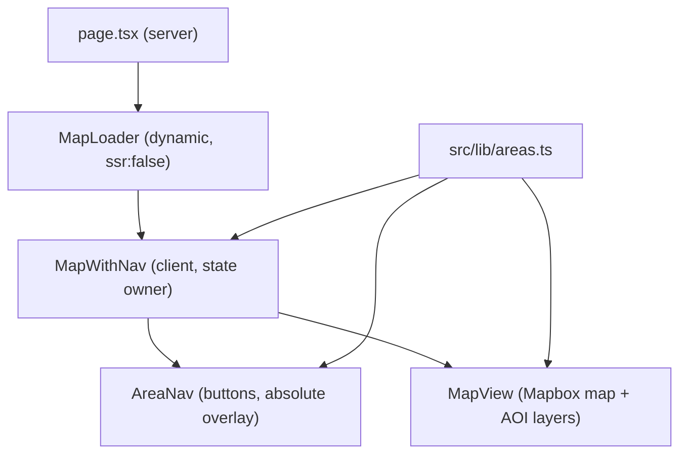
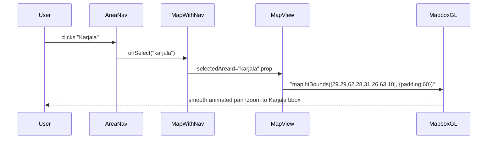

# Modification Design: Areas of Interest (AOI) Navigation & Highlighting

## Overview

Add three named **Areas of Interest (AOIs)** — Lappi, Karjala, and Turku — as:

1. **A typed data module** (`src/lib/areas.ts`) that serves as the single source of truth for AOI definitions. These definitions will later drive PostGIS queries, so they must be precise and machine-readable.
2. **Map highlight layers** — semi-transparent fill + outline polygons rendered via Mapbox GL JS GeoJSON sources on every map load.
3. **Navigation buttons** — a top-centered horizontal strip of three buttons that animate the map to each AOI's bounding box.

---

## Detailed Analysis

### Input Data

The AOI bounding boxes come from `.local/points_of_interest.md` in the format `minLng,minLat,maxLng,maxLat`:

| Area    | minLng    | minLat    | maxLng    | maxLat    |
| ------- | --------- | --------- | --------- | --------- |
| Lappi   | 20.500488 | 68.114293 | 23.708496 | 69.388049 |
| Karjala | 29.289551 | 62.283256 | 31.256104 | 63.104700 |
| Turku   | 21.093750 | 59.767460 | 23.115234 | 60.565379 |

These are EPSG:4326 (WGS-84) coordinate pairs — directly usable in GeoJSON, PostGIS `ST_MakeEnvelope`, and Mapbox `fitBounds`.

### DB Query Relevance

The `src/lib/areas.ts` module will export each area's `bbox` as a typed 4-tuple `[minLng, minLat, maxLng, maxLat]`. Future PostGIS queries can directly use this:

```sql
ST_MakeEnvelope(minLng, minLat, maxLng, maxLat, 4326)
```

This aligns with the existing `/api/features?bbox=` route format.

### Map Rendering

Current `MapView.tsx` initialises a Mapbox `Map` and adds a `NavigationControl`. The map init runs once in `useEffect([], [])`. AOI layers must be added **after** the map's `style.load` event (via `map.on('load', ...)`) to avoid "style not loaded" errors.

The Mapbox `fill` layer supports a `['get', 'color']` data-driven expression to read the `color` property from each GeoJSON feature, allowing all three polygons to be stored in a single source with distinct colors.

### State Management Architecture

The navigation buttons must be able to trigger `map.fitBounds()` on the Mapbox instance, which lives inside `MapView`. The cleanest approach is:

- Create `MapWithNav` (client component) that owns `selectedAreaId` state
- `MapWithNav` renders `AreaNav` (buttons) + `MapView` in a `relative` container
- `MapView` receives `selectedAreaId` and calls `map.fitBounds()` in a `useEffect` that watches it
- `MapLoader` is updated to dynamically import `MapWithNav` instead of `MapView`

### Component Hierarchy



---

## Alternatives Considered

### Alt A: Buttons inside MapView

Merge buttons and map into a single component. Simpler import graph, but violates single-responsibility and makes `MapView` harder to test independently.

### Alt B: useImperativeHandle / forwardRef

Expose `flyTo(id)` imperatively via ref from `MapView`. More flexible for future imperative control, but adds complexity (forwardRef, useImperativeHandle) without a current need.

### Alt C: Zustand / context for map ref

Global state holding the Mapbox instance. Over-engineered for three buttons.

**Chosen**: `selectedAreaId` prop-based approach — simplest, testable, follows existing React patterns.

---

## Detailed Design

### 1. `src/lib/areas.ts` — AOI Data Module

```typescript
export interface AreaOfInterest {
  id: string;
  name: string;
  /** [minLng, minLat, maxLng, maxLat] — EPSG:4326, for fitBounds & ST_MakeEnvelope */
  bbox: [number, number, number, number];
  /** Geographic center for label placement */
  center: [number, number];
  /** Tailwind-compatible hex color for fill/stroke */
  color: string;
  /** Human-readable description — for DB ingestion docs and explainability panel */
  description: string;
}

export const AREAS_OF_INTEREST: AreaOfInterest[] = [
  {
    id: "lappi",
    name: "Lappi",
    bbox: [20.500488, 68.114293, 23.708496, 69.388049],
    center: [22.104492, 68.751171],
    color: "#ef4444",
    description:
      "Northern Lapland — sparse road network, extreme weather, border zone with Norway and Sweden. " +
      "Key features: E8/E75 highways, Saariselkä highlands, Inari lake system.",
  },
  {
    id: "karjala",
    name: "Karjala",
    bbox: [29.289551, 62.283256, 31.256104, 63.1047],
    center: [30.272827, 62.693978],
    color: "#3b82f6",
    description:
      "North Karelia — Finnish-Russian border zone, lake-forest terrain. " +
      "Key features: Joensuu logistics hub, Niirala border crossing, Saimaa canal system.",
  },
  {
    id: "turku",
    name: "Turku",
    bbox: [21.09375, 59.76746, 23.115234, 60.565379],
    center: [22.104492, 60.166419],
    color: "#22c55e",
    description:
      "Archipelago Sea / Turku region — maritime chokepoints, island chains, ferry routes. " +
      "Key features: Turku port, Archipelago Sea national park, Stockholm/Tallinn ferry links.",
  },
];
```

### 2. `src/components/AreaNav.tsx` — Navigation Buttons

A presentational client component:

- Horizontal flex row of three buttons, `absolute` positioned at `top-4`, centered via `left-1/2 -translate-x-1/2`
- `z-10` to float above the map canvas
- Active area gets a colored highlight border (`ring-2`)
- Semi-transparent dark background for legibility against the map
- Each button shows the area name

### 3. `src/components/MapView.tsx` — Extended

New prop: `selectedAreaId?: string | null`

**On `map.on('style.load', ...)`:**

- Build a GeoJSON `FeatureCollection` with three `Feature<Polygon>` entries (one per AOI)
- Each polygon is the closed bounding box ring derived from the area's `bbox`
- `properties` include `{ color, name }` for data-driven styling
- Add source `"aoi-source"` + two layers:
  - `"aoi-fill"`: `fill` type, `fill-color: ['get', 'color']`, `fill-opacity: 0.12`
  - `"aoi-outline"`: `line` type, `line-color: ['get', 'color']`, `line-width: 2`

**New `useEffect([selectedAreaId])`:**

- When `selectedAreaId` changes (and is non-null), find the matching area
- Call `map.fitBounds(area.bbox, { padding: 60, duration: 1200 })`

### 4. `src/components/MapWithNav.tsx` — State Wrapper

New `'use client'` component:

```tsx
export default function MapWithNav() {
  const [selectedAreaId, setSelectedAreaId] = useState<string | null>(null);
  return (
    <div className="relative w-full h-full">
      <AreaNav selectedAreaId={selectedAreaId} onSelect={setSelectedAreaId} />
      <MapView selectedAreaId={selectedAreaId} />
    </div>
  );
}
```

### 5. `src/components/MapLoader.tsx` — Updated Import

```tsx
const MapLoader = dynamic(() => import("./MapWithNav"), { ssr: false, ... });
```

---

## GeoJSON Data Flow Sequence



---

## GeoJSON Polygon Construction

Each bbox `[minLng, minLat, maxLng, maxLat]` becomes a closed ring:

```json
[
  [minLng, minLat],
  [maxLng, minLat],
  [maxLng, maxLat],
  [minLng, maxLat],
  [minLng, minLat]
]
```

Stored as a `Feature<Polygon>` with `color` and `name` in `properties`.

---

## Testing Strategy

- **`src/lib/areas.ts`**: Validate all 3 areas are present, bboxes are valid 4-tuples, `id` values are unique.
- **`AreaNav.tsx`**: 3 buttons render; clicking calls `onSelect` with the correct `id`; active area gets a visual distinction.
- **`MapView.tsx`**: Extend existing mock — mock `map.on` to capture `'load'` callback, verify `addSource`/`addLayer` calls; verify `fitBounds` is called when `selectedAreaId` prop changes.
- **`MapWithNav.tsx`**: Clicking a button propagates `selectedAreaId` change to `MapView`.

---

## Summary

| File                                      | Action     | Purpose                                                       |
| ----------------------------------------- | ---------- | ------------------------------------------------------------- |
| `src/lib/areas.ts`                        | **Create** | AOI data — single source of truth for map + future DB queries |
| `src/components/AreaNav.tsx`              | **Create** | Navigation button strip                                       |
| `src/components/MapWithNav.tsx`           | **Create** | State wrapper (owns selectedAreaId)                           |
| `src/components/MapView.tsx`              | **Modify** | Add AOI layers + fitBounds on selectedAreaId change           |
| `src/components/MapLoader.tsx`            | **Modify** | Import `MapWithNav` instead of `MapView`                      |
| `src/test/lib/areas.test.ts`              | **Create** | AOI data validation                                           |
| `src/test/components/AreaNav.test.tsx`    | **Create** | Button rendering + callback tests                             |
| `src/test/components/MapWithNav.test.tsx` | **Create** | State wiring tests                                            |
| `src/test/components/MapView.test.tsx`    | **Modify** | Extend mock for new map events + layer calls                  |

---

## References

- Mapbox GL JS `fitBounds`: https://docs.mapbox.com/mapbox-gl-js/api/map/#map#fitbounds
- Mapbox GL JS GeoJSON source: https://docs.mapbox.com/mapbox-gl-js/style-spec/sources/#geojson
- Mapbox GL JS `fill` layer: https://docs.mapbox.com/mapbox-gl-js/style-spec/layers/#fill
- Mapbox GL JS `line` layer: https://docs.mapbox.com/mapbox-gl-js/style-spec/layers/#line
- Next.js dynamic imports: https://nextjs.org/docs/pages/building-your-application/optimizing/lazy-loading
