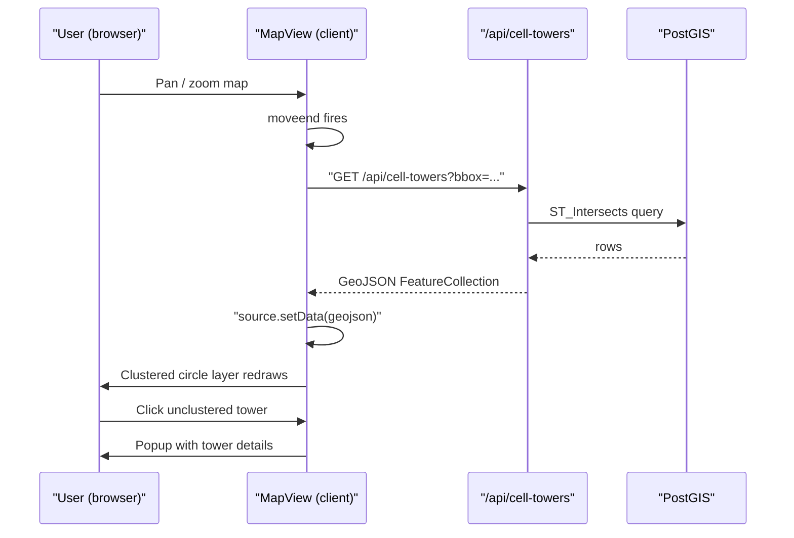
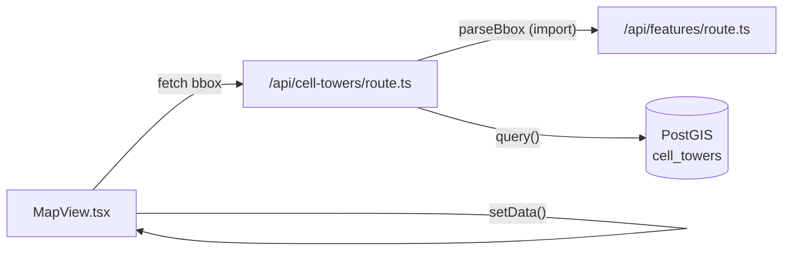

# Design: Cell Tower Overlay — Viewport-Driven API + Map Layer

## Overview

Add a `/api/cell-towers` Next.js API route that queries the `cell_towers` PostGIS table for towers intersecting the current map viewport, and render those towers in `MapView` as a clustered Mapbox GL JS layer with click-to-popup interactivity.

---

## Detailed Analysis

### Current state

- `src/app/api/features/route.ts` — generic GeoJSON endpoint that stubs a `poi` table query. Exports `parseBbox` (reusable) and the GeoJSON interface types.
- `src/components/MapView.tsx` — Mapbox map with AOI fill/outline layers loaded on `style.load`. No dynamic data fetching.
- `src/lib/db.ts` — `pg.Pool` singleton + `query<T>` helper.
- `cell_towers` table — PostGIS `GEOMETRY(Point, 4326)` with GIST index. Columns: `id, radio, aoi_id, lon, lat, geom, range_m, samples, avg_signal`.

### Problem

There is no endpoint that exposes cell tower data, and the map does not fetch or render any dynamic data layer.

### Requirements

1. API returns a GeoJSON `FeatureCollection` of cell towers within a bbox.
2. Frontend fetches on every `moveend` (pan/zoom completes) and on initial map load.
3. Towers render as clustered circles; unclustered towers are colored by radio type.
4. Clicking an unclustered tower opens a Mapbox popup with details.
5. All existing tests must remain green; new code must be tested.

---

## Alternatives Considered

### A — Extend `/api/features` to include cell towers

**Pros**: one endpoint, minimal new code.
**Cons**: mixes heterogeneous feature types; makes it harder to add per-layer query params (e.g., filter by radio type). The existing route carries a stub `poi` query that will be replaced later — coupling cell towers to it creates confusion.
**Decision**: rejected.

### B — New dedicated `/api/cell-towers` route (chosen)

**Pros**: single-responsibility, independently testable, clean URL semantics, easy to add query params (radio type filter, limit) later.
**Cons**: slight duplication of bbox-parse boilerplate — mitigated by re-exporting `parseBbox` from the features route.

### C — Server-Sent Events / WebSocket for live updates

Overkill for a hackathon demo. `moveend` polling is sufficient and matches the existing features-API pattern.

---

## Detailed Design

### 1. API Route — `src/app/api/cell-towers/route.ts`

```
GET /api/cell-towers?bbox=minLng,minLat,maxLng,maxLat
```

- Reuses `parseBbox` imported from `@/app/api/features/route`.
- Queries `cell_towers` with `ST_Intersects` + `ST_MakeEnvelope`.
- Returns a GeoJSON `FeatureCollection`; each feature carries properties:
  `id`, `radio`, `aoi_id`, `range_m`, `avg_signal`, `samples`
- Graceful degradation: if `DATABASE_URL` is absent, returns an empty collection with `X-Aurora-Warning` header (same pattern as features route).
- On DB error: `500` with JSON error body.
- `LIMIT 2000` prevents accidental full-table returns on a very wide viewport while staying well within Mapbox's rendering budget.

SQL:
```sql
SELECT
  id,
  radio,
  aoi_id,
  range_m,
  samples,
  avg_signal,
  ST_AsGeoJSON(geom) AS geojson
FROM cell_towers
WHERE ST_Intersects(
  geom,
  ST_MakeEnvelope($1, $2, $3, $4, 4326)
)
LIMIT 2000
```

### 2. MapView changes — `src/components/MapView.tsx`

#### New Mapbox source & layers (added on `style.load`)

| Name | Type | Purpose |
|---|---|---|
| `cell-towers-source` | GeoJSON, `cluster: true`, `clusterMaxZoom: 14`, `clusterRadius: 50` | Raw data + clustering config |
| `cell-towers-clusters` | `circle` | Large circle for cluster groups |
| `cell-towers-cluster-count` | `symbol` | Count label inside cluster circle |
| `cell-towers-unclustered` | `circle` | Individual tower dot, colored by radio type |

Radio type → color mapping (Mapbox `match` expression):

| Radio | Color | Hex |
|---|---|---|
| GSM | amber | `#facc15` |
| UMTS | orange | `#f97316` |
| LTE | green | `#22c55e` |
| CDMA | purple | `#a78bfa` |
| *(fallback)* | slate | `#94a3b8` |

#### Viewport fetch function

```ts
async function fetchCellTowers(map: mapboxgl.Map): Promise<void>
```

- Called once after `style.load` completes (initial load).
- Registered on `map.on('moveend', ...)`.
- Reads `map.getBounds()` → constructs bbox string → `fetch('/api/cell-towers?bbox=...')`.
- On success: `(map.getSource('cell-towers-source') as GeoJSONSource).setData(geojson)`.
- Errors are `console.error`-logged; map remains functional.

#### Click popup

- `map.on('click', 'cell-towers-unclustered', handler)` opens a `mapboxgl.Popup` at the feature's coordinates showing: radio type, AOI, estimated range, average signal.
- Cursor changes to `pointer` on `mouseenter` / resets on `mouseleave`.

---

## Architecture Diagram



---

## Component Diagram



---

## Summary

- **One new file**: `src/app/api/cell-towers/route.ts` (~60 lines).
- **One modified file**: `src/components/MapView.tsx` — add source/layers on `style.load`, add `moveend` listener, add popup handler.
- **No new dependencies** — Mapbox GL JS already includes `GeoJSONSource` and `Popup`.
- `parseBbox` is imported from the features route to avoid duplication.
- Existing tests are unaffected; new tests cover the API route and new MapView behavior.

---

## References

- Mapbox GL JS Clustering: https://docs.mapbox.com/mapbox-gl-js/example/cluster/
- Mapbox GeoJSONSource.setData: https://docs.mapbox.com/mapbox-gl-js/api/sources/#geojsonsource#setdata
- Mapbox Popup: https://docs.mapbox.com/mapbox-gl-js/api/markers/#popup
- PostGIS ST_Intersects: https://postgis.net/docs/ST_Intersects.html
- OpenCelliD schema: `.local/handoff.md`
