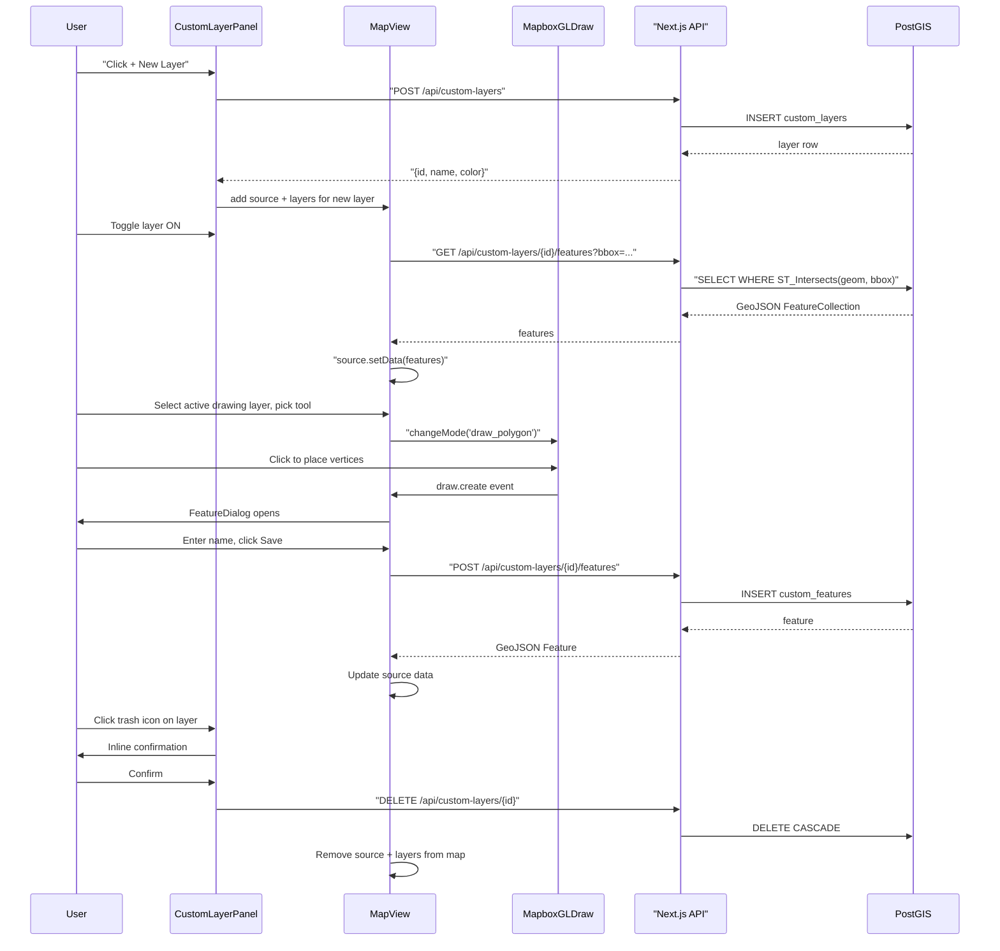
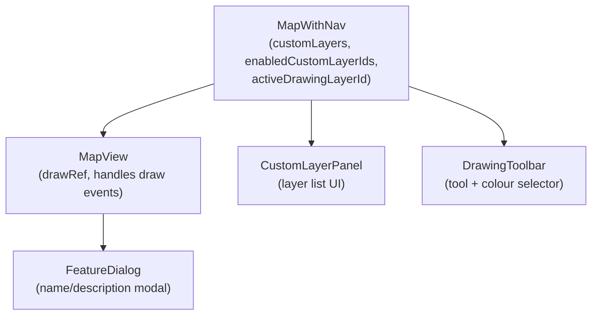

# Design: Collaborative Custom Drawing Layers

## Overview

Add a collaborative drawing system to the Aurora IPB map. Users can create named **custom layers**, draw geometric features (points, lines, polygons, rectangles) onto those layers, style each feature with a predefined military colour palette, and annotate features with free-text names/descriptions. All data is persisted to PostGIS and shared across all users in real-time (on viewport navigation). Custom layers are loaded on-demand per the current viewport, defaulting to disabled on startup.

---

## Detailed Analysis

### Goals

1. **Layer management** — create, rename, toggle visibility, and delete custom layers.
2. **Drawing tools** — point, polyline, polygon (click to add vertices), and rectangle.
3. **Feature metadata** — each feature has a name (free text) and optional description.
4. **Style** — each feature has an individual stroke/fill colour from a predefined palette.
5. **Persistence** — all layers and features are stored in PostGIS; every user sees others' drawings.
6. **Viewport-scoped loading** — features for an enabled layer are fetched using the current map bbox; only re-fetched on `moveend` or layer toggle-on.
7. **Extensibility** — data model must support future military symbol features (SIDC, milsymbol props).
8. **Deletion** — any user can delete any layer (anonymous, no auth for now).

### Constraints

- Mapbox GL JS is the renderer; SSR-unsafe.
- All map interactions must live in `'use client'` components.
- Drawing tools must not conflict with existing map interactions (pan/zoom, cell-tower click).

---

## Alternatives Considered

| Option                          | Pros                                                                                    | Cons                                                                                | Decision                        |
| ------------------------------- | --------------------------------------------------------------------------------------- | ----------------------------------------------------------------------------------- | ------------------------------- |
| `@mapbox/mapbox-gl-draw`        | Official, well-maintained, TypeScript types, integrates directly with Mapbox map object | Rectangle not built-in; must add custom mode                                        | **Selected** — most natural fit |
| `react-map-gl-draw` (nebula.gl) | React-native API                                                                        | Requires `react-map-gl` wrapper around the entire map; would require large refactor | Rejected                        |
| Custom canvas drawing           | Full control                                                                            | Very large implementation effort                                                    | Rejected                        |
| `leaflet-draw`                  | Simple API                                                                              | Not compatible with Mapbox GL JS                                                    | Rejected                        |

### Rectangle mode

`@mapbox/mapbox-gl-draw` has no built-in rectangle mode. Options:

- **`mapbox-gl-draw-rectangle-mode`** npm package — minimal, well-known community plugin.
- Build a custom mode from scratch — unnecessary complexity.

Decision: use `mapbox-gl-draw-rectangle-mode`.

---

## Database Design

### Schema

```sql
-- custom_layers: one row per user-created layer
CREATE TABLE custom_layers (
  id          UUID PRIMARY KEY DEFAULT gen_random_uuid(),
  name        TEXT NOT NULL,
  description TEXT,
  color       TEXT NOT NULL DEFAULT '#ef4444',   -- default red (hex from palette)
  created_at  TIMESTAMPTZ NOT NULL DEFAULT now(),
  updated_at  TIMESTAMPTZ NOT NULL DEFAULT now()
);

-- custom_features: one row per drawn geometry; extensible for future milsymbol data
CREATE TABLE custom_features (
  id            UUID PRIMARY KEY DEFAULT gen_random_uuid(),
  layer_id      UUID NOT NULL REFERENCES custom_layers(id) ON DELETE CASCADE,
  name          TEXT,
  description   TEXT,
  feature_type  TEXT NOT NULL,   -- 'Point' | 'LineString' | 'Polygon' | 'Rectangle'
  geom          GEOMETRY(Geometry, 4326) NOT NULL,
  color         TEXT NOT NULL,   -- per-feature colour override (hex)
  properties    JSONB NOT NULL DEFAULT '{}',  -- reserved for future milsymbol/SIDC data
  created_at    TIMESTAMPTZ NOT NULL DEFAULT now(),
  updated_at    TIMESTAMPTZ NOT NULL DEFAULT now()
);

CREATE INDEX idx_custom_features_layer_id ON custom_features(layer_id);
CREATE INDEX idx_custom_features_geom     ON custom_features USING GIST(geom);
```

### Why JSONB `properties`?

The `properties` column is intentionally open-ended. When military symbols are added later, the SIDC code, milsymbol options, and any APP-6 attributes can be stored here without a schema migration. The `feature_type` discriminator lets the client render the right icon vs. geometry.

---

## API Design

All routes live under `/api/custom-layers`.

| Method   | Path                                     | Purpose                                                    |
| -------- | ---------------------------------------- | ---------------------------------------------------------- |
| `GET`    | `/api/custom-layers`                     | List all layers (no features)                              |
| `POST`   | `/api/custom-layers`                     | Create a layer                                             |
| `DELETE` | `/api/custom-layers/[id]`                | Delete a layer (cascades features)                         |
| `GET`    | `/api/custom-layers/[id]/features`       | Fetch features by bbox `?bbox=minLng,minLat,maxLng,maxLat` |
| `POST`   | `/api/custom-layers/[id]/features`       | Add a feature                                              |
| `PUT`    | `/api/custom-layers/[id]/features/[fid]` | Update feature name/description/color/geometry             |
| `DELETE` | `/api/custom-layers/[id]/features/[fid]` | Delete a single feature                                    |

### GeoJSON Feature response shape

```jsonc
{
  "type": "Feature",
  "id": "<uuid>",
  "geometry": {
    /* GeoJSON geometry */
  },
  "properties": {
    "id": "<uuid>",
    "layer_id": "<uuid>",
    "name": "Observation post Alpha",
    "description": "",
    "feature_type": "Point",
    "color": "#ef4444",
    "created_at": "2026-05-16T10:00:00Z",
    // future: "sidc": "SFGPUUSR-------", "milsymbol": {...}
  },
}
```

---

## UI Design

### New Components

```
src/
├── components/
│   ├── CustomLayerPanel.tsx   # Layer list, create/delete/toggle; floats bottom-right
│   ├── DrawingToolbar.tsx     # Tool palette + colour picker; floats top-right
│   └── FeatureDialog.tsx      # Modal to name/describe a newly drawn feature
```

### CustomLayerPanel

- Floating dark-slate panel (matching `LayerPanel` style), anchored `right-4 bottom-10`.
- **Header**: "Custom Layers" + collapse toggle + "+ New Layer" button.
- **Layer row**: checkbox (toggle visibility) · layer name · colour dot · trash icon.
- **New Layer form** (inline): text input for name, colour swatch picker, "Create" button.
- Deleting a layer shows a confirmation prompt inline (no system `confirm()`).

### DrawingToolbar

- Shown only when a layer is selected as the **active drawing layer**.
- Tools: Point, Line, Polygon, Rectangle.
- Colour palette: 8 swatches — Red `#ef4444`, Orange `#f97316`, Yellow `#eab308`, Green `#22c55e`, Blue `#3b82f6`, Cyan `#06b6d4`, White `#f8fafc`, Purple `#a855f7`.
- Active tool + active colour are highlighted.
- "Cancel" button exits drawing mode without saving.
- "Delete selected" button when a drawn feature is selected on map.

### FeatureDialog

- Lightweight modal that appears after `draw.create` fires.
- Fields: Name (required), Description (optional).
- "Save" POSTs to backend, then updates the Mapbox source data.
- "Discard" deletes the in-progress drawing from the Draw control.

### Integration with MapView

`MapView` already owns the Mapbox map instance. The Draw control will be:

1. Initialised once (after map `load`) as a ref `drawRef`.
2. Passed the active colour via a ref so event handlers see the latest value without re-initialisation.
3. Map events `draw.create`, `draw.delete`, `draw.update`, `draw.selectionchange` are registered on the map object.

`MapWithNav` will own:

- `customLayers` state: `CustomLayer[]`
- `enabledCustomLayerIds` state: `Set<string>` — layer IDs currently toggled on
- `activeDrawingLayerId` state: `string | null`

Custom features will be stored in **per-layer Mapbox sources** named `custom-layer-<id>` with corresponding fill/line/symbol layers so each layer can be toggled independently.

---

## Data Flow Diagram



---

## Component Hierarchy



---

## File-by-File Change Summary

| File                                                     | Change                                                                            |
| -------------------------------------------------------- | --------------------------------------------------------------------------------- |
| `src/lib/customLayers.ts`                                | TypeScript types: `CustomLayer`, `CustomFeature`, `DrawingTool`, `COLOUR_PALETTE` |
| `src/app/api/custom-layers/route.ts`                     | GET list + POST create                                                            |
| `src/app/api/custom-layers/[id]/route.ts`                | DELETE layer                                                                      |
| `src/app/api/custom-layers/[id]/features/route.ts`       | GET bbox features + POST create feature                                           |
| `src/app/api/custom-layers/[id]/features/[fid]/route.ts` | PUT update + DELETE feature                                                       |
| `src/components/CustomLayerPanel.tsx`                    | New: layer list UI                                                                |
| `src/components/DrawingToolbar.tsx`                      | New: tool/colour selector                                                         |
| `src/components/FeatureDialog.tsx`                       | New: name/description modal                                                       |
| `src/components/MapView.tsx`                             | Add Draw control, per-layer sources/layers, moveend for custom layers             |
| `src/components/MapWithNav.tsx`                          | Add custom layer state + wiring                                                   |
| `.local/setup_custom_layers.sql`                         | PostgreSQL setup script                                                           |
| `src/test/...`                                           | New tests for all above                                                           |

---

## Design Summary

- **`@mapbox/mapbox-gl-draw`** with a rectangle mode plugin handles all geometry drawing inside the existing Mapbox map instance.
- **Two PostGIS tables** (`custom_layers`, `custom_features`) with a JSONB `properties` column for future military symbol data.
- **Seven API routes** covering full CRUD for layers and features, using bbox-scoped queries for viewport-efficient loading.
- **Three new React components** (`CustomLayerPanel`, `DrawingToolbar`, `FeatureDialog`) follow the existing dark-slate floating panel style.
- Layers default to **disabled** on load; enabling one triggers a bbox fetch and subsequent `moveend` refreshes.
- Per-feature colours from an **8-colour military palette** stored on each `custom_features` row.

---

## References

- [mapbox-gl-draw API](https://github.com/mapbox/mapbox-gl-draw/blob/main/docs/API.md)
- [mapbox-gl-draw npm](https://www.npmjs.com/package/@mapbox/mapbox-gl-draw)
- [@types/mapbox\_\_mapbox-gl-draw](https://www.npmjs.com/package/@types/mapbox__mapbox-gl-draw)
- [mapbox-gl-draw-rectangle-mode](https://www.npmjs.com/package/mapbox-gl-draw-rectangle-mode)
- [PostGIS ST_Intersects](https://postgis.net/docs/ST_Intersects.html)
- [Mapbox GL JS GeoJSON source](https://docs.mapbox.com/mapbox-gl-js/style-spec/sources/#geojson)
