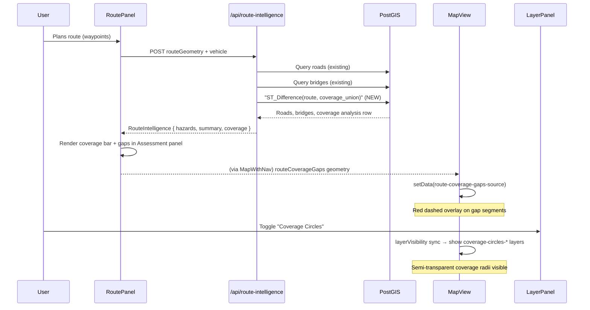

# Design: Cellular Coverage Along Route

## Overview

Extend the existing Route Intelligence system (`/api/route-intelligence`, `RoutePanel`, `MapView`) to analyse cellular tower coverage along a planned route. The feature has two sub-goals:

1. **Coverage gap analysis**: Identify segments of the route that fall outside all cell tower coverage ranges. Show coverage % and gap summary in the `RoutePanel` Route Assessment section; render uncovered segments as a red overlay on the map route line.
2. **Coverage circle overlay**: Optional Mapbox layer that renders each cell tower's coverage area as a semi-transparent circle polygon so the user can see coverage topology visually.

---

## Problem Analysis

### Existing Data

- **`cell_towers` table**: `id, radio, aoi_id, range_m, avg_signal, samples, geom (POINT, EPSG:4326)`.
  - `range_m` is the estimated coverage radius in metres (sourced from OpenCelliD).
  - `avg_signal` is average received signal in dBm (negative; closer to 0 = stronger).
- **`/api/route-intelligence`** currently queries `roads` and `bridges` near the route and returns `{ hazards, summary }`.
- **`RoutePanel`** fetches intelligence after each route plan and displays `summary + hazards`.
- **`MapView`** renders:
  - `route-source` → `route-line` (single-colour line, the planned route)
  - `route-hazards-source` → three circle layers (info/warning/critical dots)

### Gap in Current Design

There is no analysis of cellular connectivity along the route. A military planner cannot currently see:
- Whether a route segment passes through a mobile dead zone.
- Which parts of the route have no cell coverage (safe comms zone vs. exposure risk).

---

## Alternatives Considered

### A — Client-side only (JS distance maths)
Fetch all towers near the route bbox and compute coverage in the browser. **Rejected**: would require sending hundreds of tower records to the client; duplicate spatial logic that PostGIS already handles well.

### B — Per-sample-point PostGIS queries
Sample the route at N points; for each run a separate `ST_DWithin` query. **Rejected**: N round-trips are slow; batch queries are better.

### C — PostGIS coverage union (chosen)
Compute `ST_Union(ST_Buffer(tower_geom, range_m))` for all towers near the route, then `ST_Difference(route_geom, coverage_union)` to extract the uncovered portion as a (Multi)LineString geometry. A single query, fully server-side.

### D — Raster-based (PostGIS raster extension)
Intersect route against a pre-computed coverage raster. **Rejected**: not available in standard PostGIS, would require additional pre-computation.

---

## Detailed Design

### 1. PostGIS Coverage Query

Added as a third `Promise.all` branch inside `POST /api/route-intelligence`:

```sql
WITH
route AS (
  SELECT ST_GeomFromGeoJSON($1) AS geom
),
towers AS (
  SELECT
    geom,
    COALESCE(range_m, 500)::float AS range_m
  FROM cell_towers
  WHERE ST_DWithin(
    geom::geography,
    (SELECT geom::geography FROM route),
    15000
  )
),
coverage_union AS (
  SELECT
    ST_Union(
      ST_Buffer(t.geom::geography, t.range_m)::geometry
    ) AS geom
  FROM towers t
),
uncovered AS (
  SELECT
    ST_Difference(
      (SELECT geom FROM route),
      COALESCE((SELECT geom FROM coverage_union),
               'GEOMETRYCOLLECTION EMPTY'::geometry)
    ) AS geom
),
covered AS (
  SELECT
    ST_Intersection(
      (SELECT geom FROM route),
      COALESCE((SELECT geom FROM coverage_union),
               'GEOMETRYCOLLECTION EMPTY'::geometry)
    ) AS geom
)
SELECT
  ST_AsGeoJSON(u.geom)                           AS gap_geojson,
  ST_Length((SELECT geom::geography FROM route)) AS route_length_m,
  ST_Length(c.geom::geography)                   AS covered_length_m,
  ST_Length(u.geom::geography)                   AS uncovered_length_m,
  ST_NumGeometries(u.geom)                       AS gap_count,
  (
    SELECT MAX(ST_Length(part::geography))
    FROM ST_Dump(u.geom) AS d(path, part)
  )                                              AS longest_gap_m
FROM uncovered u, covered c;
```

**Notes on coordinate system**: `ST_Buffer` on a geography type performs a geodesic buffer (metres). Casting the result to geometry gives EPSG:4326 coordinates. `ST_Difference` is planar but accurate enough at Finland's scale (distortion < 0.3% at 60 °N over a 15 km radius). The 15 km search radius is conservative — no GSM/LTE tower in Finland reaches beyond ~8 km. Fallback when `range_m` is NULL: default 500 m.

### 2. New Types in `src/lib/routing.ts`

```typescript
export interface CoverageAnalysis {
  route_length_m: number;
  covered_pct: number;        // 0–100
  gap_count: number;
  longest_gap_m: number;
  gap_geometry: GeoJSON.Geometry | null; // LineString | MultiLineString
}
```

`RouteIntelligence` gains an optional field:
```typescript
coverage: CoverageAnalysis | null;
```

### 3. API Handler Changes (`/api/route-intelligence/route.ts`)

- Add third entry to `Promise.all`: the coverage query above.
- Parse the single result row into `CoverageAnalysis`.
- Graceful degradation: if query throws, coverage field is omitted (undefined). If no towers are found near the route, the whole route is considered uncovered (covered_pct = 0).

### 4. MapView: Coverage Gap Layer

Two new additions on `style.load`:

- Source `route-coverage-gaps-source` (GeoJSON, empty FeatureCollection initially)
- Layer `route-coverage-gaps-line` — red (`#ef4444`), width 6, dashed (`[6, 4]`), slot `top`, rendered above the blue route line so gaps are clearly visible

New prop:
```typescript
routeCoverageGaps?: GeoJSON.Geometry | null;
```

New `useEffect([routeCoverageGaps])` syncs source data.

### 5. MapView: Coverage Circle Overlay

Source `coverage-circles-source` populated from `rawTowerDataRef` (same data already fetched for the tower icon layer). A utility function `towerToCirclePolygon` converts each tower Point + `range_m` into an approximate geodesic circle polygon (64 segments):

```typescript
function towerToCirclePolygon(lng, lat, radiusM): GeoJSON.Polygon {
  const latRad = (lat * Math.PI) / 180;
  const dLat = radiusM / 111320;
  const dLng = radiusM / (111320 * Math.cos(latRad));
  const coords = Array.from({ length: 65 }, (_, i) => {
    const a = (i / 64) * 2 * Math.PI;
    return [lng + dLng * Math.sin(a), lat + dLat * Math.cos(a)] as [number, number];
  });
  return { type: "Polygon", coordinates: [coords] };
}
```

Two layers:
- `coverage-circles-fill` — fill, `#3b82f6`, opacity 0.07
- `coverage-circles-line` — line, `#3b82f6`, width 1, opacity 0.3

The existing `layerVisibility` sync effect handles show/hide via `LAYER_GROUPS["cellCoverageCircles"]`.

The circles source is refreshed whenever `rawTowerDataRef` changes (i.e., on `moveend`) — reusing the same `fetchCellTowers` trigger.

### 6. Layers (`src/lib/layers.ts`)

- `LayerKey` gets: `cellCoverageCircles`
- `DEFAULT_LAYER_VISIBILITY`: `cellCoverageCircles: false`
- `LAYER_GROUPS`: `cellCoverageCircles: ["coverage-circles-fill", "coverage-circles-line"]`

### 7. LayerPanel

New row in COMMS section: **"Coverage Circles"** with a cyan dot. Toggling calls `onToggle("cellCoverageCircles")`.

### 8. RoutePanel UI

In the Route Assessment block, below the hazard list, a new **"COMMS COVERAGE"** sub-section:

```
COMMS COVERAGE
▓▓▓▓▓▓▓▓░░░░ 67%
3 gap(s) · longest 4.2 km
```

- Coverage bar: 12 chars, `▓` for covered fraction, `░` for uncovered
- Full coverage: `✓ Full cellular coverage`
- No data (coverage null): `No coverage data`

### 9. MapWithNav Changes

Derive `routeCoverageGaps` from existing `routeIntelligence` state:
```typescript
const routeCoverageGaps = routeIntelligence?.coverage?.gap_geometry ?? null;
```
Pass to `MapView` as `routeCoverageGaps={routeCoverageGaps}`.

No new state needed.

---

## Architecture Diagram



---

## Summary

| What | Where |
|------|-------|
| New SQL coverage query | `src/app/api/route-intelligence/route.ts` |
| New types `CoverageAnalysis` | `src/lib/routing.ts` |
| Gap geometry overlay | `MapView.tsx` — `route-coverage-gaps-*` layers |
| Coverage circle overlay | `MapView.tsx` — `coverage-circles-*` layers |
| LayerKey `cellCoverageCircles` | `src/lib/layers.ts` |
| Coverage summary UI | `RoutePanel.tsx` Route Assessment section |
| Prop wiring | `MapWithNav.tsx` → `MapView.tsx` |

---

## References

- PostGIS `ST_Buffer` geography: https://postgis.net/docs/ST_Buffer.html
- PostGIS `ST_Difference`: https://postgis.net/docs/ST_Difference.html
- PostGIS `ST_Intersection`: https://postgis.net/docs/ST_Intersection.html
- OpenCelliD `range` field: empirically derived from handoff measurements
- Finland geodesic constants: 1° lat ≈ 111.3 km, 1° lon at 60 °N ≈ 55.7 km
