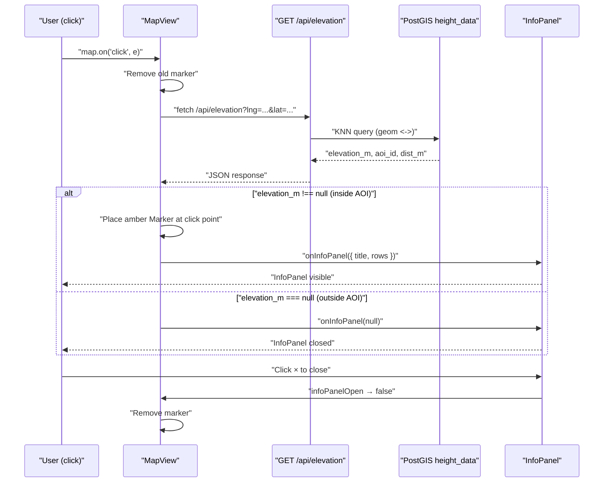

# Design: Elevation Click Feature

## Overview

Add on-demand terrain elevation lookup to the Aurora IPB map. A user clicks anywhere on the map and sees the NLS Finland DEM elevation for that point in the InfoPanel on the right side. A temporary amber marker pin at the click location provides spatial context. The InfoPanel is dismissed via its existing × button. The API is designed for future extension (temperature, other point data).

---

## Detailed Analysis

### What already exists

| Component | Relevant state / method |
|---|---|
| `MapWithNav` | Owns `infoPanelData: InfoPanelData \| null`, passes `onInfoPanel={setInfoPanelData}` to MapView and `infoPanelOpen={infoPanelData !== null}` |
| `MapView` | Receives `onInfoPanel` callback; has `infoPanelOpen` prop watched in a `useEffect` that clears municipality highlight when panel closes |
| `InfoPanel` | Generic right-panel driven by `{ title, rows[] }` — no changes needed |
| `height_data` table | PostGIS table with ~1.9 M rows at 50 m resolution; GiST index on `geom`; KNN query via `<->` operator returns nearest point |

### Problem scope

Two files need changes; nothing else:

1. **`src/app/api/elevation/route.ts`** — new API route (create)
2. **`src/components/MapView.tsx`** — add click handler + marker lifecycle (edit)

`InfoPanel`, `MapWithNav`, `layers.ts` are already correctly wired.

### Interaction with existing click handlers

Mapbox fires layer-specific click handlers **before** the general `map.on('click', …)` handler. The existing popup flow (cell towers, roads, bridges, municipalities, custom layers) is unaffected. The elevation panel updates alongside any feature popup — showing terrain context for whatever was clicked. This is intentional for IPB: knowing the elevation of a bridge or cell tower site is always relevant.

The municipality click already calls `onInfoPanel` to show municipality data; a subsequent general click for elevation overwrites it. This is acceptable — the user's intent at a click is to get the elevation at that point.

---

## Alternatives Considered

| Alternative | Decision |
|---|---|
| Dedicated "Inspect" tool mode (toolbar button) | Rejected — adds interaction complexity with no demo benefit. Any click is an implicit inspect request. |
| Show elevation in a `mapboxgl.Popup` instead of InfoPanel | Rejected — InfoPanel is the established pattern for contextual data. Popups are for feature-specific callouts. |
| Client-side elevation from Mapbox terrain tiles (`map.queryTerrainElevation`) | Rejected — requires terrain3D to be enabled; accuracy varies. NLS DEM at 50 m is the authoritative source. |
| Permanent marker (saved to DB) | Rejected — elevation markers are ephemeral UI helpers, not persistent annotations. Use custom drawing layers for that. |

---

## Detailed Design

### Part 1 — API Route: `GET /api/elevation`

**File:** `src/app/api/elevation/route.ts`

```
GET /api/elevation?lng=22.27&lat=60.45
```

#### Request validation
- `lng` and `lat` parsed from `req.nextUrl.searchParams`
- Both must be present and parse to finite numbers
- Invalid → 400 `{ "error": "lng and lat query params required" }`

#### DB guard
```ts
if (!process.env.DATABASE_URL) return NextResponse.json({ elevation_m: null });
```

#### KNN query
```sql
SELECT elevation_m, aoi_id, grid_file,
       ST_Distance(
         geom::geography,
         ST_SetSRID(ST_MakePoint($1, $2), 4326)::geography
       ) AS dist_m
FROM height_data
ORDER BY geom <-> ST_SetSRID(ST_MakePoint($1, $2), 4326)
LIMIT 1;
```

The `<->` operator on the GiST-indexed `geom` column performs an efficient KNN lookup. `ST_Distance(...::geography)` returns metres between the click point and the nearest grid point. At 50 m stride the result is at most ~35 m away, so this is always fast and reliable within the AOIs.

#### Response shapes
```jsonc
// Hit inside an AOI:
{ "elevation_m": 6.65, "aoi_id": "turku", "grid_file": "L3323", "dist_m": 12.4 }

// Click outside all AOIs (empty result set):
{ "elevation_m": null }

// DB error:
{ "error": "Database query failed" }  // 500
```

---

### Part 2 — MapView Click Handler + Marker

**File:** `src/components/MapView.tsx`

#### New ref (added alongside existing refs)
```ts
const elevationMarkerRef = useRef<mapboxgl.Marker | null>(null);
```

#### Click handler (inside `style.load` callback, after all existing setup)
```ts
map.on("click", async (e) => {
  const { lng, lat } = e.lngLat;

  // Remove previous marker immediately on each click
  elevationMarkerRef.current?.remove();
  elevationMarkerRef.current = null;

  try {
    const res = await fetch(
      `/api/elevation?lng=${lng.toFixed(6)}&lat=${lat.toFixed(6)}`
    );
    if (!res.ok) return;
    const data = await res.json() as {
      elevation_m: number | null;
      aoi_id?: string;
      dist_m?: number;
    };

    if (data.elevation_m === null) {
      onInfoPanel?.(null);  // clear panel when outside AOIs
      return;
    }

    // Amber pin marker at click point
    const el = document.createElement("div");
    el.style.cssText =
      "width:14px;height:14px;border-radius:50%;" +
      "background:#facc15;border:2px solid #fff;" +
      "box-shadow:0 0 6px rgba(0,0,0,0.6);";
    elevationMarkerRef.current = new mapboxgl.Marker({ element: el })
      .setLngLat([lng, lat])
      .addTo(map);

    onInfoPanel?.({
      title: "Terrain Elevation",
      rows: [
        ["Elevation", `${data.elevation_m.toFixed(1)} m`],
        ["Coordinates", `${lat.toFixed(4)}°N  ${lng.toFixed(4)}°E`],
        ["AOI", data.aoi_id ?? "—"],
        ["Source", "NLS Finland DEM (50 m)"],
        ["Source dist", data.dist_m != null ? `${data.dist_m.toFixed(0)} m` : "—"],
      ],
    });
  } catch {
    // Elevation is supplementary — fail silently
  }
});
```

#### Marker cleanup in InfoPanel-close effect

The existing `useEffect([infoPanelOpen])` clears the municipality highlight. Extend it:

```ts
useEffect(() => {
  if (infoPanelOpen) return;
  // existing: cancel animation + clear highlight source
  elevationMarkerRef.current?.remove();
  elevationMarkerRef.current = null;
  // ...
}, [infoPanelOpen]);
```

#### Cleanup on map teardown

Add to the existing cleanup return function:
```ts
elevationMarkerRef.current?.remove();
```

---

### Data Flow Diagram



---

### Marker Visual Design

- **Shape**: 14 px filled circle (consistent with IPB dot language)
- **Color**: Amber `#facc15` — distinct from cell tower blue, road red/green, bridge yellow (amber is darker/warmer), custom layer colours
- **Border**: 2 px white with drop shadow — visible on dark and satellite backgrounds
- **Positioning**: Centred on the click `LngLat`
- **Lifecycle**: Replaced on next click, removed on InfoPanel × close, removed on map teardown

---

## File Change Summary

| File | Change |
|---|---|
| `src/app/api/elevation/route.ts` | **Create** — new API route (~50 lines) |
| `src/components/MapView.tsx` | **Edit** — `elevationMarkerRef`, click handler, infoPanelOpen effect extension, cleanup |
| `src/test/api/elevation.test.ts` | **Create** — unit tests for the new route |
| `src/test/components/MapView.test.tsx` | **Edit** — add elevation fetch mock and click handler tests |

---

## Summary

The change is minimal and surgical. No state hierarchy changes, no new UI components, no new layer keys. The API is trivially extensible — future point-query routes (temperature, soil type, population density) follow the identical pattern and add rows to the InfoPanel response without any UI changes.

---

## References

- [Mapbox GL JS — map click event](https://docs.mapbox.com/mapbox-gl-js/api/map/#map.event:click)
- [Mapbox GL JS — Marker](https://docs.mapbox.com/mapbox-gl-js/api/markers/#marker)
- [PostGIS KNN with `<->` operator](https://postgis.net/workshops/postgis-intro/knn.html)
- Handoff document: `.local/height_data_feature_handoff.md`
