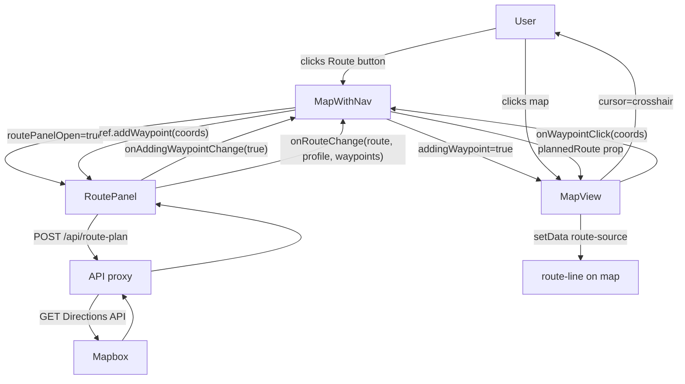

# Modification Design: Phase 1 Route Planning

**Date:** 2026-05-16  
**Branch:** `feat/navigation-api`

---

## Overview

Add basic route planning to the Aurora IPB map. A user clicks "Route" to open a floating panel, adds waypoints by clicking on the map, picks a travel profile (driving / walking / cycling / driving-traffic), and sees the route highlighted on the map. No GPS tracking or turn-by-turn live guidance — just static route preview and step list.

---

## Detailed Analysis

### What Phase 1 Must Do

1. Accept 2–25 waypoints placed by clicking the map.
2. Call the **Mapbox Directions API** and display the returned route geometry as a coloured line.
3. Show total distance, total duration, and the ordered step list.
4. Allow clearing the route and switching travel profiles.
5. Not break any existing functionality (drawing layers, elevation clicks, etc.).

### Interaction with Existing Click Handlers

`MapView` already has a general `map.on("click", ...)` handler that fires the elevation lookup. When `addingWaypoint` is true we need to intercept that click and route it to `onWaypointClick` instead. The cleanest approach is a ref flag (`addingWaypointRef`) that the existing handler checks before running elevation logic — no new event listener needed.

### Mapbox Directions API Shape (verified from docs)

```
GET https://api.mapbox.com/directions/v5/{profile}/{lon1,lat1;lon2,lat2}
    ?geometries=geojson&steps=true&overview=full&access_token=…
```

Profiles: `mapbox/driving` | `mapbox/driving-traffic` | `mapbox/walking` | `mapbox/cycling`

Response (relevant fields):
```json
{
  "code": "Ok",
  "routes": [{
    "distance": 12400.3,
    "duration": 910.1,
    "geometry": { "type": "LineString", "coordinates": [...] },
    "legs": [{
      "distance": 12400.3,
      "duration": 910.1,
      "steps": [{
        "maneuver": { "instruction": "Head north on Mannerheimintie" },
        "distance": 340.0,
        "duration": 42.0
      }]
    }]
  }],
  "waypoints": [...]
}
```

---

## Alternatives Considered

| Alternative | Decision |
|-------------|----------|
| Call Mapbox directly from the browser | Rejected — exposes token in client bundle, no future caching/rate-limit point |
| `mapbox-gl-directions` plugin | Rejected — unmaintained, opinionated UI, no control over military UX |
| `@hello-pangea/dnd` for waypoint reordering | Deferred — up/down buttons are sufficient for Phase 1, add no dependency |
| Owned waypoints in `MapWithNav` | Rejected — waypoints are tightly coupled to routing UI; only geometry needs to propagate up |
| Route line as Marker vs Mapbox layer | Layer chosen for route line (z-ordered, cheap); Markers chosen for waypoints (always on top, extensible) |

---

## Detailed Design

### 1. `src/lib/routing.ts` — Types and Utilities

```typescript
export type RouteProfile = 'driving' | 'walking' | 'cycling' | 'driving-traffic';

export interface Waypoint {
  id: string;                    // stable uuid for React list key
  label: string;                 // "Start", "Stop 1", "Destination"
  coordinates: [number, number]; // [lng, lat]
}

export interface RouteStep {
  instruction: string;
  distance_m: number;
  duration_s: number;
}

export interface RouteLeg {
  distance_m: number;
  duration_s: number;
  steps: RouteStep[];
}

export interface PlannedRoute {
  geometry: GeoJSON.LineString;
  total_distance_m: number;
  total_duration_s: number;
  legs: RouteLeg[];
}

export const PROFILE_COLORS: Record<RouteProfile, string> = {
  driving: '#3b82f6',           // blue
  walking: '#22c55e',           // green
  cycling: '#eab308',           // amber
  'driving-traffic': '#f97316', // orange
};
```

Helpers: `formatDuration(s)`, `formatDistance(m)`, `profileLabel(p)`.

### 2. `src/app/api/route-plan/route.ts` — Backend Proxy

**Method:** `POST`  
**Body:** `{ waypoints: [number, number][], profile: RouteProfile }`

Validation:
- 2–25 waypoints (array of `[lng, lat]` pairs)
- `profile` is one of the four allowed values
- Returns 400 with `{ error: string }` on failure

Happy path:
1. Build Mapbox URL with semicolon-separated `lng,lat` coordinate string
2. `fetch()` the Directions API server-side
3. Parse `routes[0]`, normalise to `PlannedRoute` shape
4. Return 200 with `PlannedRoute`

Error cases:
- Token absent → 503 + `X-Aurora-Warning` header
- Mapbox returns non-200 → 502
- `routes` empty (no route found) → 404

### 3. `src/components/RoutePanel.tsx`

**Position:** `absolute left-4 bottom-40 z-10` (above LayerPanel at `bottom-10`)

Props:
```typescript
interface RoutePanelProps {
  onAddingWaypointChange: (active: boolean) => void;
  onRouteChange: (route: PlannedRoute | null, profile: RouteProfile, waypoints: Waypoint[]) => void;
  onClose: () => void;
}
export interface RoutePanelHandle {
  addWaypoint: (coords: [number, number]) => void;
}
```

Internal state: `waypoints`, `profile`, `route`, `loading`, `error`, `expandedLeg`.

Auto-fetch: 400 ms debounced `useEffect([waypoints, profile])` → `POST /api/route-plan`.

Waypoint list: up/down buttons to reorder, × to remove. "Add Stop" calls `onAddingWaypointChange(true)`. Coordinate arrives via imperative `addWaypoint(coords)` from `MapWithNav`.

`useImperativeHandle` exposes `addWaypoint` to parent ref.

### 4. MapView Additions

New optional props:
```typescript
plannedRoute?: PlannedRoute | null;
routeProfile?: RouteProfile;
routeWaypoints?: Waypoint[];
addingWaypoint?: boolean;
onWaypointClick?: (coords: [number, number]) => void;
```

**In `style.load`:** add `route-source` (GeoJSON, empty) + `route-line` layer (line, width 5, color from `PROFILE_COLORS`).

**`useEffect([plannedRoute, routeProfile])`:** update `route-source` data and repaint line color.

**`useEffect([routeWaypoints])`:** clear old `mapboxgl.Marker` objects, create new numbered markers.

**`useEffect([addingWaypoint])`:** set cursor to `crosshair` / `""`.

**Elevation click:** check `addingWaypointRef.current` first. If true, fire `onWaypointClick([lng, lat])` and return without doing elevation lookup.

### 5. MapWithNav Additions

```typescript
const [routePanelOpen, setRoutePanelOpen] = useState(false);
const [plannedRoute, setPlannedRoute] = useState<PlannedRoute | null>(null);
const [routeProfile, setRouteProfile] = useState<RouteProfile>('driving');
const [routeWaypoints, setRouteWaypoints] = useState<Waypoint[]>([]);
const [addingWaypoint, setAddingWaypoint] = useState(false);
const routePanelRef = useRef<RoutePanelHandle | null>(null);
```

Route button: floating `absolute top-4 right-20 z-10` button (avoids coupling AreaNav).

`handleWaypointClick(coords)`: calls `routePanelRef.current?.addWaypoint(coords)` then `setAddingWaypoint(false)`.

---

## Data Flow Diagram



---

## Summary

Phase 1 adds six new files and modifies three existing ones. No new npm dependencies. The Mapbox token stays server-side. `RoutePanel` owns waypoints and exposes `addWaypoint` imperatively. `MapView` renders the route line and numbered waypoint markers, and intercepts one click per "add stop" operation. `MapWithNav` coordinates state between the two.

---

## References

- [Mapbox Directions API docs](https://docs.mapbox.com/api/navigation/directions/) — verified endpoint, profiles, response shape
- Route planning plan: `/Users/om/aurora/.local/route_planning_integration_plan.md`
