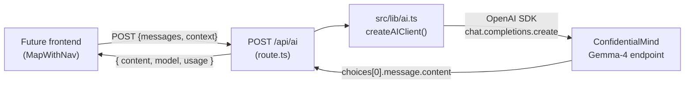

# Design: ConfidentialMind AI Backend Integration

## Overview

Add a server-side AI layer to the Aurora IPB application. A new Next.js API route
(`POST /api/ai`) exposes an OpenAI-compatible chat completions interface backed by
ConfidentialMind's hosted Gemma-4 model. No frontend changes in this phase — only
the wiring (client lib + route + tests).

---

## Detailed Analysis

### ConfidentialMind Endpoint

ConfidentialMind exposes an **OpenAI-compatible** REST API. The Python reference client:

```python
client = OpenAI(base_url=base_url.rstrip("/") + "/v1", api_key=api_key)
response = client.chat.completions.create(model=..., messages=..., ...)
```

Environment variables (already in `.env.local`, prefixed `CM_`):

| Variable        | Description                                 |
|-----------------|---------------------------------------------|
| `CM_BASE_URL`   | Project endpoint (path to the workspace)    |
| `CM_API_KEY`    | JWT bearer token                            |
| `CM_MODEL_NAME` | Model ID (`google/gemma-4-31B-it`)          |

The OpenAI Node.js SDK accepts a custom `baseURL` and `apiKey`, making it a
drop-in client for any OpenAI-compatible endpoint.

### Future Context

The eventual product goal is: *user looks at a map viewport → Aurora collects
visible data (cell towers, weather, election results, demographics) → sends it
as structured context to the AI → AI returns an IPB-style analysis*.

This phase only wires the transport. The prompt/context assembly will come in a
later phase once the frontend component is designed.

---

## Alternatives Considered

### A. Raw `fetch` against the endpoint

**Pro:** no extra dependency.  
**Con:** must manually build OpenAI request/response types, handle retries, error
codes, streaming framing, etc. The OpenAI SDK already does all this and is the
reference implementation used by ConfidentialMind themselves.

### B. Vercel AI SDK (`ai` package)

**Pro:** streaming helpers, React `useChat` hook.  
**Con:** larger dependency, forces a specific streaming wire format, overkill for
a backend-only phase. Can be added later on top.

### C. `openai` npm SDK with custom `baseURL` ✓ (chosen)

Mirrors the Python reference client exactly. Lightweight, well-typed, handles
retries and error unwrapping. Custom `baseURL` + `apiKey` is the documented
approach for any OpenAI-compatible provider.

---

## Detailed Design

### 1. `openai` npm package

```
npm install openai
```

Version pinned in `package.json`. No other runtime dependencies added.

### 2. `src/lib/ai.ts` — client factory

```typescript
import OpenAI from "openai";

export function createAIClient(): OpenAI {
  const baseURL = process.env.CM_BASE_URL;
  const apiKey  = process.env.CM_API_KEY;
  if (!baseURL || !apiKey) {
    throw new Error("CM_BASE_URL and CM_API_KEY must be set");
  }
  return new OpenAI({
    baseURL: baseURL.replace(/\/$/, "") + "/v1",
    apiKey,
  });
}

export const CM_MODEL = process.env.CM_MODEL_NAME ?? "google/gemma-4-31B-it";
```

A **factory function** (not a module-level singleton) is used because:
- Next.js App Router API routes run in the Node.js runtime where `process.env`
  is available at request time.
- A factory avoids holding a long-lived client object across hot-reloads in dev.
- Tests can call the factory after setting env vars without module-cache tricks.

### 3. `POST /api/ai` route

**Request body:**

```typescript
interface AIRequest {
  messages: Array<{ role: "system" | "user" | "assistant"; content: string }>;
  maxTokens?: number;   // default 1024
  temperature?: number; // default 0.2
}
```

**Response (200):**

```typescript
interface AIResponse {
  content: string;
  model: string;
  usage: { promptTokens: number; completionTokens: number; totalTokens: number } | null;
}
```

**Error responses:**

| Status | Condition                                      |
|--------|------------------------------------------------|
| 400    | Missing or empty `messages` array              |
| 503    | `CM_BASE_URL` / `CM_API_KEY` not configured    |
| 502    | Upstream ConfidentialMind request failed       |
| 500    | Unexpected server error                        |

**Handler sketch:**

```typescript
export async function POST(req: NextRequest) {
  if (!process.env.CM_BASE_URL || !process.env.CM_API_KEY) {
    return NextResponse.json({ error: "AI not configured" }, { status: 503 });
  }

  const body = await req.json();
  if (!Array.isArray(body.messages) || body.messages.length === 0) {
    return NextResponse.json({ error: "messages required" }, { status: 400 });
  }

  try {
    const client = createAIClient();
    const completion = await client.chat.completions.create({
      model: CM_MODEL,
      messages: body.messages,
      max_tokens: body.maxTokens ?? 1024,
      temperature: body.temperature ?? 0.2,
    });
    return NextResponse.json({
      content: completion.choices[0].message.content,
      model: completion.model,
      usage: completion.usage ? { ... } : null,
    });
  } catch (err) {
    // OpenAI SDK wraps upstream errors in APIError
    if (err instanceof OpenAI.APIError) {
      return NextResponse.json({ error: err.message }, { status: 502 });
    }
    return NextResponse.json({ error: "Internal error" }, { status: 500 });
  }
}
```

### 4. Tests (`src/test/api/ai.test.ts`)

Mock the entire `openai` module with `vi.mock("openai")`. Test cases:
- 503 when env vars absent
- 400 when `messages` is missing
- 400 when `messages` is empty array
- 200 with correct response shape when upstream returns data
- `usage` is null when upstream omits it
- 502 when upstream throws `OpenAI.APIError`
- 500 on unexpected error

---

## Component Diagram



---

## Summary

- **One new npm dependency**: `openai` (the official SDK, used by ConfidentialMind's own examples).
- **Two new files**: `src/lib/ai.ts` (client factory + model constant) and `src/app/api/ai/route.ts` (POST handler).
- **Graceful degradation**: 503 when env vars absent — the rest of the app is unaffected.
- **No frontend changes** in this phase.
- **Environment variables**: `CM_BASE_URL`, `CM_API_KEY`, `CM_MODEL_NAME` (all server-side only — no `NEXT_PUBLIC_` prefix, never sent to the browser).

---

## References

- OpenAI Node.js SDK custom baseURL: https://github.com/openai/openai-node#custom-urls
- Next.js App Router API Routes: https://nextjs.org/docs/app/building-your-application/routing/route-handlers
- ConfidentialMind Python example (provided by user)
