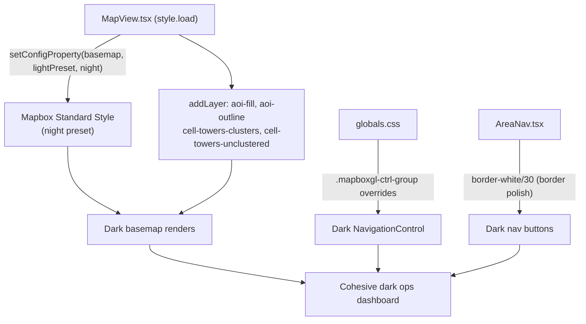

# Design: Full Dark Theme Audit

## Overview

A full dark theme audit of the Aurora IPB application. Every visible surface — Mapbox basemap, navigation controls, AOI nav buttons, cell tower popups, and page chrome — should read as a cohesive, high-contrast military ops dashboard with no light surfaces leaking through.

---

## Detailed Analysis

### Current State

| Surface                       | Current                                            | Problem                                                                  |
| ----------------------------- | -------------------------------------------------- | ------------------------------------------------------------------------ |
| Mapbox basemap                | `mapbox://styles/mapbox/standard` (day preset)     | Renders a bright, light-grey map that dominates the full-screen viewport |
| Mapbox NavigationControl      | Default (white pill buttons with white bg)         | White buttons clash heavily against the dark page and dark basemap       |
| AreaNav buttons               | `bg-black/60 backdrop-blur-sm border-white/20`     | Already dark; inactive border opacity is slightly low                    |
| Cell tower popup              | `#0f172a` / `#e2e8f0` / `#334155` inline styles    | Already dark and consistent with slate palette                           |
| Page background / body        | `#0d1117` CSS variable                             | Already dark; correct                                                    |
| `globals.css` popup overrides | `aurora-popup` transparent wrapper + tip `#334155` | Already correct                                                          |

The dominant problem is the **Mapbox basemap**. Because `MapView` fills the entire viewport (`w-full h-full`), a light basemap makes the whole application read as light regardless of surrounding chrome.

Secondary problem: the **Mapbox NavigationControl** renders as bright white pill buttons — high visual noise against any dark surface.

---

## Alternatives Considered

### A. Switch to `mapbox://styles/mapbox/dark-v11`

**Pros**: One-line change; immediately dark.
**Cons**: Static legacy style; no 3D buildings or dynamic lighting; Mapbox is deprecating v10/v11 static styles in favour of Standard; lower visual quality.
**Decision**: rejected.

### B. Use `mapbox://styles/mapbox/satellite-streets-v12`

**Pros**: Dark by nature (satellite imagery); dramatic, tactical look.
**Cons**: Satellite imagery reduces road/terrain legibility; less useful for planning overlays; our AOI polygon fills become less visible against detailed imagery.
**Decision**: rejected for primary basemap (could be added as a toggle later).

### C. Mapbox Standard style with `lightPreset: "night"` ✅ (Chosen)

**Pros**: Modern, actively maintained; 3D capabilities; dynamic lighting; sets all map elements (terrain, roads, water, labels, buildings) to a coherent dark palette; all existing custom layers (AOI, cell towers) sit on top unchanged; matches the direction Mapbox is investing in.
**Cons**: Config property must be applied in the `style.load` callback, not at map construction (the Standard style config is only available after the style is loaded).
**Decision**: chosen.

---

## Detailed Design

### 1. Mapbox Dark Basemap — `src/components/MapView.tsx`

Inside the existing `style.load` handler, add as the very first line:

```ts
map.setConfigProperty("basemap", "lightPreset", "night");
```

The four available Standard presets are `"day"`, `"dawn"`, `"dusk"`, and `"night"`. The `"night"` preset darkens:

- Water → deep navy
- Land → near-black (visually close to `#0d1117`)
- Roads → dark grey with light labels
- Buildings → dark charcoal
- POI labels → white / light grey

All our existing layers (`aoi-fill`, `aoi-outline`, `cell-towers-*`) are added to this same handler and will render on top of the dark basemap — no changes needed to those layers.

### 2. Mapbox NavigationControl — Dark CSS Override — `src/app/globals.css`

Mapbox GL injects its own stylesheet (`mapbox-gl/dist/mapbox-gl.css`). The NavigationControl renders as `.mapboxgl-ctrl-group` with white background `#fff` buttons. We add targeted overrides to `globals.css`:

```css
/* Dark NavigationControl */
.mapboxgl-ctrl-group {
  background: #1e293b !important;
  border: 1px solid #334155 !important;
  border-radius: 6px !important;
  box-shadow: none !important;
}

.mapboxgl-ctrl-group button {
  background-color: transparent !important;
  border-bottom: 1px solid #334155 !important;
}

.mapboxgl-ctrl-group button:last-child {
  border-bottom: none !important;
}

/* Invert + dim Mapbox SVG icons so they appear light on dark background */
.mapboxgl-ctrl-group button .mapboxgl-ctrl-icon {
  filter: invert(1) brightness(0.85);
}
```

These use `!important` because Mapbox's own stylesheet is injected after our CSS and sets inline `background` on some elements.

### 3. AreaNav Buttons — Minor Polish — `src/components/AreaNav.tsx`

Current inactive border: `border-white/20` (20% white = very faint).
Change to: `border-white/30` (30% white) for slightly better legibility against the now-darker basemap.

No other changes to AreaNav needed — the `bg-black/60 backdrop-blur-sm` already reads well on a dark map.

### 4. Popup — No Changes Needed

The cell tower popup already uses:

- Background: `#0f172a` (slate-900)
- Text: `#e2e8f0` (slate-200)
- Border: `#334155` (slate-700)
- Muted labels: `#64748b` (slate-500)

These are consistent with the dark palette. The `globals.css` popup wrapper overrides (`aurora-popup`) are already correct.

### 5. Palette Reference

All dark surfaces draw from the Tailwind slate scale:

| Token       | Hex       | Usage                        |
| ----------- | --------- | ---------------------------- |
| `slate-950` | `#0a0f1e` | Deepest backgrounds (body)   |
| `slate-900` | `#0f172a` | Popup background             |
| `slate-800` | `#1e293b` | NavigationControl background |
| `slate-700` | `#334155` | Borders, dividers, popup tip |
| `slate-500` | `#64748b` | Muted labels in popup        |
| `slate-200` | `#e2e8f0` | Body text                    |
| `white`     | `#ffffff` | Headings, active labels      |

---

## Component Interaction Diagram



---

## Summary

Three targeted changes achieve the full dark theme:

1. **`src/components/MapView.tsx`** — add `map.setConfigProperty("basemap", "lightPreset", "night")` as the first line of the existing `style.load` handler.
2. **`src/app/globals.css`** — add CSS overrides for `.mapboxgl-ctrl-group` and child elements to darken the NavigationControl.
3. **`src/components/AreaNav.tsx`** — change inactive button border from `border-white/20` to `border-white/30`.

No new dependencies. No API or schema changes. The popup is already correct and requires no changes. All existing tests should continue to pass (no behavioural changes — only visual/styling).

---

## References

- [Mapbox Standard style — `lightPreset` config property](https://docs.mapbox.com/mapbox-gl-js/example/set-config-property/)
- [Enhanced Mapbox Standard — customization](https://www.mapbox.com/blog/standard-style-updates-more-customization-options-to-personalize-the-map)
- [Mapbox GL JS — Map config](https://docs.mapbox.com/mapbox-gl-js/api/map/)
- Tailwind CSS v4 slate palette
