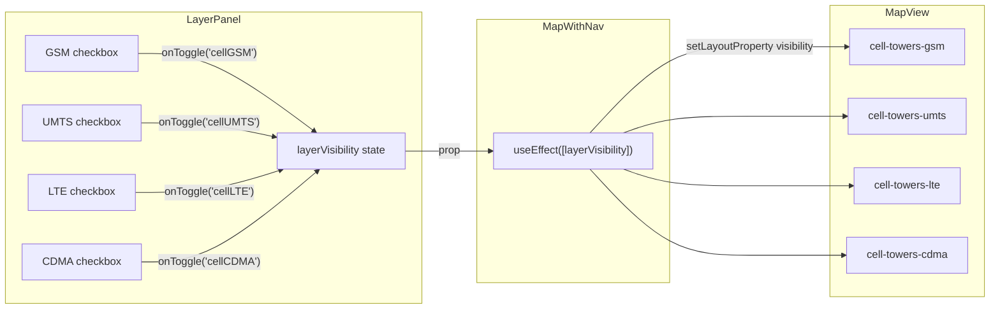

# Design: Cell Tower Layer Toggles in LayerPanel

## Overview

Add per-radio-type (GSM / UMTS / LTE / CDMA) visibility toggles for cell towers to the existing
`LayerPanel` component. Each radio type gets its own colored dot and checkbox. The dot color
matches the map marker color exactly. Colors are brightened one Tailwind shade across the board for
better contrast on the dark night basemap.

---

## Detailed Analysis

### Current State

| Location                        | Relevant code                                                                                                                                    |
| ------------------------------- | ------------------------------------------------------------------------------------------------------------------------------------------------ |
| `src/lib/layers.ts`             | Four keys: `terrain3d`, `hillshade`, `contours`, `landcover`                                                                                     |
| `src/components/LayerPanel.tsx` | Three sections (Terrain / Elevation / Vegetation); no cell towers                                                                                |
| `src/components/MapView.tsx`    | Single `cell-towers-unclustered` layer uses a Mapbox `match` expression for color by radio type; cluster layers use a fixed dark slate `#64748b` |

Cell towers are always visible — there is no way to hide them from the UI.

### Problem

1. The user cannot toggle cell towers on/off from the LayerPanel.
2. There is no per-radio-type granularity.
3. The cluster circle color (`#64748b`) and some existing layer-panel dot colors are dark and hard
   to distinguish on the night basemap.

---

## Alternatives Considered

| Option                                                                 | Verdict                                                                                                                                                                                    |
| ---------------------------------------------------------------------- | ------------------------------------------------------------------------------------------------------------------------------------------------------------------------------------------ |
| Single "Cell Towers" toggle (all types on/off)                         | Simpler but less useful for analysts wanting, e.g., only LTE.                                                                                                                              |
| Per-radio-type toggles (chosen)                                        | Four rows — one per radio type — gives fine-grained control. Matches user preference.                                                                                                      |
| Dynamic filter rewriting on the single `cell-towers-unclustered` layer | Works but is fragile: building a `match` filter expression from state at runtime is more complex than the clean `setLayoutProperty('visibility',…)` pattern already used for other layers. |

---

## Detailed Design

### 1. `src/lib/layers.ts`

Add four new `LayerKey` values and map them to dedicated per-type Mapbox layer IDs.

```ts
export type LayerKey =
  | "terrain3d"
  | "hillshade"
  | "contours"
  | "landcover"
  | "cellGSM"
  | "cellUMTS"
  | "cellLTE"
  | "cellCDMA";

export const DEFAULT_LAYER_VISIBILITY: LayerVisibility = {
  terrain3d: false,
  hillshade: true,
  contours: true,
  landcover: true,
  cellGSM: true,
  cellUMTS: true,
  cellLTE: true,
  cellCDMA: true,
};

export const LAYER_GROUPS: Record<LayerKey, string[]> = {
  // existing…
  cellGSM: ["cell-towers-gsm"],
  cellUMTS: ["cell-towers-umts"],
  cellLTE: ["cell-towers-lte"],
  cellCDMA: ["cell-towers-cdma"],
};
```

### 2. `src/components/MapView.tsx` — split unclustered layer into four

Replace the single `cell-towers-unclustered` layer with four per-type circle layers. Each uses a
static filter so Mapbox only draws the matching radio type:

| Layer ID           | Filter                             | Color (new)            |
| ------------------ | ---------------------------------- | ---------------------- |
| `cell-towers-gsm`  | `["==", ["get", "radio"], "GSM"]`  | `#fde047` (yellow-300) |
| `cell-towers-umts` | `["==", ["get", "radio"], "UMTS"]` | `#fb923c` (orange-400) |
| `cell-towers-lte`  | `["==", ["get", "radio"], "LTE"]`  | `#4ade80` (green-400)  |
| `cell-towers-cdma` | `["==", ["get", "radio"], "CDMA"]` | `#c4b5fd` (violet-300) |

The cluster circle color brightens from `#64748b` to `#94a3b8` (slate-400). The stroke changes
from near-black `#1e293b` to `rgba(0,0,0,0.5)` so it no longer darkens individual dots.

The popup click handler and hover cursor handlers attach to all four per-type layer IDs instead of
the old single ID. The visibility-sync `useEffect` iterates `LAYER_GROUPS` automatically — no
extra logic needed once the new layer IDs are registered there.

### 3. `src/components/LayerPanel.tsx` — COMMS section

Add a `COMMS` section with a `LayerRow` per radio type. The `dotColor` exactly matches the
`circle-color` used in the corresponding Mapbox layer:

```
GSM   dot #fde047   UMTS  dot #fb923c
LTE   dot #4ade80   CDMA  dot #c4b5fd
```

---

## Data Flow Diagram



---

## Color Reference

| Radio type | Old marker color     | New marker color     | Layer panel dot |
| ---------- | -------------------- | -------------------- | --------------- |
| GSM        | `#facc15` yellow-400 | `#fde047` yellow-300 | `#fde047`       |
| UMTS       | `#f97316` orange-500 | `#fb923c` orange-400 | `#fb923c`       |
| LTE        | `#22c55e` green-500  | `#4ade80` green-400  | `#4ade80`       |
| CDMA       | `#a78bfa` violet-400 | `#c4b5fd` violet-300 | `#c4b5fd`       |
| Cluster    | `#64748b` slate-500  | `#94a3b8` slate-400  | —               |

---

## Summary

Three files change: `layers.ts`, `MapView.tsx`, `LayerPanel.tsx`.

- Four new `LayerKey` values (`cellGSM`, `cellUMTS`, `cellLTE`, `cellCDMA`).
- Four Mapbox circle layers replace the single `cell-towers-unclustered` layer; cluster layers
  are kept intact.
- Colors are brightened one shade across the board.
- The visibility-sync mechanism requires **zero changes** — it already iterates `LAYER_GROUPS`.
- Tests that reference `cell-towers-unclustered` must be updated to the new layer IDs.

---

## References

- Mapbox GL JS `setLayoutProperty`: https://docs.mapbox.com/mapbox-gl-js/api/map/#map#setlayoutproperty
- Mapbox layer filters: https://docs.mapbox.com/mapbox-gl-js/style-spec/expressions/#filter
- Tailwind color palette: https://tailwindcss.com/docs/customizing-colors
