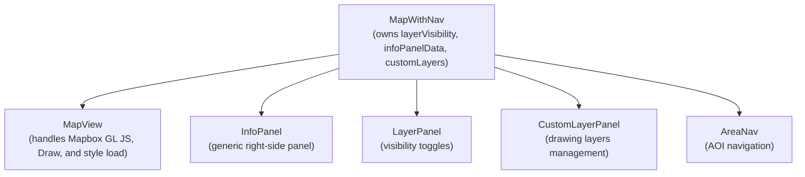

# Design Document: Aurora IPB Enhancements

## Satellite Style Toggle

### Overview
This modification adds a global style toggle to the Aurora IPB application, allowing users to switch between the "Mapbox Standard" (Military/Night) basemap and "Mapbox Satellite Streets". This provides analysts with high-resolution imagery while maintaining all tactical overlays, terrain features, and drawing capabilities.

### Goals
- Provide a clear UI toggle to switch to satellite view.
- Maintain all custom layers (Cell Towers, AOIs, Drawing Layers).
- Maintain 3D terrain and contour features in satellite mode.
- Ensure the transition is smooth and doesn't lose application state.

### MapView Refactoring
The logic inside the `style.load` callback in `MapView.tsx` is idempotent and re-runnable. Move one-time initializations (Draw control, Navigation control) out of any style-specific logic.

## Generic Info Panel & Bridge Zoom Fix

### Overview
Two targeted UX fixes:
1. **Generic info panel** — replaced municipality popups with a persistent right-side `InfoPanel` component rendered in React. It accepts a title and a list of `[label, value]` rows.
2. **Bridge icon minzoom** — added `minzoom: 12` constraint on the `bridges-symbol` layer to hide them until the user zooms in.

### Popup Stacking Solution
`mapboxgl.Popup` instances are replaced with a React side panel controlled by state in `MapWithNav`. This prevents visual collisions and stacking issues.

### Bridge Icon Clutter Solution
Setting `minzoom: 12` aligns bridge visibility with the zoom level where individual bridge features are meaningful.

## Component Architecture

