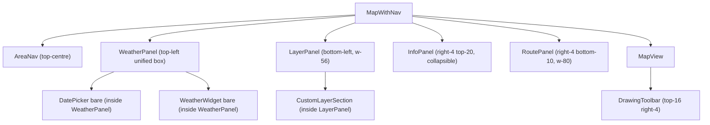
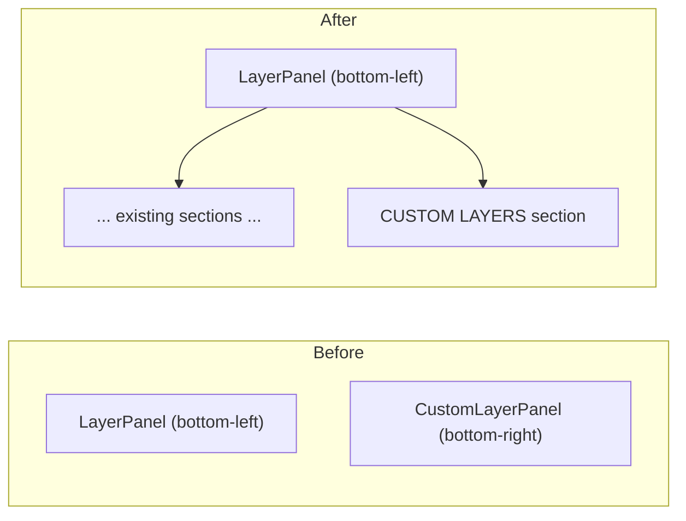
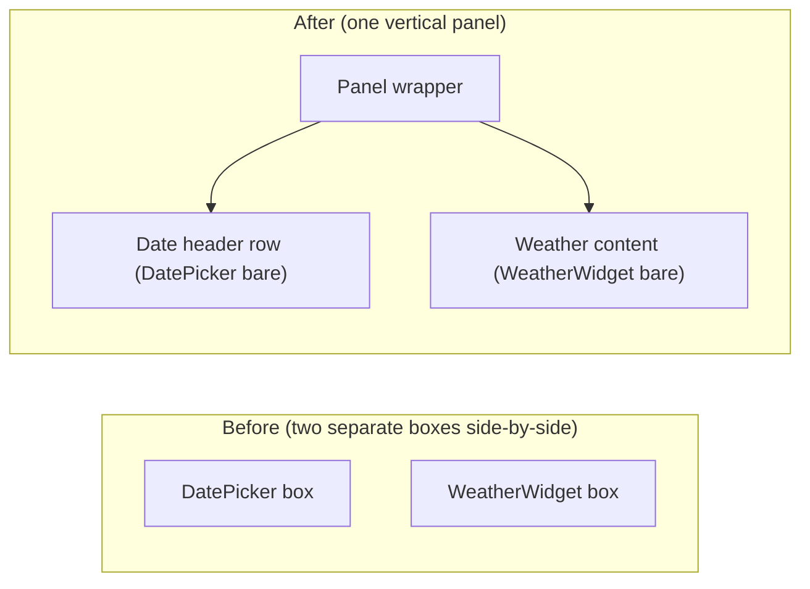

# UI Layout & Accessibility Overhaul — Design Document

## Overview

This document describes the design for a comprehensive UI layout and accessibility improvement pass
on the Aurora IPB application. The five problem areas are:

1. **Custom Layers panel** (bottom-right) is redundant as a standalone overlay — it belongs in the
   existing Layers panel (bottom-left).
2. **Weather + DatePicker** appear as two separate boxes at the top-left; they should be unified
   into one coherent panel.
3. **InfoPanel** (municipality / elevation) and **RoutePanel** clutter the map centre; both should
   live on the right-side edge as collapsible panels.
4. **"Route" button** is small, low-contrast, and poorly labelled — it should read "Plan a Route"
   and be styled as a primary CTA.
5. **Map lines** (roads, drawn features, route) are low-contrast against the dark Mapbox Standard
   night basemap — they need higher contrast colours, thicker strokes, and halo effects.

---

## Analysis of Current Problems

### 1 – Custom Layers Panel (bottom-right)

`CustomLayerPanel` is positioned at `absolute right-4 bottom-10 z-10`. This places it in the
bottom-right corner while the "Layers" panel is in the bottom-left. Users must look in two different
corners to manage layers. The current panel has its own header/collapse toggle, making it
structurally identical to the Layers panel — a strong signal they should be merged.

### 2 – Weather / Date split box

`MapWithNav` renders:
```tsx
<div className="absolute left-4 top-16 z-10 flex items-start gap-2">
  <WeatherWidget ... />
  <DatePicker ... />
</div>
```
Each child renders its own `rounded-lg border border-slate-700 bg-slate-900/90 ...` panel — two
separate boxes side-by-side. This makes the relationship between the date selector and the weather
data unclear. The expected UX is "choose a date, see weather for that date" — best expressed as a
single stacked panel.

### 3 – InfoPanel & RoutePanel position

`InfoPanel` is at `right-4 top-1/2 -translate-y-1/2` (vertically centred right). `RoutePanel` is
at `bottom-10 left-1/2 -translate-x-1/2` (bottom-centre, 384 px wide). Both encroach on the map
canvas — the route panel in particular blocks the centre of the screen where the user is most likely
to be interacting with the map.

The right-side edge is the canonical location for detail/context panels in map applications
(Google Maps, Mapbox Studio, Felt, etc.). Stacking InfoPanel and RoutePanel on the right keeps the
map centre clear. Both panels are optional/dismissible so they don't permanently consume space.

### 4 – Route button

Current: `"absolute top-4 right-20 z-10 ... bg-black/60 ... Route"`.

Problems:
- `bg-black/60` is nearly invisible against the dark basemap.
- The label "Route" is ambiguous — is it a layer, a view, or an action?
- It sits at `right-20` to avoid the Mapbox NavigationControl, but also collides with
  `DrawingToolbar` at `right-4` when drawing mode is active.

### 5 – Map contrast

In Mapbox Standard night mode, the basemap background for land is approximately `#1a1a2e`. Against this:
- `roads-line` default colour `#64748b` (slate-500) at opacity 0.8 is barely distinguishable.
- Min line width at zoom 8 is 1 px — subpixel on retina displays.
- `railways-line` at `#a78bfa` width 2 with `[2,2]` dasharray renders as dots at medium zoom.
- Route line at `#3b82f6` (blue-500) width 5 is acceptable colour-wise but has no halo, so it
  can merge visually into map tile roads below.
- Custom layer lines at width 4 rely on bright palette colours (acceptable) but benefit from a
  contrasting stroke for legibility on both light and dark map tiles.

---

## Alternatives Considered

| Option | Decision |
|--------|----------|
| Create a new `RightSidebar` wrapper component for InfoPanel + RoutePanel | Rejected — adds abstraction without benefit; Tailwind absolute positioning achieves the same layout directly. |
| Use a drawer/slide-in animation for right panels | Deferred — outside scope; but collapsible via local `collapsed` state achieves 90% of the UX benefit without animation complexity. |
| Delete `CustomLayerPanel.tsx` and inline its JSX in `LayerPanel.tsx` | Rejected — all existing `CustomLayerPanel` tests would break. Preferred: extract inner body as `CustomLayerSection`, keep legacy export. |
| Strip outer wrapper from `WeatherWidget` / `DatePicker` via a `bare` prop | **Accepted** — cleanest approach; backwards-compatible with existing tests (bare=false by default). |
| Move DrawingToolbar to left side | Rejected — inconsistent with its existing top-right placement; better to shift it down to `top-16` to avoid collision with the route button. |

---

## Detailed Design

### Component interaction map



### 1 – Merge Custom Layers into Layer Panel

**Strategy**: Give `LayerPanel` optional custom-layer props; render `CustomLayerPanel`'s inner
content as a new section inside the same panel container.



Changes:
- `CustomLayerPanel.tsx` is refactored to export a `CustomLayerSection` component containing the
  inner body (list + create form) **without** the outer absolute-positioned panel wrapper.
  The legacy default export `CustomLayerPanel` is kept as a thin wrapper for existing test
  compatibility.
- `LayerPanel` receives an optional `customLayerProps` object typed as the existing
  `CustomLayerPanelProps`. When provided, a `CUSTOM LAYERS` section heading and
  `<CustomLayerSection {...customLayerProps} />` appear at the bottom of the panel body.
- `LayerPanel` width: `w-48` → `w-56` (224 px) to accommodate layer names.
- `MapWithNav` no longer renders `<CustomLayerPanel .../>` as a standalone sibling; it passes
  props to `<LayerPanel customLayerProps={...} />`.

### 2 – Unified Weather Panel



Changes:
- `DatePicker`: add `bare?: boolean` prop. When `bare=true`, return just the inner `<select>`
  elements (wrapped in a plain `<div className="flex items-center gap-1">`), with no outer
  `rounded-lg border ... backdrop-blur-sm` div.
- `WeatherWidget`: add `bare?: boolean` prop. When `bare=true`, all three render branches (loading,
  no-data, data) return their content without the outer panel div. Padding is removed; the parent
  provides it.
- `MapWithNav` wrapper:

```tsx
{selectedAreaId && (
  <div className="absolute left-4 top-16 z-10 w-52 rounded-lg border border-slate-700 bg-slate-900/90 backdrop-blur-sm shadow-xl">
    {/* Date row */}
    <div className="flex items-center gap-2 px-3 py-2 border-b border-slate-700/40">
      <span className="text-[9px] font-mono text-slate-500 uppercase tracking-widest flex-1">
        Date
      </span>
      <DatePicker
        bare
        month={selectedDay.month}
        day={selectedDay.day}
        onChange={(month, day) => setSelectedDay({ month, day })}
      />
    </div>
    {/* Weather data */}
    <WeatherWidget
      bare
      region={selectedAreaId}
      month={selectedDay.month}
      day={selectedDay.day}
    />
  </div>
)}
```

### 3 – InfoPanel and RoutePanel on the Right Edge

#### Position changes

| Panel | Before | After |
|-------|--------|-------|
| `InfoPanel` | `absolute right-4 top-1/2 -translate-y-1/2` | Rendered as `absolute right-4 top-20 z-20 max-h-[60vh] overflow-y-auto` |
| `RoutePanel` | `absolute bottom-10 left-1/2 -translate-x-1/2 w-96` | `absolute right-4 bottom-10 z-20 w-80` |

InfoPanel positioning is changed by updating the class directly inside `InfoPanel.tsx`. RoutePanel
positioning is changed inside `RoutePanel.tsx`.

#### Collapsibility

**InfoPanel**: add `collapsed / setCollapsed` local state (default `false`). A `▾/▸` chevron in
the header row beside the `×` close button toggles collapsed state. When collapsed, only the
title bar renders (content area gets `hidden`). The `×` still dismisses entirely (calls `onClose`).

**RoutePanel**: existing `onClose` handler already removes the panel from the DOM. Add a collapse
chevron (`▾/▸`) in the header. Collapsed state hides the body; header stays visible. Default
expanded. Collapsing does NOT call `onClose`; it just hides the body.

#### RoutePanel width adjustment

`w-96` (384 px) → `w-80` (320 px): better on 1280 px wide displays while still readable.

### 4 – "Plan a Route" Button

| Property | Before | After |
|----------|--------|-------|
| Text | `"Route"` | `"Plan a Route"` |
| Background | `bg-black/60 backdrop-blur-sm` | `bg-blue-600 hover:bg-blue-700` |
| Border (inactive) | `border-white/30` | `border-blue-500` |
| Border (active) | `border-blue-400 shadow-[0_0_0_2px_#60a5fa]` | unchanged |
| Padding | `px-3 py-1.5` | `px-4 py-2` |
| Position | `top-4 right-20` | `top-4 right-4` |
| `data-testid` | `route-toggle-btn` | `route-toggle-btn` (unchanged) |

The `DrawingToolbar` currently uses `top-4 right-4` which would overlap with the repositioned
button. Fix: change `DrawingToolbar` outer div to `top-16 right-4` (64 px below the nav bar).

### 5 – Map Contrast Improvements

#### Roads

Add a dark halo layer **below** `roads-line`:

```js
map.addLayer({
  id: "roads-line-casing",
  type: "line",
  minzoom: 12,
  source: "roads-source",
  layout: { visibility: vis.roads ? "visible" : "none" },
  paint: {
    "line-color": "#0f172a",
    "line-width": ["interpolate", ["linear"], ["zoom"], 8, 3, 14, 7],
    "line-opacity": 0.65,
  },
});
```

Update `roads-line`:
- Default colour: `#64748b` → `#94a3b8`
- Opacity: 0.8 → 1.0
- Width: `[zoom 8→1, zoom 14→3]` → `[zoom 8→1.5, zoom 14→4]`

Layer insertion order: `roads-line-casing` added before `roads-line` (Mapbox `addLayer` without
`before` param appends; use `before: "roads-line"` for the casing).

#### Route line

Add a white glow layer **below** `route-line`:

```js
map.addLayer({
  id: "route-line-outline",
  type: "line",
  source: "route-source",
  slot: "top",
  layout: { "line-join": "round", "line-cap": "round" },
  paint: {
    "line-color": "#ffffff",
    "line-width": 9,
    "line-opacity": 0.25,
  },
});
```

The `route-line` colour and width remain unchanged (`#3b82f6`, width 5).

#### Railways

- Width: 2 → 3
- Dasharray: `[2, 2]` → `[4, 2]`

#### Custom layer lines

- `line-width`: 4 → 5 for the `-line` paint layer.
- `circle-radius`: 10 → 11 for better point visibility.

---

## Screen Layout Diagram

```
┌────────────────────────────────────────────────────────────────────────────┐
│  AreaNav (top-centre: Lappi | Karjala | Turku)       [Plan a Route] (top-4 right-4) │
├───────────────────────────────────────────────────────────────────────────────┤
│  ┌──────────┐                                          ┌─────────────────┐  │
│  │  Date:   │                                          │ Municipality /  │  │
│  │  [May▼][16▼]                                       │ Elevation info  │  │
│  │  Hist avg · N yr                                   │ (InfoPanel,     │  │
│  │  12.3°C ± 2.1°                                    │  right-4 top-20)│  │
│  │  18% rain                                          └─────────────────┘  │
│  └──────────┘                                                               │
│                                                                              │
│                     M  A  P     C  A  N  V  A  S                            │
│                                                                              │
│                                                          ┌─────────────────┐│
│  ┌─────────────────────┐                                │ Route Planning  ││
│  │ Layers              │                                │ (RoutePanel,    ││
│  │ ─ Basemap           │                                │  right-4 bot-10)││
│  │ ─ Terrain           │                                │ w-80            ││
│  │ ─ Elevation         │                                └─────────────────┘│
│  │ ─ Vegetation        │                                                    │
│  │ ─ Comms             │                                                    │
│  │ ─ Infrastructure    │                                                    │
│  │ ─ Custom Layers     │                                                    │
│  │   + New Layer       │                                                    │
│  └─────────────────────┘                                                    │
└─────────────────────────────────────────────────────────────────────────────┘
```

---

## Summary of File Changes

| File | Change summary |
|------|---------------|
| `src/components/CustomLayerPanel.tsx` | Extract `CustomLayerSection` (inner body, no outer div); keep `CustomLayerPanel` legacy wrapper. |
| `src/components/LayerPanel.tsx` | Accept `customLayerProps?`; render `CustomLayerSection`; widen to `w-56`. |
| `src/components/WeatherWidget.tsx` | Add `bare?: boolean` prop. |
| `src/components/DatePicker.tsx` | Add `bare?: boolean` prop. |
| `src/components/InfoPanel.tsx` | Add `collapsed/setCollapsed` state + chevron toggle; update position class to `right-4 top-20 z-20 max-h-[60vh] overflow-y-auto`. |
| `src/components/RoutePanel.tsx` | Change position from bottom-centre to `right-4 bottom-10`; width `w-80`; add collapse chevron. |
| `src/components/DrawingToolbar.tsx` | `top-4 right-4` → `top-16 right-4` to avoid route button overlap. |
| `src/components/MapView.tsx` | Add `roads-line-casing` + `route-line-outline` layers; update road/railway/custom-layer paint values. |
| `src/components/MapWithNav.tsx` | Remove `<CustomLayerPanel/>`; pass props to `LayerPanel`; unify weather wrapper; update route button label/style/position. |
| Tests | Update affected tests for new prop signatures, positions, and section merges. |

---

## References

- Mapbox GL JS line layer paint spec: https://docs.mapbox.com/mapbox-gl-js/style-spec/layers/#line
- Mapbox Standard night-mode: https://docs.mapbox.com/mapbox-gl-js/guides/styles/
- WCAG 1.4.11 non-text contrast (3:1 minimum for UI components against adjacent colours)
- Map panel UX patterns: Felt.com, Google Maps sidebar, Mapbox Studio sidebar
