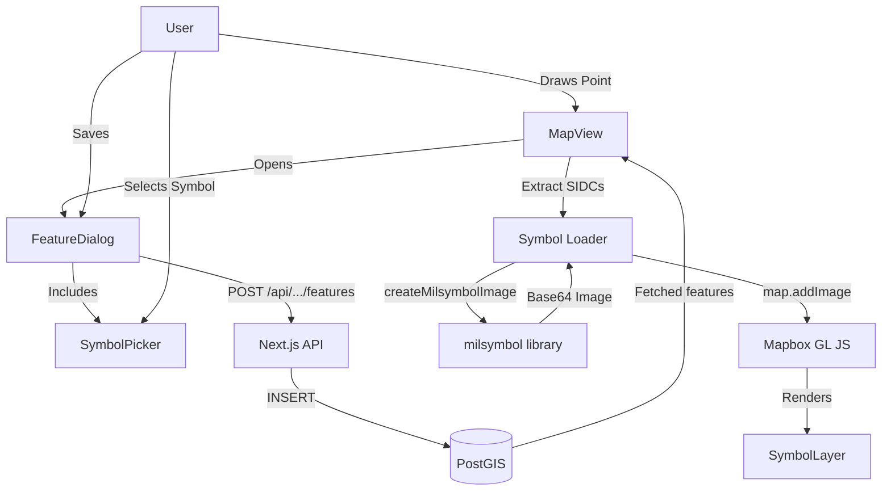

# Design Document: Military Symbol Support for Custom Layers

## Overview
This modification enables users to add NATO APP-6 / US MIL-STD-2525 military symbols to point features in custom drawing layers. These symbols will be persisted in the database and rendered dynamically on the map using the `milsymbol` library.

## Goal
- Allow users to select a military symbol (SIDC) when saving a drawn point feature.
- Persist the SIDC in the `properties` JSONB column of the `custom_features` table.
- Render these symbols on the map with standard NATO affiliation colors (Blue/Red/Green/Yellow).
- Ensure symbols are synced across users and persist on page reload.

## Detailed Analysis

### Current State
- `custom_features` table has `properties` JSONB, currently empty.
- `FeatureDialog` only allows entering Name and Description.
- `MapView` renders points as simple circles using `circle-color` from the `color` column.
- `milsymbol.ts` already has `createMilsymbolImage` utility.

### Requirements
1. **SIDC Storage**: Store `{ sidc: "..." }` in `properties`.
2. **Symbol Selection**: A searchable UI component to pick from common military symbols.
3. **Dynamic Rendering**: Mapbox needs images registered via `map.addImage`. Since SIDCs are dynamic, we must register them on-the-fly as features are loaded.
4. **Affiliation Colors**: Use standard colors determined by the SIDC's affiliation character (2nd position).

## Proposed Design

### 1. Symbol Data (`src/lib/milsymbolData.ts`)
Create a curated list of common military symbols with their SIDC and a human-readable name. This will power the searchable dropdown.

### 2. UI - Symbol Picker (`src/components/SymbolPicker.tsx`)
A new component that:
- Takes a `selectedSidc` and `onChange`.
- Displays a searchable list of symbols.
- Shows a preview of the symbol using `milsymbol` (via a simplified version of the rendering logic).

### 3. Feature Dialog Integration
Modify `FeatureDialog` to include the `SymbolPicker` when the feature type is a `Point`.
Update the `onSave` callback to include the selected SIDC.

### 4. Database & API
- **POST /api/custom-layers/[id]/features**: Already accepts `properties`.
- **PUT /api/custom-layers/[id]/features/[fid]**: Update to accept and save `properties`.

### 5. Map Rendering (`src/components/MapView.tsx`)
- **Symbol Layer**: Add a new `symbol` layer for each custom source, filtered to points with a `sidc` property.
- **Dynamic Image Loading**:
  - Create a utility `ensureMilsymbolImages(map, features)` that:
    1. Extracts all unique SIDCs from the features.
    2. Checks if `map.hasImage(id)`.
    3. If not, generates the image and calls `map.addImage`.
  - Call this utility after fetching features in `fetchCustomLayerFeatures`.

### Diagram (Mermaid)

## Alternatives Considered
- **Pre-loading all symbols**: Too many possible SIDCs; would bloat the initial load and memory.
- **Fixed icon set**: Limit to ~20 icons. This is easier but doesn't meet the "military symbol" requirement which implies the full standard flexibility.
- **Server-side rendering of icons**: Unnecessary overhead since `milsymbol` is lightweight and works well in the browser.

## Summary
The design leverages existing infrastructure (PostGIS properties column, Mapbox dynamic layers) to add a rich military feature set with minimal architectural changes. The key challenge is the async registration of images in Mapbox, which is handled by a reactive loader triggered on data fetch.

## References
- [milsymbol documentation](https://www.spatialillusions.com/milsymbol/docs/index.html)
- [Mapbox GL JS: Add an icon to the map](https://docs.mapbox.com/mapbox-gl-js/example/add-image/)
- [NATO APP-6D Standard](https://en.wikipedia.org/wiki/NATO_Joint_Military_Symbology)
