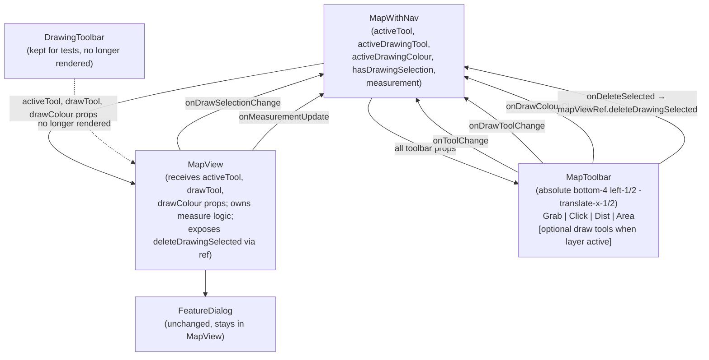

# Design: Unified Bottom-Center Map Toolbar

## Overview

Replace the existing floating `DrawingToolbar` (top-right panel) with a new unified bottom-center toolbar called `MapToolbar`. The toolbar always exposes four interaction-mode buttons (Grab, Click, Measure Distance, Measure Area). When a custom drawing layer is active, draw tool buttons (Point / Line / Polygon / Rectangle + colour palette + Delete Selected) are appended to the right of the standard tools, separated by a visual divider. Switching away from a measure tool immediately clears the temporary geometry.

---

## Detailed Analysis of the Goal

### Current state

| Element                         | Location                  | Behaviour                                                                                          |
| ------------------------------- | ------------------------- | -------------------------------------------------------------------------------------------------- |
| Map interaction                 | Always "click everything" | Elevation + municipality popups fire on every click                                                |
| DrawingToolbar                  | `absolute top-16 right-4` | Only visible when `activeDrawingLayerId !== null`; owns its own tool/colour state inside `MapView` |
| No grab / click / measure tools | —                         | No explicit mode selector                                                                          |

### What the user asked for

1. **Grab** – default map-pan behaviour (cursor = grab/grabbing).
2. **Click** – what currently always fires: elevation query + municipality highlight + road/bridge popups.
3. **Measure Distance** – click to place points forming a LineString; running km total shown inline; cleared on tool switch.
4. **Measure Area** – click to form a Polygon; m² / km² shown inline; cleared on tool switch.
5. **Draw tools (append when layer active)** – Point / Line / Polygon / Rectangle + colour palette + Delete Selected (when selection exists). No visible divider change — the existing cancel mechanism remains (deselecting the active layer in LayerPanel).

---

## Alternatives Considered

### A. Keep toolbar inside MapView (no state lifting)

- Con: `MapView` is already 2 000+ lines. Adding more UI state makes it harder to test and maintain.
- Con: The new toolbar must sit _outside_ the `<div ref={containerRef}>` element because Mapbox owns that DOM node's events.

### B. Move all state into a Context

- Con: Overkill for a single feature; the existing prop-drilling pattern is consistent throughout the codebase.

### C. Render toolbar inside MapView's React tree (already outside containerRef)

- `MapView` already renders `DrawingToolbar` and `FeatureDialog` inside its root `<div className="relative w-full h-full">`, outside the map container div. The toolbar could live there.
- Con: Bottom-center positioning would float relative to MapView, which is full-screen — this works fine actually. But drawing state still needs to be shared with MapWithNav.
- Pro: keeps drawing state local to MapView.

### D. Lift drawing state to MapWithNav, position toolbar in MapWithNav ✓ (chosen)

- `MapWithNav` already owns `activeDrawingLayerId`, all route state, and the InfoPanel. Adding `activeTool`, `activeDrawingTool`, and `activeDrawingColour` is a small, consistent extension.
- `MapToolbar` becomes a simple presentational component, easy to test.
- `MapView` receives tool state via props; its internal click handler switches behaviour based on `activeTool`.
- `DrawingToolbar.tsx` is kept (test compatibility) but no longer rendered by `MapView`.

---

## Detailed Design

### 1. New type: `MapTool`

```ts
// src/lib/mapTool.ts  (new small module)
export type MapTool = "grab" | "click" | "measure-distance" | "measure-area";
export const DEFAULT_MAP_TOOL: MapTool = "grab";

export interface MeasurementState {
  distance_km?: number;
  area_km2?: number;
}
```

### 2. State lifted to `MapWithNav`

```ts
// New state added to MapWithNav
const [activeTool, setActiveTool] = useState<MapTool>("grab");
const [activeDrawingTool, setActiveDrawingTool] = useState<DrawingTool | null>(
  null,
);
const [activeDrawingColour, setActiveDrawingColour] = useState<string>(
  COLOUR_PALETTE[0].hex,
);
const [hasDrawingSelection, setHasDrawingSelection] = useState(false);
const [measurement, setMeasurement] = useState<MeasurementState | null>(null);
```

`MapView` loses its own `activeDrawingTool`, `activeDrawingColour`, `hasDrawingSelection` state and receives them as props instead.

### 3. New props added to `MapViewProps`

```ts
activeTool?: MapTool;                              // which interaction mode
activeDrawingTool?: DrawingTool | null;            // lifted from MapView
activeDrawingColour?: string;                      // lifted from MapView
onDrawToolChange?: (t: DrawingTool | null) => void;
onDrawColourChange?: (hex: string) => void;
onDrawSelectionChange?: (has: boolean) => void;
onMeasurementUpdate?: (m: MeasurementState | null) => void;
```

### 4. New component: `MapToolbar`

**File:** `src/components/MapToolbar.tsx`

**Position in MapWithNav:** `absolute bottom-4 left-1/2 -translate-x-1/2 z-10` — bottom-center, floats above the map.

**Visual structure (left → right):**

```
[ ✋ Grab ] [ 👆 Click ] [ 📏 Dist ] [ ⬡ Area ]   ║   [ • ] [ — ] [ ⬡ ] [ ▭ ]  ● ● ● ● ● ● ● ●  [ Del ] [ ✕ ]
                                                   ^
                                   only when activeDrawingLayerId !== null
```

- Toolbar: `rounded-xl border border-slate-700 bg-slate-900/90 backdrop-blur-sm shadow-xl px-3 py-2 flex items-center gap-1`
- Each tool button: 36×36 px rounded, `aria-pressed`, active = `bg-blue-600 text-white`, inactive = `text-slate-400 hover:text-white hover:bg-slate-700`
- Measurement badge: small `text-[10px]` label under (or right of) the active measure button showing "3.2 km" or "1.4 km²"
- Colour swatches: 20×20 px circles
- "Delete" appears only when `hasDrawingSelection === true`
- Cancel (✕) exits drawing mode: calls `onCancelDrawing()` (which clears `activeDrawingLayerId` in MapWithNav)

**Props:**

```ts
interface MapToolbarProps {
  activeTool: MapTool;
  onToolChange: (t: MapTool) => void;
  measurement: MeasurementState | null;
  // Draw tools section
  activeDrawingLayerId: string | null;
  activeDrawingLayerName: string | undefined;
  activeDrawingTool: DrawingTool | null;
  activeDrawingColour: string;
  hasDrawingSelection: boolean;
  onDrawToolChange: (t: DrawingTool | null) => void;
  onDrawColourChange: (hex: string) => void;
  onDeleteSelected: () => void;
  onCancelDrawing: () => void;
}
```

### 5. Measurement implementation in `MapView`

#### Refs added to MapView

```ts
const measurePointsRef = useRef<[number, number][]>([]);
const activeToolRef = useRef<MapTool>(activeTool ?? "grab");
```

#### Map sources/layers added in `style.load`

```
"measure-source"  → GeoJSON FeatureCollection
"measure-line"    → line layer, dashed cyan (#06b6d4), width 2, dashes [4,2]
"measure-fill"    → fill layer, cyan fill-opacity 0.15 (Polygon only)
"measure-vertices" → circle layer, radius 4, cyan, for each clicked point
```

#### Click handler routing (inside existing `map.on("click", async (e) => {...})`)

```
1. waypoint intercept (unchanged first)
2. grab mode → return early (no action)
3. measure-distance / measure-area → append point, update source, call onMeasurementUpdate
4. click mode → existing elevation + interactive-layer logic
```

#### Double-click to finish / undo last point

- `map.on("dblclick", ...)` — prevent default zoom; pop last point (double-click adds the point twice, so remove the extra one). The measurement finalises with whatever points remain.

#### `computeMeasurement` — pure math helpers (no dependency)

- Distance: sum haversine formula across consecutive point pairs → `distance_km`
- Area: Shoelace formula on projected coordinates → `area_km2`

#### Clearing on tool switch

```ts
useEffect(() => {
  activeToolRef.current = activeTool ?? "grab";
  if (activeTool !== "measure-distance" && activeTool !== "measure-area") {
    measurePointsRef.current = [];
    clearMeasureSources(map);
    onMeasurementUpdate?.(null);
  }
  // Update cursor
  map.getCanvas().style.cursor =
    activeTool === "grab"
      ? ""
      : activeTool === "click"
        ? "default"
        : "crosshair";
}, [activeTool]);
```

### 6. Cursor management

| `activeTool`       | Cursor                              |
| ------------------ | ----------------------------------- |
| `grab`             | `""` (Mapbox handles grab/grabbing) |
| `click`            | `"default"`                         |
| `measure-distance` | `"crosshair"`                       |
| `measure-area`     | `"crosshair"`                       |

### 7. Removing `DrawingToolbar` render from `MapView`

The `DrawingToolbar` component render inside `MapView`'s JSX is removed. The component file itself stays because `DrawingToolbar.test.tsx` imports it directly.

### 8. `handleDeleteSelected` in MapWithNav

Since `drawRef` lives in `MapView`, we expose a method via `MapViewHandle`:

```ts
interface MapViewHandle {
  getMapScreenshot: () => string | undefined;
  deleteDrawingSelected: () => void; // calls drawRef.current?.trash()
}
```

MapWithNav calls `mapViewRef.current?.deleteDrawingSelected()` from the toolbar's `onDeleteSelected`.

---

## Component Diagram



---

## Implementation Summary

| File                                      | Change                                                                                                                                                                        |
| ----------------------------------------- | ----------------------------------------------------------------------------------------------------------------------------------------------------------------------------- |
| `src/lib/mapTool.ts`                      | **New**: `MapTool` type, `DEFAULT_MAP_TOOL`, `MeasurementState`                                                                                                               |
| `src/components/MapToolbar.tsx`           | **New**: unified toolbar component                                                                                                                                            |
| `src/components/MapView.tsx`              | Accept drawing state as props; add `activeTool` prop; add measure sources/layers; route click by tool; expose `deleteDrawingSelected` via ref; remove `DrawingToolbar` render |
| `src/components/MapWithNav.tsx`           | Add `activeTool`, `activeDrawingTool`, `activeDrawingColour`, `hasDrawingSelection`, `measurement` state; wire `MapToolbar`; pass new props to `MapView`                      |
| `src/components/DrawingToolbar.tsx`       | No change (kept for test compatibility)                                                                                                                                       |
| `src/test/components/MapToolbar.test.tsx` | **New**: unit tests for toolbar                                                                                                                                               |
| `src/test/components/MapView.test.tsx`    | Update prop list; add tests for tool routing and measure                                                                                                                      |
| `src/test/components/MapWithNav.test.tsx` | Update stub props; add tool state wiring tests                                                                                                                                |
| `CLAUDE.md`                               | Update component descriptions                                                                                                                                                 |
