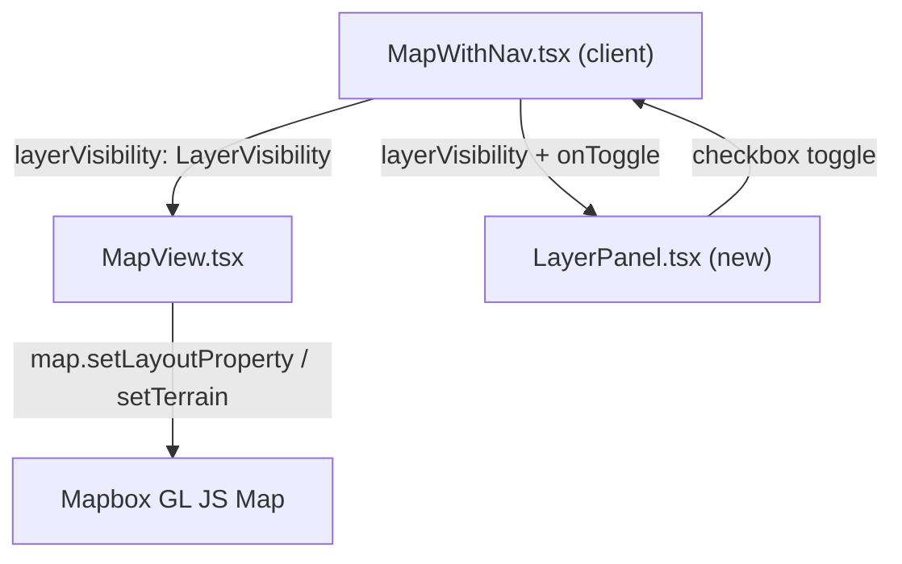

# Design Document: Military Terrain & Intelligence Layers

## Overview

Add military-relevant map overlay layers to the Aurora IPB dark-theme Mapbox map, controlled via a floating toggle panel. Layers cover terrain analysis, elevation, land cover (vegetation density), and water — critical data for GO/SLOW-GO/NO-GO terrain assessment and convoy route planning.

---

## Detailed Analysis

### Current State

`MapView.tsx` initialises a single Mapbox Standard style map (night preset) with:
- AOI bounding-box polygons (`aoi-source`, `aoi-fill`, `aoi-outline`)
- Cell tower overlay with clustering (`cell-towers-source`, 3 layers)

All layers are always-visible; there is no layer control UI. The component is entirely self-contained (refs, not state, for the map instance). `MapWithNav.tsx` owns only `selectedAreaId` state.

### Problem

Military analysts need to read terrain features directly on the map to perform IPB:
1. **Elevation/terrain** — hills, ridgelines, valleys (3D or hillshade-derived)
2. **Contour lines** — precise elevation data for tactical planning
3. **Vegetation/land cover** — forests (NO-GO for vehicles), scrub (SLOW-GO), open terrain (GO)
4. **Water obstacles** — rivers, lakes, bogs (crossing obstacles)
5. **Routes** — road network legibility in tactical context

These must be **individually toggleable** because analysts may want clean basemap + only contours, or full terrain mode, depending on the planning phase.

### Data Sources

All layers are served from Mapbox-hosted tilesets — no additional backend is required:

| Layer group | Tileset | Type |
|---|---|---|
| 3D Terrain + Hillshade | `mapbox://mapbox.mapbox-terrain-dem-v1` | raster-dem |
| Contour lines | `mapbox://mapbox.mapbox-terrain-v2` | vector (source-layer: `contour`) |
| Land cover | `mapbox://mapbox.mapbox-terrain-v2` | vector (source-layer: `landcover`) |
| Water | Mapbox Standard built-in | config property |

### Constraints

- Mapbox GL JS v3 (installed `^3.23.1`) — Standard style with slots (`bottom`, `middle`, `top`) is fully supported.
- SSR guard already in place via `MapLoader.tsx`.
- Map init is one-shot (`useEffect([], [])`); layer visibility changes must go through `map.setLayoutProperty()` and `map.setTerrain()` in a separate `useEffect` keyed to layer state.
- Must remain readable in 2D (flat) mode — 3D terrain is optional.
- Dark/military colour palette throughout (slate, olive, muted greens, blues).

---

## Alternatives Considered

### A. Always-on overlay layers (rejected)
Simpler implementation, no UI needed. Rejected because stacking all layers simultaneously creates a visually noisy map — analysts need to focus on specific intelligence aspects. Toggle control is essential for operational use.

### B. External tile server (rejected)
Hosting a custom Mapbox-compatible tile server with NLS Finland data would provide higher-fidelity Finnish terrain. Rejected for this phase — the hackathon timeline requires a working demo using Mapbox-hosted tilesets. Finnish PostGIS data (landcover from NLS CORINE) can be added as a future phase via `/api/landcover` GeoJSON overlay.

### C. Layer control in sidebar (rejected)
A full sidebar panel requires significant layout restructuring and is harder to use while panning the map. A floating semi-transparent panel (bottom-left) is more space-efficient and stays visible regardless of AOI nav state.

### D. `setConfigProperty` for water colour only (accepted for water)
The Standard style's `colorWater` config property colours all water features globally without an additional source or layer. This is the correct approach for water highlighting — no GeoJSON overlay needed at this stage.

---

## Detailed Design

### 1. Layer Architecture

Two Mapbox sources are added once on `style.load`:

```
mapbox-dem      → raster-dem (terrain-dem-v1)
terrain-v2      → vector (terrain-v2 tileset)
```

Five new layers are added in slot order:

| Layer ID | Type | Source | Source-layer | Slot | Toggle key |
|---|---|---|---|---|---|
| `hillshading` | hillshade | mapbox-dem | — | bottom | `hillshade` |
| `landcover-military` | fill | terrain-v2 | landcover | bottom | `landcover` |
| `contours-minor` | line | terrain-v2 | contour | bottom | `contours` |
| `contours-major` | line | terrain-v2 | contour | bottom | `contours` |
| `contours-labels` | symbol | terrain-v2 | contour | middle | `contours` |

3D terrain is controlled via `map.setTerrain()` / `map.setTerrain(null)` — not a layer, so it uses a separate `terrain3d` toggle key.

Water colour is controlled via `map.setConfigProperty('basemap', 'colorWater', ...)` — also not a layer.

### 2. Layer Group → Toggle Keys

```
terrain3d   → 3D terrain extrusion (setTerrain on/off)
hillshade   → hillshading layer
contours    → contours-minor, contours-major, contours-labels layers
landcover   → landcover-military layer
```

Cell towers remain controlled by their existing always-on logic (no change in this PR).

### 3. Component Architecture



**State location:** `MapWithNav` — owns `LayerVisibility` state (Record of toggle keys → boolean).

**`LayerVisibility` type (new, in `src/lib/layers.ts`):**

```ts
export type LayerKey = 'terrain3d' | 'hillshade' | 'contours' | 'landcover';

export interface LayerVisibility extends Record<LayerKey, boolean> {
  terrain3d: boolean;
  hillshade:  boolean;
  contours:   boolean;
  landcover:  boolean;
}

export const DEFAULT_LAYER_VISIBILITY: LayerVisibility = {
  terrain3d: false,
  hillshade:  true,
  contours:   true,
  landcover:  true,
};
```

**`LayerPanel.tsx` (new `src/components/LayerPanel.tsx`):**
- `'use client'`
- Props: `visibility: LayerVisibility`, `onToggle: (key: LayerKey) => void`
- Renders a fixed-position floating panel (bottom-left, above Mapbox attribution)
- Dark slate background (`bg-slate-900/90 border-slate-700`)
- Military-style section headings: `TERRAIN`, `ELEVATION`, `VEGETATION`
- Each row: label + checkbox/switch
- Collapsible with a chevron button

**`MapView.tsx` changes:**
- New prop: `layerVisibility: LayerVisibility`
- `style.load` handler adds all sources and layers (initial visibility set from `layerVisibility` at init time)
- New `useEffect([layerVisibility], ...)` syncs visibility changes to the live map:
  ```ts
  // Layer groups → layer IDs
  const LAYER_GROUPS: Record<LayerKey, string[]> = {
    terrain3d: [],  // handled via setTerrain
    hillshade:  ['hillshading'],
    contours:   ['contours-minor', 'contours-major', 'contours-labels'],
    landcover:  ['landcover-military'],
  };
  ```

**`MapWithNav.tsx` changes:**
- Import and render `LayerPanel` (positioned absolute bottom-left inside the map container)
- Add `layerVisibility` state initialised to `DEFAULT_LAYER_VISIBILITY`
- Pass `layerVisibility` and `onToggle` to `LayerPanel`
- Pass `layerVisibility` to `MapView`

### 4. Visual Style Palette

All layer colours follow the existing dark/military slate palette:

| Layer | Colour intent | Value |
|---|---|---|
| Hillshade shadow | Night-mode terrain shadow | `#0d1520` |
| Hillshade highlight | Pale ridge highlight | `#3a6080` |
| Contour (minor) | Subtle elevation line | `rgba(100,160,120,0.45)` |
| Contour (major) | Bold 5× interval line | `rgba(130,200,150,0.75)` |
| Contour labels | Elevation annotation | `#8acd9a` text, dark halo |
| Landcover: wood | NO-GO forest | `rgba(20,83,45,0.55)` |
| Landcover: scrub | SLOW-GO | `rgba(54,83,20,0.35)` |
| Landcover: grass/crop | GO terrain | `rgba(74,108,42,0.22)` |
| Landcover: snow | Hazard | `rgba(180,210,255,0.3)` |
| Water (config) | Obstacle blue | `#0d2137` |

### 5. Military Standard Style Config Hardening

On `style.load`, add military-appropriate config hardening (suppress civilian noise):

```ts
map.setConfigProperty('basemap', 'showPointOfInterestLabels', false);
map.setConfigProperty('basemap', 'showTransitLabels', false);
map.setConfigProperty('basemap', 'show3dObjects', false);
map.setConfigProperty('basemap', 'colorWater', '#0d2137');
```

These fire unconditionally — they harden the basemap for IPB use regardless of which toggleable layers are on.

### 6. 3D Terrain Behaviour

- When `terrain3d: true`: `map.setTerrain({ source: 'mapbox-dem', exaggeration: 1.5 })`
- When `terrain3d: false`: `map.setTerrain(null)`
- The map pitch is not forced — analysts control camera with mouse. The 3D toggle enables terrain extrusion but does not lock/unlock the camera.
- When 3D terrain is off, hillshade + contours still provide 2D terrain readability.

### 7. LayerPanel UI Layout

```
┌─────────────────────────────────────┐
│  LAYERS                          ▲  │
├─────────────────────────────────────┤
│  TERRAIN                            │
│  ○ 3D Terrain                   [✓] │
│  ○ Hillshade                    [✓] │
├─────────────────────────────────────┤
│  ELEVATION                          │
│  ○ Contour Lines                [✓] │
├─────────────────────────────────────┤
│  VEGETATION                         │
│  ○ Land Cover                   [✓] │
└─────────────────────────────────────┘
```

Position: `absolute` bottom-left (`left-4 bottom-10`), above Mapbox attribution.
Width: `w-52` (208px). Dark slate background with 90% opacity.

---

## Summary

| Component | Change |
|---|---|
| `src/lib/layers.ts` | **New** — `LayerKey`, `LayerVisibility`, `DEFAULT_LAYER_VISIBILITY`, `LAYER_GROUPS` |
| `src/components/LayerPanel.tsx` | **New** — floating toggle panel |
| `src/components/MapView.tsx` | Add terrain sources/layers; `layerVisibility` prop + sync effect |
| `src/components/MapWithNav.tsx` | Add `layerVisibility` state; render `LayerPanel` |

No API routes, database changes, or new npm packages are required. All terrain data comes from Mapbox-hosted tilesets already accessible with the existing `NEXT_PUBLIC_MAPBOX_TOKEN`.

---

## References

- Mapbox Terrain DEM source: `mapbox://mapbox.mapbox-terrain-dem-v1`
- Mapbox Terrain v2 (contours + landcover): `mapbox://mapbox.mapbox-terrain-v2`
- Mapbox Standard style slots: `bottom`, `middle`, `top`
- Mapbox GL JS `setTerrain()` API — enable/disable 3D terrain extrusion
- Mapbox Standard style `setConfigProperty('basemap', ...)` — config property reference
- `map.setLayoutProperty(id, 'visibility', 'visible'|'none')` — runtime layer toggle
