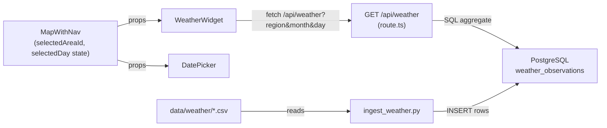
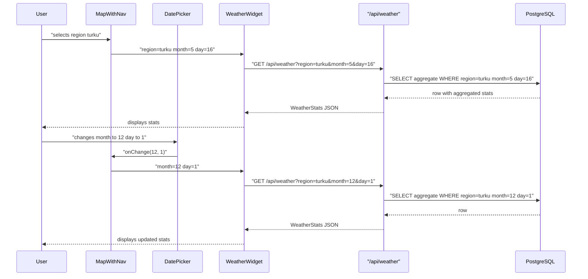

# Design: Historical Weather Widget

## Overview

Add a historical weather widget to the Aurora IPB map that shows climate statistics for the selected Area of Interest. When a region is active, a compact panel in the top-left corner displays aggregated temperature and precipitation statistics for a user-chosen calendar day, derived from 10 years of FMI station data (~3,600 daily readings per region).

Weather data is first ingested from CSV into PostgreSQL (matching the existing infrastructure data pattern), and the API route queries the DB rather than reading files at request time.

## Detailed Analysis

### Source Data

Three CSV files at `data/weather/{region}_weather.csv` (turku, karjala, lappi). Each row is one daily observation from a fixed FMI weather station:

| Column (Finnish)     | Meaning             | Notes                          |
| -------------------- | ------------------- | ------------------------------ |
| Havaintoasema        | Station name        | Not stored — not displayed     |
| Vuosi                | Year                | 2016–2026                      |
| Kuukausi             | Month               | 1–12                           |
| Päivä                | Day                 | 1–31                           |
| Aika                 | Time (local)        | Always 03:00, ignored          |
| Sademäärä [mm]       | Precipitation mm    | **-1 = no rain, treated as 0** |
| Ilman keskilämpötila | Mean temperature °C |                                |
| Ylin lämpötila       | Max temperature °C  |                                |
| Alin lämpötila       | Min temperature °C  |                                |

~10 years → ~10 matching rows per calendar day per region.

### Goal

- Ingest weather observations into PostgreSQL table `weather_observations`
- API route queries DB, aggregates by (region, month, day)
- Stats displayed: avg mean/min/max temp with ± spread, rain probability %, avg mm on wet days
- Widget hidden when no region selected; date picker defaults to today

### Constraints

- Station name is **not** stored or displayed
- No new npm dependencies; ingestion uses existing Python stack (psycopg2, tqdm, dotenv)
- API route uses existing `query` helper from `src/lib/db.ts`
- Consistent with existing dark-slate UI style

## Alternatives Considered

| Approach                            | Pros                                                  | Cons                                                           | Decision   |
| ----------------------------------- | ----------------------------------------------------- | -------------------------------------------------------------- | ---------- |
| DB ingest + SQL aggregate           | Fast queries, consistent with all other data, indexed | Requires ingestion step                                        | **Chosen** |
| API route reads CSV directly        | No ingestion step                                     | Slow file I/O per request, not consistent with project pattern | Rejected   |
| Static JSON pre-built at build time | No fetch latency                                      | Requires build script, harder to extend                        | Rejected   |
| Bundle CSV as static import         | Simple                                                | ~300 KB added to JS, leaks raw data to client                  | Rejected   |

## Detailed Design

### Architecture



### Phase 0 — DB Ingestion Script

**File:** `scripts/ingest_weather.py`

Follows the same pattern as `ingest_geodata.py`:

- Reads `.env.local` for `DATABASE_URL`
- `--no-drop` flag for idempotent re-runs
- `tqdm` progress bars
- `execute_values` + per-batch commits (500 rows/batch)

**Table schema:**

```sql
CREATE TABLE IF NOT EXISTS weather_observations (
  id         SERIAL PRIMARY KEY,
  region_id  TEXT    NOT NULL,   -- 'turku' | 'karjala' | 'lappi'
  year       SMALLINT NOT NULL,
  month      SMALLINT NOT NULL,
  day        SMALLINT NOT NULL,
  precip_mm  REAL,               -- NULL when original value was -1
  mean_temp  REAL NOT NULL,
  max_temp   REAL NOT NULL,
  min_temp   REAL NOT NULL
);
CREATE INDEX IF NOT EXISTS weather_region_month_day
  ON weather_observations (region_id, month, day);
```

Station name is intentionally excluded from the schema.

`-1` precipitation values are stored as `NULL` (no rain).

### API Route: `GET /api/weather`

**File:** `src/app/api/weather/route.ts`

**Query params:** `region` (turku|karjala|lappi), `month` (1–12), `day` (1–31)

**SQL:**

```sql
SELECT
  COUNT(*)                                          AS sample_size,
  AVG(mean_temp)                                    AS avg_temp,
  AVG(min_temp)                                     AS min_temp,
  AVG(max_temp)                                     AS max_temp,
  AVG((max_temp - min_temp) / 2.0)                  AS temp_spread,
  100.0 * COUNT(precip_mm) / COUNT(*)               AS rain_probability,
  COALESCE(AVG(precip_mm), 0)                       AS avg_rain_mm
FROM weather_observations
WHERE region_id = $1
  AND month     = $2
  AND day       = $3
```

`COUNT(precip_mm)` counts only non-NULL rows (rainy days), so rain probability and avg are correct automatically — no special -1 handling needed after ingestion.

**Response type:**

```ts
interface WeatherStats {
  region: string;
  month: number;
  day: number;
  avgTemp: number;
  minTemp: number;
  maxTemp: number;
  tempSpread: number;
  rainProbability: number;
  avgRainMm: number;
  sampleSize: number;
}
```

Graceful degradation: if `DATABASE_URL` is absent or query fails, returns zeroed stats with `sampleSize: 0`.

### State in `MapWithNav`

```ts
const [selectedDay, setSelectedDay] = useState<{ month: number; day: number }>(
  () => {
    const now = new Date();
    return { month: now.getMonth() + 1, day: now.getDate() };
  },
);
```

`selectedDay` always has a value (defaults to today). The whole widget block renders only when `selectedAreaId !== null`.

### New Components

#### `WeatherWidget`

**File:** `src/components/WeatherWidget.tsx`
**Props:** `region: string`, `month: number`, `day: number`

- Fetches `/api/weather?…` on prop changes via `useEffect`
- Shows a loading skeleton while fetching
- Layout:

```
🌡 12.3°C ± 4.1°   ↑17.1°  ↓7.5°
🌧 42% chance · avg 3.2 mm on wet days
```

Styling: `absolute left-4 top-16 z-10`, dark slate card, `font-mono text-xs`, same palette as LayerPanel / InfoPanel.

#### `DatePicker`

**File:** `src/components/DatePicker.tsx`
**Props:** `month: number`, `day: number`, `onChange: (month: number, day: number) => void`

- Two `<select>` dropdowns: Month (Jan–Dec) and Day (1–31)
- Days clamped to valid range for chosen month (Feb max 29)
- Same dark-slate styling

### Layout in `MapWithNav`

```tsx
{
  selectedAreaId && (
    <div className="absolute left-4 top-16 z-10 flex items-start gap-2">
      <WeatherWidget
        region={selectedAreaId}
        month={selectedDay.month}
        day={selectedDay.day}
      />
      <DatePicker
        month={selectedDay.month}
        day={selectedDay.day}
        onChange={(month, day) => setSelectedDay({ month, day })}
      />
    </div>
  );
}
```

### Sequence Diagram



## Summary

- **Phase 0:** Python ingestion script (`scripts/ingest_weather.py`) loads CSVs → `weather_observations` table; station name excluded; `-1` precipitation stored as `NULL`
- **Phase 1:** API route (`/api/weather`) queries DB with a single aggregate SQL, uses existing `query` helper
- **Phase 2:** `WeatherWidget` component fetches and displays stats (no station name shown)
- **Phase 3:** `DatePicker` component for month/day selection
- **Phase 4:** Wire everything into `MapWithNav`; final tests and docs

## References

- FMI open data: https://www.ilmatieteenlaitos.fi/avoin-data
- Existing ingestion pattern: `scripts/ingest_geodata.py`
- Style reference: `src/components/LayerPanel.tsx`, `src/components/InfoPanel.tsx`
- Next.js Route Handlers: https://nextjs.org/docs/app/building-your-application/routing/route-handlers
