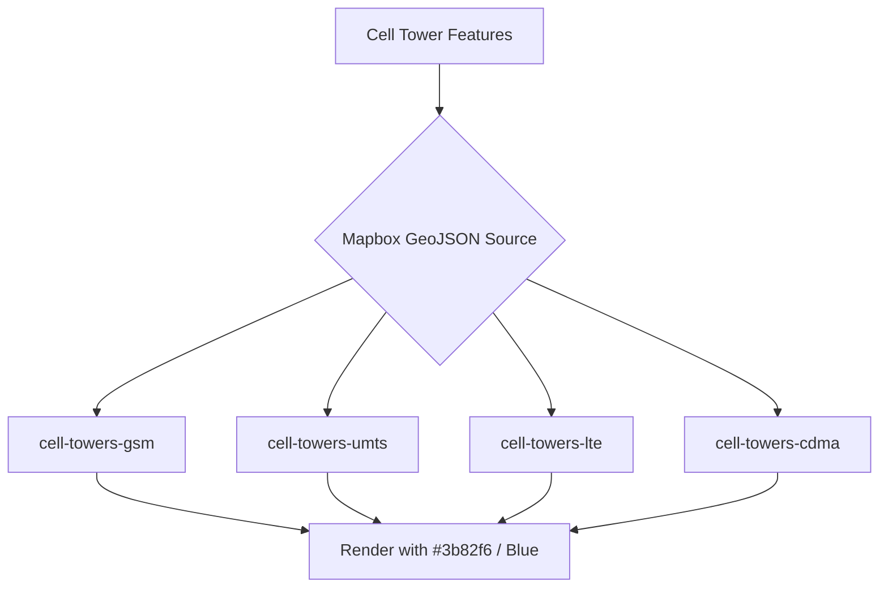

# Modification Design: Update Cell Tower Colors to Friendly (Blue)

## Overview

The goal of this modification is to update the NATO military symbology color used for cell towers in the Next.js application. Currently, the cell towers are color-coded based on their radio type (GSM, UMTS, LTE, CDMA) using various colors (yellow, orange, green, purple). According to military symbol conventions, these ground signal radio units should be rendered as "friendly" entities, which are conventionally represented with a blue color (`#3b82f6`).

## Analysis of the Problem

The application renders cell towers on a Mapbox GL JS map inside `src/components/MapView.tsx`.
When the map style loads, it initializes the cell tower layers for each radio type and generates the corresponding NATO symbols using `createMilsymbolImage`.

Currently, the `towerLayers` configuration defines colors for each radio type:

- GSM: `#fde047` (Yellow)
- UMTS: `#fb923c` (Orange)
- LTE: `#4ade80` (Green)
- CDMA: `#c4b5fd` (Purple)

The SIDC (Symbol Identification Code) used is `SFGPUUSR-------` (Friendly Ground Signal Radio Unit). However, the `fillColor` parameter passed to `milsymbol` overrides the default friendly color with the custom colors listed above.

## Alternatives Considered

- **Change the SIDC:** The SIDC already uses 'F' for friendly (`SF...`). The issue is purely the overridden `fillColor`.
- **Remove `fillColor` entirely:** We could omit the `fillColor` parameter when calling `createMilsymbolImage`, which would allow `milsymbol` to use its default color for friendly units. However, to maintain visual consistency with the app's established UI palette (e.g., `#3b82f6` used for Blue), it is safer and more explicit to pass `#3b82f6` to all radio types.

## Detailed Design

1. Modify `src/components/MapView.tsx`.
2. Locate the `towerLayers` configuration array inside the `style.load` event handler.
3. Update the `color` property for all radio types (GSM, UMTS, LTE, CDMA) to the standard friendly blue: `#3b82f6`.

## Summary

By changing the `color` property in the `towerLayers` definition in `src/components/MapView.tsx` to `#3b82f6`, all cell tower markers will correctly display as friendly blue units, aligning with NATO APP-6 military symbol conventions.

## References

- Internal `src/lib/milsymbolData.ts` indicating `{ label: "Friend", code: "F", color: "#3b82f6" }`.
- Military Symbology conventions for SIDC "F" (Friendly).
