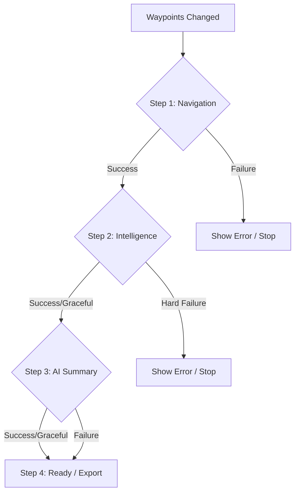
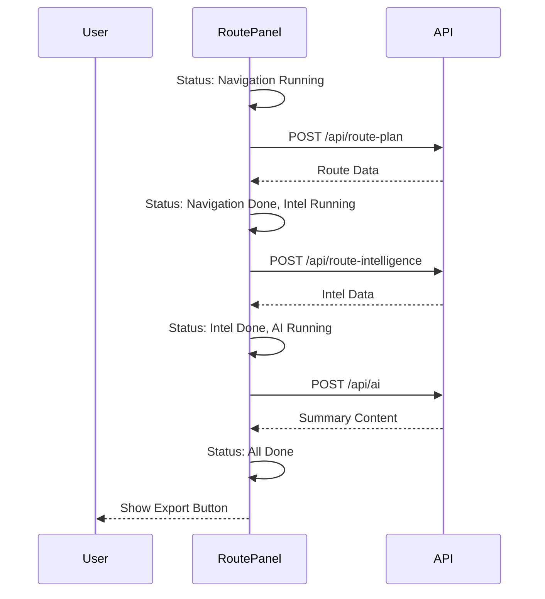

# Modification Design: Sequential Route Planning Flow

## Overview

This modification refactors the route planning workflow in the Aurora IPB application to follow a strictly sequential, multi-step process. A vertical status list will be added to the `RoutePanel` to provide clear feedback on the progress of Navigation, Intelligence analysis, and AI Summary generation. Export functionality will be restricted until all steps are complete.

## Detailed Analysis of the Goal

Currently, the route planner initiates several asynchronous processes (Navigation, Intelligence, and AI Summary) that trigger based on dependency changes in `useEffect` hooks. While functional, the loading states are disjointed, and there is no unified visual representation of the overall progress.

### Goals:

1.  **Strict Sequential Execution**:
    - Step 1: Navigation API (Route calculation)
    - Step 2: Route Intelligence (Hazard and infrastructure analysis)
    - Step 3: AI Tactical Summary (Executive summary generation)
    - Step 4: Completion and Export availability
2.  **Unified Progress UI**: A vertical list showing each step with its current status (Pending, Running, Complete, or Error).
3.  **Controlled Export**: The "Export" button will only be active once all analysis steps have finished successfully (or gracefully handled failures).
4.  **Graceful Error Handling**: Allow the flow to continue or adjust if certain non-critical steps fail (e.g., Intelligence failing might still allow a basic summary, or AI Summary failing shouldn't block viewing the route).

## Alternatives Considered

- **Parallel Execution (Current)**: Fastest performance but confusing UI when multiple loading indicators appear and disappear independently.
- **Full-Screen Stepper**: Too intrusive for a map-centric application where the user might want to see the map updates as they happen.
- **Integrated Progress Bar**: Less descriptive than a vertical status list; doesn't communicate what is actually happening at each stage.

## Detailed Design

### State Management

A new state object will be introduced in `RoutePanel` to track the status of the planning flow.

```typescript
type StepStatus = "pending" | "running" | "complete" | "error";

interface PlanningFlow {
  navigation: StepStatus;
  intelligence: StepStatus;
  summary: StepStatus;
}
```

### Component Structure Changes (`RoutePanel.tsx`)

1.  **Flow Coordinator**: A central logic block (likely replacing or wrapping the existing `useEffect` hooks) that manages transitions between `PlanningFlow` states.
2.  **Status List UI**: A new sub-component or section within `RoutePanel` that renders the vertical progress list.
3.  **Conditional Rendering**: Update existing sections (Route Summary, Hazards, AI Summary) to respect the current flow state.
4.  **Export Guard**: Modify the Export button logic to check if `flow.summary` is 'complete' or 'error' (if graceful).

### Sequence Logic

1.  **Trigger**: User adds/changes waypoints or profile.
2.  **Step 1**: Reset flow to `{ navigation: 'running', intelligence: 'pending', summary: 'pending' }`. Call `/api/route-plan`.
3.  **Transition 1**: If Navigation succeeds, set `navigation: 'complete'` and `intelligence: 'running'`.
4.  **Step 2**: Call `/api/route-intelligence`.
5.  **Transition 2**: If Intelligence succeeds (or gracefully fails), set `intelligence: 'complete'` and `summary: 'running'`.
6.  **Step 3**: Call `/api/ai`.
7.  **Transition 3**: Set `summary: 'complete'`. Enable Export.

### Diagrams (Mermaid)





## Summary of the Design

The `RoutePanel` will be refactored to treat the analysis process as a state machine. This ensures that data dependencies are handled correctly and provides the user with a predictable, transparent experience. The UI will prominently feature the status of each tactical analysis step, making the "Intelligence Preparation of the Battlespace" process feel like a cohesive operation.

## References

- [Next.js App Router Documentation](https://nextjs.org/docs/app)
- [React useEffect Best Practices](https://react.dev/reference/react/useEffect)
- [Tailwind CSS v4 Documentation](https://tailwindcss.com/docs)
