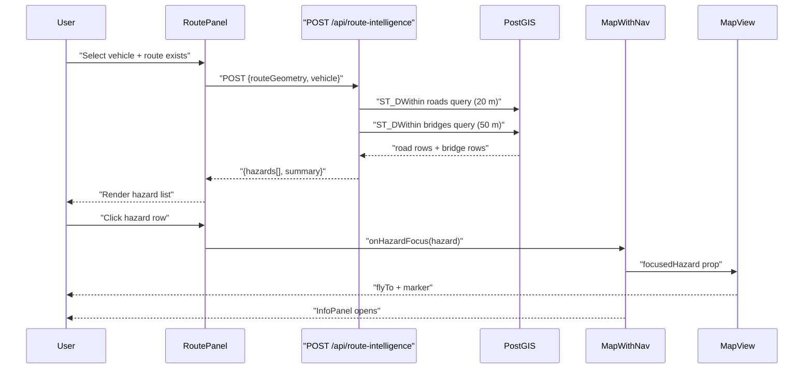
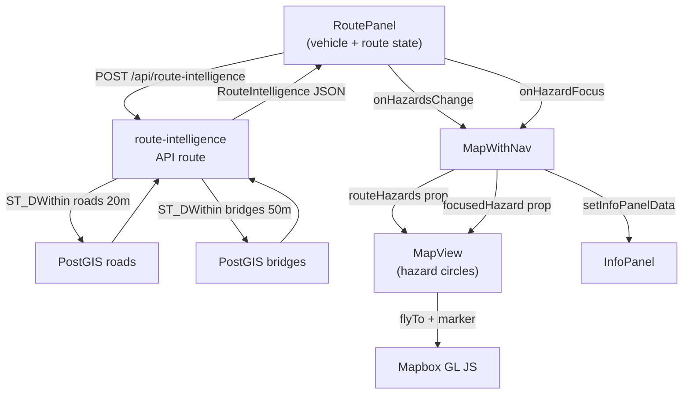

# Design Document: Route Intelligence — Phase 2 Hazard Analysis

**Date:** 2026-05-16  
**Branch:** `feat/navigation-api`  
**Feature:** Vehicle-aware route hazard analysis with interactive warning panel

---

## Overview

Phase 2 extends the existing route planning panel (Phase 1, already shipped) with a
**route intelligence** layer that cross-references the planned route geometry against
Finland's road and bridge infrastructure data stored in PostGIS. It produces a
structured list of hazards (CRITICAL / WARNING / INFO) visible in `RoutePanel` and
lets the analyst click each hazard to fly the map to the problem location, drop a
colored marker, and open the InfoPanel with full infrastructure details.

---

## Detailed Problem Analysis

### What data do we have?

**`roads` table** (Digiroad, Finnish Transport Infrastructure Agency):
| Column | Type | Meaning |
|---|---|---|
| `max_mass_kg` | int\|null | Total vehicle mass limit |
| `max_height_cm` | int\|null | Height clearance |
| `max_bogie_mass_kg` | int\|null | Bogie (tracked axle group) limit |
| `max_axle_mass_kg` | int\|null | Single axle limit |
| `width_cm` | int\|null | Road carriageway width |
| `has_damage` | bool | Damage reported |
| `damage_recurring` | bool | Recurring seasonal damage |
| `condition_class` | int\|null | 1 (excellent) → 5 (very poor) |
| `condition_text` | str\|null | Free-text condition note |
| `rut_depth_mm` | int\|null | Rut depth (mm) |
| `ride_quality` | int\|null | 1 (smooth) → 5 (very rough) |
| `pavement_type` | int\|null | 1=Asphalt, 2=Gravel, 3=Dirt |
| `functional_class` | int\|null | Road class (1=motorway … 5=local) |
| `lane_count` | int\|null | Number of lanes |

**`bridges` table** (Digiroad):
| Column | Type | Meaning |
|---|---|---|
| `max_vehicle_mass_t` | float\|null | Total vehicle mass limit (tonnes) |
| `max_bogie_mass_t` | float\|null | Bogie mass limit (tonnes) |
| `max_combination_mass_t` | float\|null | Combination vehicle limit |
| `max_axle_mass_t` | float\|null | Single axle limit (tonnes) |
| `height_restriction_m` | float\|null | Height restriction (m) |
| `status` | str\|null | Bridge condition status string |
| `name` | str\|null | Bridge name |
| `type_name` | str\|null | Bridge structural type |

### Hazard classification rules

| Source | Condition | Severity | Message template |
|---|---|---|---|
| Road | `has_damage=true AND damage_recurring=true` | WARNING | "Recurring road damage" |
| Road | `has_damage=true` | INFO | "Road damage reported" |
| Road | `condition_class >= 4` | WARNING | "Poor road condition (class N)" |
| Road | `max_mass_kg > 0 AND vehicle.mass_t*1000 > max_mass_kg` | CRITICAL | "Road weight limit exceeded (N kg)" |
| Road | `max_bogie_mass_kg > 0 AND vehicle.bogie_mass_t*1000 > max_bogie_mass_kg` | CRITICAL | "Road bogie limit exceeded (N kg)" |
| Road | `max_axle_mass_kg > 0 AND vehicle.axle_mass_t*1000 > max_axle_mass_kg` | CRITICAL | "Road axle limit exceeded (N kg)" |
| Road | `pavement_type IN (2,3)` | INFO | "Unpaved surface (Gravel/Dirt)" |
| Road | `rut_depth_mm >= 30` | WARNING | "Heavy rutting (N mm)" |
| Road | `width_cm > 0 AND vehicle.width_m*100 > width_cm` | CRITICAL | "Road too narrow for vehicle (N cm)" |
| Road | `max_height_cm > 0 AND vehicle.height_m*100 > max_height_cm` | CRITICAL | "Height restriction on road (N cm)" |
| Bridge | `status != null AND status NOT ILIKE 'ok%'` | WARNING | "Bridge condition: {status}" |
| Bridge | `max_vehicle_mass_t > 0 AND vehicle.mass_t > max_vehicle_mass_t` | CRITICAL | "Bridge vehicle limit exceeded (N t)" |
| Bridge | `max_bogie_mass_t > 0 AND vehicle.bogie_mass_t > max_bogie_mass_t` | CRITICAL | "Bridge bogie limit exceeded (N t)" |
| Bridge | `max_axle_mass_t > 0 AND vehicle.axle_mass_t > max_axle_mass_t` | CRITICAL | "Bridge axle limit exceeded (N t)" |
| Bridge | `height_restriction_m > 0 AND vehicle.height_m > height_restriction_m` | CRITICAL | "Height restriction (N m)" |

**Infantry special-case:** Infantry profile has `mass_t = 0` — all mass-based checks are skipped (0 > any limit is always false). Road damage/condition checks still fire.

Road deduplication: multiple road rows often share the same `link_id`. We group by `link_id` and represent each unique segment once (worst-case check per link). This prevents the same potholed road generating 50 identical warnings.

---

## Alternatives Considered

| Option | Pros | Cons | Decision |
|---|---|---|---|
| Client-side hazard check (fetch road/bridge GeoJSON, classify in browser) | No new API | Route geometry can be long; GeoJSON payloads are large; exposes raw DB data to client | Rejected |
| New `POST /api/route-intelligence` server route | Clean separation, PostGIS spatial indexing, POST body carries both route + vehicle | One more API route | **Chosen** |
| Re-use existing `/api/roads` and `/api/bridges` routes | Re-uses code | Returns bbox-scoped data, not route-scoped; over-fetches by area | Rejected |
| Overlay hazards as a dedicated Mapbox layer (always visible) | Always visible, styled via GL | Requires passing full GeoJSON up to MapView; coordination is harder | Partially adopted: hazard circles on map + marker on click |

---

## Detailed Design

### Architecture Flow



### New file: `src/app/api/route-intelligence/route.ts`

**Request body:**
```json
{
  "routeGeometry": { "type": "LineString", "coordinates": [[lng,lat], ...] },
  "vehicle": {
    "label": "MBT (tank)",
    "mass_t": 60,
    "axle_mass_t": 0,
    "bogie_mass_t": 15,
    "height_m": 2.9,
    "width_m": 3.6
  }
}
```

**Response:**
```json
{
  "hazards": [
    {
      "id": "bridge-42",
      "type": "bridge",
      "severity": "critical",
      "message": "Bridge vehicle limit exceeded (16 t) — vehicle is 60 t",
      "coordinates": [24.94, 60.17],
      "properties": { "name": "Keravanjoki bridge", "max_vehicle_mass_t": 16 }
    }
  ],
  "summary": { "critical": 1, "warning": 2, "info": 0, "passable": false }
}
```

**PostGIS queries (parameterized):**

```sql
-- Roads: unique link_ids within 20 m of the route
SELECT DISTINCT ON (link_id)
       id, link_id, aoi_id,
       max_mass_kg, max_height_cm, max_bogie_mass_kg, max_axle_mass_kg,
       width_cm, pavement_type, has_damage, damage_recurring,
       condition_class, condition_text, rut_depth_mm,
       ST_AsGeoJSON(ST_ClosestPoint(geom, route_geom)) AS closest_pt
FROM roads, ST_GeomFromGeoJSON($1) AS route_geom
WHERE ST_DWithin(geom::geography, route_geom::geography, 20)
ORDER BY link_id
LIMIT 500;

-- Bridges: points within 50 m of the route
SELECT id, name, code, status, aoi_id,
       max_vehicle_mass_t, max_bogie_mass_t, max_combination_mass_t,
       max_axle_mass_t, height_restriction_m, type_name,
       ST_AsGeoJSON(geom) AS geojson
FROM bridges, ST_GeomFromGeoJSON($1) AS route_geom
WHERE ST_DWithin(geom::geography, route_geom::geography, 50);
```

**Error handling:**
- 400 — missing/invalid `routeGeometry` or `vehicle` fields
- 503 — `DATABASE_URL` not set (returns empty hazards with warning header, `passable: true`)
- 500 — DB error

### Extended types: `src/lib/routing.ts`

```typescript
export interface VehicleProfile {
  label: string;
  mass_t: number;
  axle_mass_t: number;
  bogie_mass_t: number;
  height_m: number;
  width_m: number;
}

export const VEHICLE_PRESETS: VehicleProfile[] = [
  { label: 'Infantry',       mass_t: 0,  axle_mass_t: 0,  bogie_mass_t: 0,  height_m: 2.0, width_m: 0.8  },
  { label: 'Wheeled APC',    mass_t: 18, axle_mass_t: 9,  bogie_mass_t: 0,  height_m: 2.7, width_m: 2.7  },
  { label: 'IFV (BMP-type)', mass_t: 22, axle_mass_t: 0,  bogie_mass_t: 6,  height_m: 2.4, width_m: 3.2  },
  { label: 'MBT (tank)',     mass_t: 60, axle_mass_t: 0,  bogie_mass_t: 15, height_m: 2.9, width_m: 3.6  },
  { label: 'Custom',         mass_t: 0,  axle_mass_t: 0,  bogie_mass_t: 0,  height_m: 2.0, width_m: 1.0  },
];

export type HazardSeverity = 'critical' | 'warning' | 'info';

export interface RouteHazard {
  id: string;
  type: 'road' | 'bridge';
  severity: HazardSeverity;
  message: string;
  coordinates: [number, number];
  properties: Record<string, unknown>;
}

export interface RouteIntelligence {
  hazards: RouteHazard[];
  summary: { critical: number; warning: number; info: number; passable: boolean };
}
```

### RoutePanel UI changes

**Vehicle section** (inserted above the waypoint list):

```
┌────────────────────────────────────────┐
│  Vehicle                               │
│  [MBT (tank)            ▾]            │
│  Mass:  [60  ] t   Axle: [0   ] t     │
│  Bogie: [15  ] t   H:    [2.9 ] m     │
│  Width: [3.6 ] m                       │
└────────────────────────────────────────┘
```

- Preset `<select>` auto-fills all 5 fields.
- Editing any field switches preset to "Custom".
- All fields are `<input type="number" min="0" step="0.1">`.

**Route Assessment section** (below route summary, only when `route` is non-null):

```
┌────────────────────────────────────────┐
│  Route Assessment                      │
│  ✗ IMPASSABLE — 1 critical hazard     │  ← red
│  ⚠ 2 warnings · 1 info               │  ← amber/slate
│                                        │
│  ● [red]   Bridge vehicle limit…       │
│            Keravanjoki · 16 t limit    │
│  ● [amber] Recurring road damage       │
│  ● [slate] Unpaved surface (Gravel)   │
└────────────────────────────────────────┘
```

- Sorted: CRITICAL, WARNING, INFO.
- Scrollable list (`max-h-48 overflow-y-auto`).
- Each row is a `<button>` that calls `onHazardFocus(hazard)`.

**New props added to `RoutePanel`:**
```typescript
onHazardsChange?: (intelligence: RouteIntelligence | null) => void;
onHazardFocus?: (hazard: RouteHazard) => void;
```

### MapWithNav changes

```typescript
const [routeIntelligence, setRouteIntelligence] = useState<RouteIntelligence | null>(null);
const [focusedHazard, setFocusedHazard] = useState<RouteHazard | null>(null);
```

`handleHazardFocus`:
```typescript
function handleHazardFocus(hazard: RouteHazard) {
  setFocusedHazard(hazard);
  setInfoPanelData({
    title: hazard.type === 'bridge' ? 'Bridge' : 'Road Segment',
    rows: buildHazardRows(hazard),
  });
}
```

Pass down to `MapView`: `routeHazards={routeIntelligence?.hazards ?? []}` and `focusedHazard={focusedHazard}`.

### MapView changes

**New props:**
```typescript
routeHazards?: RouteHazard[];
focusedHazard?: RouteHazard | null;
```

**Hazard layer** (added in `style.load`, after route layers):
- Source: `route-hazards-source` — GeoJSON, initially empty.
- `route-hazards-critical` — circle, color `#ef4444`, radius 8, stroke white 2px, filter `severity == "critical"`, slot `top`.
- `route-hazards-warning` — circle, color `#eab308`, radius 6, stroke white 1px, filter `severity == "warning"`, slot `top`.
- `route-hazards-info` — circle, color `#94a3b8`, radius 5, filter `severity == "info"`, slot `top`.

**`useEffect([routeHazards])`:**
Converts array to `FeatureCollection` (Point features, properties include `severity`, `id`, `message`) and calls `setData`.

**`useEffect([focusedHazard])`:**
- Removes previous `hazardFocusMarkerRef`.
- If non-null: `map.flyTo({ center, zoom: 15, duration: 800 })`.
- Creates a `mapboxgl.Marker({ color: severityColor })` at `focusedHazard.coordinates`.

---

## Data Flow Diagram



---

## Summary

- **New API route:** `POST /api/route-intelligence` — PostGIS ST_DWithin query against roads (20 m buffer) and bridges (50 m buffer); applies hazard classification rules; returns sorted `RouteHazard[]`.
- **New types:** `VehicleProfile`, `VEHICLE_PRESETS`, `HazardSeverity`, `RouteHazard`, `RouteIntelligence` in `src/lib/routing.ts`.
- **RoutePanel additions:** Vehicle selector with editable preset fields + custom option; hazard list section with severity-colored clickable rows.
- **MapView additions:** Three hazard circle layers; focused-hazard flyTo + colored marker effect.
- **MapWithNav additions:** `routeIntelligence`, `focusedHazard` state; `handleHazardFocus` sets InfoPanel data.
- **No new env vars** — uses existing `DATABASE_URL` and `NEXT_PUBLIC_MAPBOX_TOKEN`.

---

## References

- Digiroad data model: road and bridge attribute definitions confirmed from existing `/api/roads` and `/api/bridges` routes in the codebase.
- PostGIS `ST_DWithin` + `ST_ClosestPoint`: established pattern from `/api/elevation` route.
- Mapbox GL JS `flyTo` + `Marker`: existing patterns from elevation marker and waypoint markers in `MapView.tsx`.
- Phase 2 original plan: `.local/route_planning_integration_plan.md` sections 2.1–2.6.
