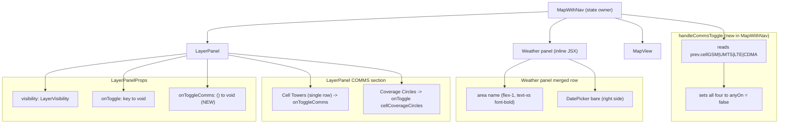

# UI Compaction — Modification Design

## Overview

Multiple floating panels on the left-hand side of the map overlap on common browser viewport sizes (1280–1440 px wide, 720–900 px tall). This document describes targeted compaction changes to reduce vertical space consumption, merge redundant controls, and add scrolling safeguards to the layer panel.

---

## Problem Analysis

### Current layout (left side, top → bottom)

| Panel | Position | Approx height |
|-------|----------|---------------|
| AreaNav | `top-4` (16 px) centered | ~38 px |
| Weather/Date panel | `left-4 top-10` (40 px) | ~120–140 px |
| LayerPanel | `left-4 bottom-10` (bottom-anchored) | ~330–400 px (grows with custom layers) |

At 900 px viewport height the layer panel reaches ~`bottom-10 + 330 px ≈ 370 px from bottom = 530 px from top`. The weather panel ends at roughly `40 + 140 = 180 px from top`. There is ~350 px of gap, but custom layers make the layer panel grow upward and eventually overlap the weather panel. The weather panel itself nearly overlaps the AreaNav (AreaNav bottom ≈ 54 px, weather panel top = 40 px → 14 px gap).

### Root causes

1. **Weather panel header wastes a full row** — the area name sits in its own `pt-2.5 pb-1` block above the date row, adding ~32–36 px.
2. **Four COMMS rows** — GSM, UMTS, LTE, CDMA each consume a row (`gap-1.5` between them) ≈ 4 × 20 px = 80 px just for comms; in practice only operators want per-type control which is not a current use-case.
3. **LayerPanel has no height cap** — adding custom layers causes unbounded growth upward.
4. **Minor spacing waste** — `gap-1.5` between rows, `pb-3` bottom padding, `py-2` date row are all slightly larger than needed.

---

## Alternatives Considered

### A — CSS-only scrolling trick on LayerPanel
Add `max-h` + `overflow-y-auto` without touching content. Solves the scroll problem but not the overlap problem.

### B — Move panels to different screen edges
Put weather top-right. Breaks left-panel visual grouping and conflicts with InfoPanel/RoutePanel on the right.

### C — Collapsible weather panel
Already the LayerPanel has a collapse chevron. Adding the same to weather adds toggle fatigue for the most-used element.

### D — Selected approach: targeted compaction (3 changes)
1. **Merge area-name row into date row** in the weather panel → saves ~32 px.
2. **Replace 4 COMMS rows with 1 "Cell Towers" row** in LayerPanel → saves ~60 px.
3. **Cap LayerPanel height with scroll** → prevents future growth from causing overlaps.
4. **Minor spacing reductions** across DatePicker selects, row gaps, and padding.

---

## Detailed Design

### 1. Weather panel header compaction (`MapWithNav.tsx`)

**Before:**
```
+------------------------------+
| Archipelago Sea              |  <- separate name row (pt-2.5 pb-1)
+------------------------------+
| Date            [Jan] [15]   |  <- date row (py-2 border-b)
+------------------------------+
| Historical avg x 10 yr       |
| 2.3C +/- 1.2  max 3.5 min 1 |
| 45% rain avg 3.2 mm          |
+------------------------------+
```

**After:**
```
+------------------------------+
| Archipelago Sea  [Jan] [15]  |  <- merged row (py-1.5)
+------------------------------+
| Historical avg x 10 yr       |
| 2.3C +/- 1.2  max 3.5 min 1 |
| 45% rain avg 3.2 mm          |
+------------------------------+
```

Implementation: replace the two `<div>` blocks (area-name block + date row) with a single flex row. Area name uses `text-xs font-bold flex-1` (smaller than current `text-sm`). DatePicker bare selector occupies the right portion.

### 2. Combined Cell Towers toggle (`LayerPanel.tsx` + `MapWithNav.tsx`)

**Before (COMMS section):**
```
COMMS
* GSM          [x]
* UMTS         [x]
* LTE          [x]
* CDMA         [x]
* Coverage Cir [ ]
```

**After:**
```
COMMS
* Cell Towers  [x]
* Coverage Cir [ ]
```

**Logic:** `commsOn = vis.cellGSM || vis.cellUMTS || vis.cellLTE || vis.cellCDMA`. Toggling sets all four to `!anyOn`.

**Interface change in `LayerPanel`:**
```ts
interface LayerPanelProps {
  visibility: LayerVisibility;
  onToggle: (key: LayerKey) => void;
  onToggleComms: () => void;          // NEW — controls all 4 cell types at once
  customLayerProps?: CustomLayerPanelProps;
}
```

**`MapWithNav` handler:**
```ts
const handleCommsToggle = useCallback(() => {
  setLayerVisibility((prev) => {
    const anyOn = prev.cellGSM || prev.cellUMTS || prev.cellLTE || prev.cellCDMA;
    return { ...prev, cellGSM: !anyOn, cellUMTS: !anyOn, cellLTE: !anyOn, cellCDMA: !anyOn };
  });
}, []);
```

The four individual `LayerKey` values (`cellGSM`, `cellUMTS`, `cellLTE`, `cellCDMA`) are **not removed** from `LayerVisibility` or `LAYER_GROUPS` — `MapView` still uses them for per-type symbol layer visibility and cluster filtering. Only the UI surface changes.

### 3. LayerPanel max-height + scroll

The content `<div>` gains `max-h-[calc(100vh-10rem)] overflow-y-auto` so it never grows taller than the available viewport height minus safe margins. A custom thin scrollbar keeps the aesthetic clean.

```tsx
<div className="px-3 pb-2 flex flex-col gap-1 max-h-[calc(100vh-10rem)] overflow-y-auto">
```

`100vh - 10rem` = viewport height minus 160 px (accounts for AreaNav, bottom margin, and browser chrome).

### 4. Minor spacing reductions

| Element | Before | After | Saving |
|---------|--------|-------|--------|
| LayerPanel row gap | `gap-1.5` | `gap-1` | ~4 px per N rows |
| LayerPanel bottom padding | `pb-3` | `pb-2` | 4 px |
| DatePicker select padding | `px-2 py-1` | `px-1.5 py-0.5` | ~4 px per select |
| LayerPanel header | `py-2` | `py-1.5` | 4 px |
| WeatherWidget top label | `mb-1` | `mb-0.5` | 4 px |

---

## Architecture Diagram



---

## Summary

| Change | Files | Approx line delta |
|--------|-------|-------------|
| Merge weather header into date row | `MapWithNav.tsx` | -10, +5 |
| Single Cell Towers toggle | `LayerPanel.tsx`, `MapWithNav.tsx` | -15, +10 |
| LayerPanel max-height + scroll | `LayerPanel.tsx` | +3 |
| Minor spacing reductions | `LayerPanel.tsx`, `DatePicker.tsx`, `WeatherWidget.tsx` | +/-10 |
| Update tests | `LayerPanel.test.tsx`, `MapWithNav.test.tsx`, `DatePicker.test.tsx` | +/-20 |

No database, API, or Mapbox layer changes are required. The individual `LayerKey` values for each cell type remain intact in `lib/layers.ts` and `MapView.tsx` — only the panel UI surface changes.

---

## References

- Tailwind CSS v4 `max-h`, `overflow-y-auto` utilities (project already on Tailwind v4)
- React 18 automatic batching — functional `setState` updaters are applied sequentially on accumulated state, so toggling 4 keys requires a single `setLayerVisibility` call setting all at once.
