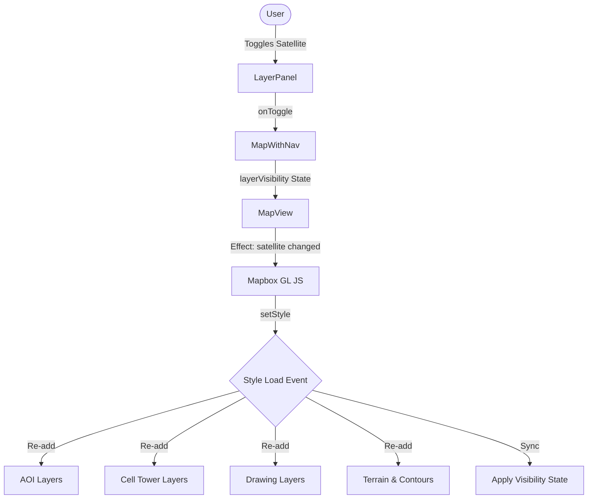

# Design Document: Satellite Style Toggle

## Overview

This modification adds a global style toggle to the Aurora IPB application, allowing users to switch between the "Mapbox Standard" (Military/Night) basemap and "Mapbox Satellite Streets". This provides analysts with high-resolution imagery while maintaining all tactical overlays, terrain features, and drawing capabilities.

## Detailed Analysis

The application currently uses `mapbox://styles/mapbox/standard` with a night preset as its primary basemap. While excellent for data visualization, certain intelligence tasks require actual satellite imagery.

### Goals

- Provide a clear UI toggle to switch to satellite view.
- Maintain all custom layers (Cell Towers, AOIs, Drawing Layers).
- Maintain 3D terrain and contour features in satellite mode.
- Ensure the transition is smooth and doesn't lose application state (e.g., active drawing, selected AOI).

### Challenges

- **Style Switching**: Changing styles in Mapbox GL JS removes all added sources and layers. These must be re-added after the new style loads.
- **Event Listeners**: Layer-specific event listeners (clicks, mouseenters) must be re-attached to the new style's layers.
- **State Sync**: The `LayerPanel` needs to reflect the current style choice, and other toggles (Terrain 3D, Hillshade) should ideally persist across styles.

## Alternatives Considered

1. **Satellite Overlay Layer**: Adding a raster layer at the bottom of the Standard style.
   - _Pros_: Faster transition (no style reload).
   - _Cons_: Standard style basemap ground layers might obscure the satellite imagery or create a messy blend. Standard style doesn't easily allow "hiding" its entire ground layer through config.
2. **Global Style Toggle (Chosen)**: Using `map.setStyle()`.
   - _Pros_: Provides the full, clean "Satellite Streets" experience including high-res imagery and properly integrated labels.
   - _Cons_: Slightly slower transition; requires robust re-initialization of custom layers.

## Detailed Design

### 1. Schema & Types

- Update `LayerKey` and `LayerVisibility` in `src/lib/layers.ts` to include `satellite`.
- `DEFAULT_LAYER_VISIBILITY` will have `satellite: false`.

### 2. MapView Refactoring

The logic inside the `style.load` callback in `MapView.tsx` needs to be idempotent and re-runnable.

- Move one-time initializations (Draw control, Navigation control, global `draw` events) out of any style-specific logic.
- The `style.load` listener will handle:
  - Setting config properties (if standard style).
  - Adding AOI sources/layers.
  - Adding Cell Tower sources/layers/icons.
  - Adding Custom Drawing Layer sources/layers.
  - Adding Terrain (DEM) and Contour sources/layers.
  - Re-applying current `layerVisibility` to the new layers.
  - Re-attaching click/hover handlers to the new layers.

### 3. UI Implementation

- Update `LayerPanel.tsx` to include a new "Basemap" section at the top.
- Add a "Satellite View" row with a toggle.

### 4. Style Logic in MapView

```typescript
useEffect(() => {
  const map = mapRef.current;
  if (!map) return;

  const targetStyle = layerVisibility.satellite
    ? "mapbox://styles/mapbox/satellite-streets-v12"
    : "mapbox://styles/mapbox/standard";

  if (map.getStyle()?.url !== targetStyle) {
    map.setStyle(targetStyle);
  }
}, [layerVisibility.satellite]);
```

### Diagram (Mermaid)



## Summary

The modification involves adding a `satellite` flag to the layer visibility state and refactoring the `MapView` component to handle style transitions gracefully. By leveraging Mapbox's `style.load` event, we ensure that all custom data layers are preserved regardless of the underlying basemap style.

## References

- [Mapbox GL JS API Reference: setStyle](https://docs.mapbox.com/mapbox-gl-js/api/map/#map#setstyle)
- [Mapbox Standard Style config](https://docs.mapbox.com/mapbox-gl-js/api/map/#map#setconfigproperty)
- [Managing layers after style switch](https://docs.mapbox.com/mapbox-gl-js/example/setstyle/)
