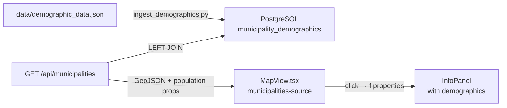

# Design: Municipality Demographic Data Integration

## Overview

Enrich the municipality info panel — shown when a user clicks a highlighted municipality on the map — with demographic statistics from Statistics Finland (Tilastokeskus) data. The source is `data/demographic_data.json`, a GeoJSON FeatureCollection covering all 308 Finnish municipalities with 2025 population figures. Data is ingested into PostgreSQL and served through the existing `/api/municipalities` route so no new API surface is needed.

---

## Detailed Analysis

### Source Data

`data/demographic_data.json` — GeoJSON FeatureCollection, 308 features (all Finnish municipalities). Geometry is in **EPSG:3067** (Finnish national grid, meters). We do **not** need the geometry; only the `properties` object matters:

| Property                 | Type      | Meaning                                              |
| ------------------------ | --------- | ---------------------------------------------------- |
| `kunta`                  | `string`  | 3-digit zero-padded municipality code — **join key** |
| `nimi` / `namn` / `name` | `string`  | Finnish / Swedish / English names                    |
| `til_vuosi`              | `integer` | Statistical year (2025)                              |
| `vaesto`                 | `integer` | Total population                                     |
| `vaesto_p`               | `float`   | Population as % of Finland total                     |
| `miehet`                 | `integer` | Male count                                           |
| `miehet_p`               | `float`   | Male %                                               |
| `naiset`                 | `integer` | Female count                                         |
| `naiset_p`               | `float`   | Female %                                             |
| `ika_0_14`               | `integer` | Count aged 0–14                                      |
| `ika_0_14p`              | `float`   | % aged 0–14                                          |
| `ika_15_64`              | `integer` | Count aged 15–64                                     |
| `ika_15_64p`             | `float`   | % aged 15–64                                         |
| `ika_65_`                | `integer` | Count aged 65+                                       |
| `ika_65_p`               | `float`   | % aged 65+                                           |

No null values in any field. The `kunta` code (e.g. `"005"`) matches the `nat_code` column already stored in the `municipalities` PostgreSQL table.

### Goal

When a user clicks a municipality on the map, the info panel should show:

```
Alajärvi / Alajärvi
  Code        005
  Region      karjala
  Population  8,982
  Male        4 516 (50.3%)
  Female      4 466 (49.7%)
  Under 15    1 373 (15.3%)
  Over 65     2 916 (32.5%)
  Data year   2025
```

### Constraints

- No new npm dependencies.
- No new API routes — extend the existing `/api/municipalities` response.
- Ingestion follows the existing Python pattern (`scripts/ingest_geodata.py`, `scripts/ingest_weather.py`).
- Graceful degradation: if demographics are absent for a municipality (LEFT JOIN miss), the info panel shows only what it already shows today.
- Tests must remain green.

---

## Alternatives Considered

| Approach                                       | Pros                                                                                              | Cons                                                                            | Decision   |
| ---------------------------------------------- | ------------------------------------------------------------------------------------------------- | ------------------------------------------------------------------------------- | ---------- |
| **Ingest into DB, JOIN in API**                | Consistent with all other data; 308-row table adds negligible query overhead; easy to update data | Requires ingestion step                                                         | **Chosen** |
| Static TS lookup module                        | Zero DB overhead; no ingestion                                                                    | Adds ~30 KB to server bundle; breaks the "data in DB" project invariant         | Rejected   |
| New `/api/demographics?code=xxx` route         | Clean separation                                                                                  | Extra fetch per click (latency); more code surface                              | Rejected   |
| Add columns directly to `municipalities` table | One table                                                                                         | Re-running `ingest_geodata.py` would silently drop demographics; tight coupling | Rejected   |

---

## Detailed Design

### Architecture



### Phase 0 — DB Ingestion

**File:** `scripts/ingest_demographics.py`

Follows the same pattern as `ingest_geodata.py` and `ingest_weather.py`:

- Reads `.env.local` for `DATABASE_URL`
- `--no-drop` flag for idempotent re-runs
- Creates `municipality_demographics` table
- Reads `data/demographic_data.json`, extracts only `properties` (ignores geometry)
- Uses `execute_values` + per-batch commits (500 rows/batch)
- `tqdm` progress bar

**Table schema:**

```sql
CREATE TABLE IF NOT EXISTS municipality_demographics (
  nat_code       TEXT     PRIMARY KEY,
  til_vuosi      SMALLINT NOT NULL,
  population     INTEGER  NOT NULL,
  male           INTEGER  NOT NULL,
  male_pct       REAL     NOT NULL,
  female         INTEGER  NOT NULL,
  female_pct     REAL     NOT NULL,
  age_0_14       INTEGER  NOT NULL,
  age_0_14_pct   REAL     NOT NULL,
  age_15_64      INTEGER  NOT NULL,
  age_15_64_pct  REAL     NOT NULL,
  age_65plus     INTEGER  NOT NULL,
  age_65plus_pct REAL     NOT NULL
);
```

No geometry is stored — municipality boundaries are already in the `municipalities` table.

### Phase 1 — API Route Update

**File:** `src/app/api/municipalities/route.ts`

Extend the SQL query with a `LEFT JOIN`:

```sql
SELECT
  m.id, m.nat_code, m.name_fi, m.name_sv, m.aoi_id,
  ST_AsGeoJSON(m.geom) AS geojson,
  d.til_vuosi,
  d.population,
  d.male,          d.male_pct,
  d.female,        d.female_pct,
  d.age_0_14,      d.age_0_14_pct,
  d.age_15_64,     d.age_15_64_pct,
  d.age_65plus,    d.age_65plus_pct
FROM municipalities m
LEFT JOIN municipality_demographics d ON d.nat_code = m.nat_code
```

All new columns are included in the GeoJSON `properties` object. `null` values (LEFT JOIN miss — municipality boundary exists but no demographics row) pass through naturally.

### Phase 2 — MapView Click Handler Update

**File:** `src/components/MapView.tsx`

The `municipalities-fill` click handler builds an `InfoPanelData`. Extend it to conditionally append demographic rows when `p.population != null`:

```typescript
const rows: [string, string | null | undefined][] = [
  ["Code", p.nat_code as string],
  ["Region", p.aoi_id as string],
];

if (p.population != null) {
  rows.push(
    ["Population", Number(p.population).toLocaleString("fi-FI")],
    ["Male", `${Number(p.male).toLocaleString("fi-FI")} (${p.male_pct}%)`],
    [
      "Female",
      `${Number(p.female).toLocaleString("fi-FI")} (${p.female_pct}%)`,
    ],
    [
      "Under 15",
      `${Number(p.age_0_14).toLocaleString("fi-FI")} (${p.age_0_14_pct}%)`,
    ],
    [
      "Over 65",
      `${Number(p.age_65plus).toLocaleString("fi-FI")} (${p.age_65plus_pct}%)`,
    ],
    ["Data year", String(p.til_vuosi)],
  );
}

onInfoPanel?.({ title: name, rows });
```

`toLocaleString("fi-FI")` formats integers with Finnish thousands separators (non-breaking space).

---

## Summary

- **Phase 0:** `scripts/ingest_demographics.py` — reads `data/demographic_data.json` properties, writes 308 rows to `municipality_demographics` table; geometry ignored.
- **Phase 1:** `/api/municipalities` LEFT JOINs `municipality_demographics`; 13 new nullable fields in GeoJSON properties.
- **Phase 2:** `MapView.tsx` click handler conditionally renders 5 demographic rows (population, male/female split, under-15, over-65) plus data year in the existing `InfoPanel`.

---

## References

- Statistics Finland open geodata: https://www.stat.fi/org/avoindata/paikkatietoaineistot_en.html
- Existing ingestion pattern: `scripts/ingest_geodata.py`, `scripts/ingest_weather.py`
- InfoPanel component: `src/components/InfoPanel.tsx`
- Municipalities click handler: `src/components/MapView.tsx` ~line 1073
