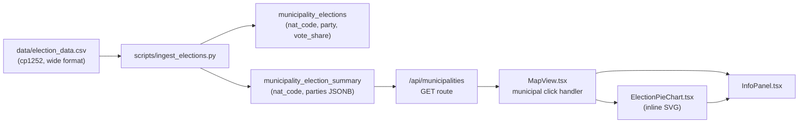

# Design: Election Data Pie Chart in Municipality InfoPanel

## Overview

Display 2023 Finnish parliamentary election results per municipality in the existing InfoPanel.
When a municipality is clicked on the map, show an inline SVG pie chart of vote shares by party,
plus a ranked list of the top 4 parties.

---

## Detailed Analysis

### Data Source

`data/election_data.csv` — Statistics Finland, 2023 parliamentary election, vote shares (%) by party per municipality.

**Format (wide):**

| Vuosi | Sukupuoli | Puolue | Osuus äänistä (%) Koko maa | … | Osuus äänistä (%) KU091 Helsinki | … |
|-------|-----------|--------|---------------------------|---|----------------------------------|---|
| 2023  | Yhteensä  | KOK    | 20.8                      | … | 26.4                             | … |

- 43 rows (1 header + 42 party rows)
- Encoding: Windows-1252 (`cp1252`)
- Line endings: `\r\n` (Windows)
- Missing value: `.` (dot) — municipality not in that electoral district or merged
- **308 current municipality columns** matching `nat_code` in our DB (e.g., `KU091`)
- **164 historical columns** (suffixed `-YY`, e.g., `KU424 Liljendal -10`) — exclude these
- Also exclude: `Koko maa` (country total) and `VP##` electoral-district aggregate columns

**Parties to retain** (22 in 2023 — no year suffix in name):
KOK, PS, SDP, KESK, VIHR, VAS, RKP, KD, LIIKE, SKP, LIBE, Piraattip., EOP, FP, KaL, KL,
SKE, AP, KRIP, VKK, VL, SML + "Muu puolue" (other parties aggregate)

**Parties to exclude from ingestion:**
- `Puolueiden äänet yhteensä` (100% total sentinel row)
- `Muut` (total "others" — covered by `Muu puolue`)
- Parties with `(YYYY)` in name — data from previous elections only

---

## Alternatives Considered

### A. Store per-party rows; aggregate top-4 in SQL

**Pro:** normalised, queryable.  
**Con:** requires `json_object_agg` correlated subquery in every municipality fetch (adds latency, complexity).

### B. Store per-party rows; aggregate top-4 at ingestion into a summary table ✓ (chosen)

Store raw `municipality_elections(nat_code, party, vote_share)` for flexibility.
At ingestion, also materialise a `municipality_election_summary(nat_code, parties JSONB)` table
where `parties` is `{"KOK": 20.8, "PS": 18.2, ...}` — a `json_object_agg` snapshot.

The municipality API LEFT JOINs this summary table (one extra join, no subquery per row).
The client receives `election_data` as a JSON string and does `JSON.parse` once per click.

### C. Store as JSONB directly (no normalised table)

**Pro:** simpler schema.  
**Con:** loses ability to query individual party results or run aggregations.

We keep the normalised table as the source of truth and add the summary as a materialised view.

---

## Detailed Design

### 1. Database Schema

```sql
CREATE TABLE municipality_elections (
  nat_code   TEXT    NOT NULL,
  party      TEXT    NOT NULL,
  vote_share REAL    NOT NULL,
  PRIMARY KEY (nat_code, party)
);
CREATE INDEX ON municipality_elections (nat_code);

CREATE TABLE municipality_election_summary (
  nat_code TEXT PRIMARY KEY,
  parties  JSONB NOT NULL
);
```

The `municipality_election_summary.parties` column is populated by:
```sql
INSERT INTO municipality_election_summary (nat_code, parties)
SELECT nat_code, json_object_agg(party, vote_share)
FROM municipality_elections
GROUP BY nat_code;
```

### 2. Ingestion Script (`scripts/ingest_elections.py`)

```
read CSV (cp1252)  →  filter party rows (drop total + historical)
                   →  for each party × each current KU-column
                       if value != '.'  →  emit (nat_code, party, vote_share)
→  upsert into municipality_elections
→  rebuild municipality_election_summary
```

`nat_code` extracted from column header: `re.search(r'KU(\d+)', col)` → zero-pad to 3 digits:
`str(int(code)).zfill(3)`.  (Note: Statistics Finland uses plain integers without zero-padding
in the header; our DB stores the 3-digit string, e.g. `091`.)

### 3. API Route Update (`/api/municipalities/route.ts`)

Extend the existing SQL with a LEFT JOIN on the summary table:

```sql
FROM municipalities m
LEFT JOIN municipality_demographics d ON d.nat_code = m.nat_code
LEFT JOIN municipality_election_summary e ON e.nat_code = m.nat_code
```

Add to SELECT: `e.parties AS election_data`

TypeScript query type gets `election_data: string | null`.  
In the `properties` object: `election_data: row.election_data ?? null`.

### 4. ElectionPieChart Component (`src/components/ElectionPieChart.tsx`)

Pure-SVG, no new npm dependencies.

**Input:** `data: Record<string, number> | null`  (party abbreviation → vote share %)

**Logic:**
1. Sort parties by vote share descending.
2. Classify each party: known party → assigned color; unknown → `#64748b` (slate).
3. Group parties with share < 2% into an "Other" bucket (added to any existing `Muu puolue`).
4. Build SVG path arcs for each slice.
5. Below the chart, list the top 4 parties with colored dot, abbreviation, and percentage.

**Party color map:**

| Party   | Color   | Notes                        |
|---------|---------|------------------------------|
| KOK     | #1D5091 | National Coalition (navy)    |
| PS      | #003580 | Finns Party (dark blue)      |
| SDP     | #CC0000 | Social Democrats (red)       |
| KESK    | #00873E | Centre Party (green)         |
| VIHR    | #82B300 | Green League (lime)          |
| VAS     | #D32F2F | Left Alliance (dark red)     |
| RKP     | #FFD700 | Swedish People's Party (gold)|
| KD      | #003F87 | Christian Democrats (blue)   |
| LIIKE   | #F06400 | Movement Now (orange)        |
| Other   | #64748B | Slate gray                   |

**SVG construction:**

```
center = (80, 80), radius = 70  (160×160 viewBox)
arc path: M cx cy  L x1 y1  A r r 0 largeArcFlag 1 x2 y2  Z
```

### 5. InfoPanel Extension

Add optional `component` field:

```typescript
export interface InfoPanelData {
  title: string;
  rows: [string, string | null | undefined][];
  component?: React.ReactNode;   // rendered below rows
}
```

InfoPanel renders `{data.component}` beneath the rows section.

### 6. MapView Wiring

In the `municipalities-fill` click handler, after building `rows`:

```typescript
import ElectionPieChart from "@/components/ElectionPieChart";

const rawElection = p.election_data as string | null;
const electionData = rawElection ? (JSON.parse(rawElection) as Record<string, number>) : null;

onInfoPanel?.({
  title: name,
  rows,
  component: electionData ? <ElectionPieChart data={electionData} /> : null,
});
```

Note: Mapbox serialises GeoJSON `properties` as JSON when storing feature data; JSONB from
PostgreSQL that arrives as an object in the API response will be re-serialised as a string by
Mapbox GL JS. We parse it in the click handler.

---

## Component Diagram



---

## Summary

- **No new npm dependencies** — pure SVG pie chart.
- **Backwards compatible** — `InfoPanelData.component` is optional; existing panels unaffected.
- **Graceful degradation** — when `election_data` is null (DB absent or no data for municipality),
  the click handler shows only Code/Region/demographic rows as before.
- **Single extra join** — the summary table adds one cheap LEFT JOIN to the existing
  municipalities query; no per-row subqueries.
- **308 municipalities × 22 parties** ≈ 6 776 rows ingested.

---

## References

- Statistics Finland open data license: CC BY 4.0
- Finnish party official colors: https://en.wikipedia.org/wiki/List_of_political_parties_in_Finland
- SVG arc path specification: https://developer.mozilla.org/en-US/docs/Web/SVG/Tutorial/Paths
